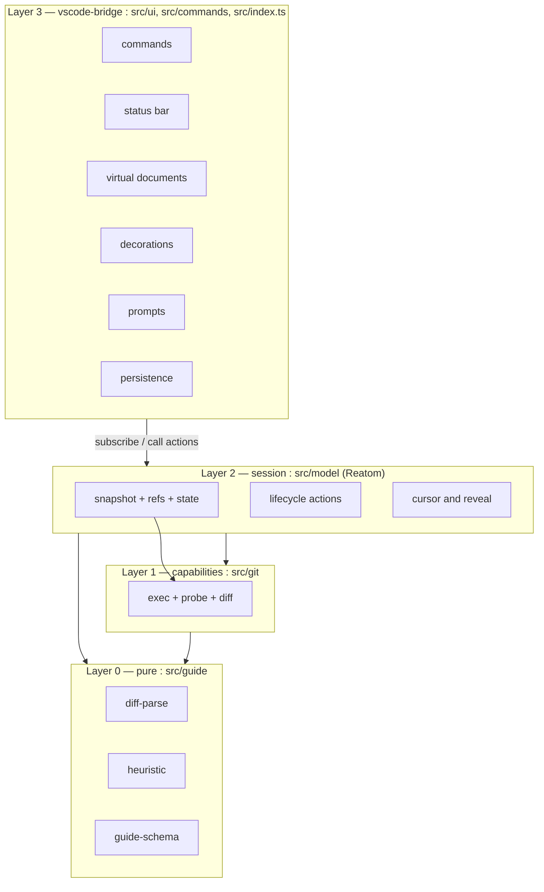

# Tabthrough — Architecture Overview

**Version:** 1.2 (ADR 0005 git-first)
**Owner:** Architect
**Status:** Phase 12 landed in code — read-only + git state; rebase / worktree phases follow
**Last updated:** 2026-09-10
**Companions:** [reatom-model.md](reatom-model.md) · [guide-schema.md](guide-schema.md) · [ADR 0002](../decisions/0002-architecture.md) · [ADR 0005](../decisions/0005-git-first-sessions.md)
**Reconciles with:** [plan.md](../progress/plan.md) · [ADR 0001](../decisions/0001-mvp-scope.md) · [product.md](../specs/product.md)

> Answers to the four open **[ARCH]** questions are in [§10](#10-answers-to-the-open-arch-questions). Git-first sessions are [§3.5](#35-git-first-sessions-adr-0005). ADR 0004 apply mode is superseded.

---

## 1. Architectural goals

Ranked. When two goals conflict, the higher one wins.

1. **Never lose work in progress.** Read-only review does not move HEAD or the index. Working changes are pinned in a snapshot commit; Finish deletes that ref. Later modes are native git exits (`rebase --abort`, `worktree remove`). Never `reset --hard`, `checkout -f`, or `clean`.
2. **One source of truth.** The Reatom model owns all session state. VS Code UI is a projection; commands are action calls. No parallel mutable session object anywhere.
3. **Testable core.** Diff parsing, heuristic ordering, and guide merging are pure functions with no `vscode` and no `child_process` in scope. They are the majority of the interesting logic and the majority of the tests.
4. **Offline-first.** MVP never needs the network. The LLM path (P1) plugs in as one more guide source behind the same interface.
5. **Honest reveal.** Every changed line belongs to exactly one step. Nothing is silently dropped — binaries and generated files get visible stub steps so `k/n` stays truthful.

---

## 2. Layers and the dependency rule



**The dependency rule** (the plan's "load-bearing rule", stated as an enforceable lint constraint):

| Directory | May import | Must **not** import |
|-----------|-----------|---------------------|
| `src/ui/**`, `src/commands/**`, `src/index.ts` | everything | — |
| `src/model/**` | `src/git`, `src/guide`, `@reatom/core` | `vscode`, `node:child_process`, `node:fs` |
| `src/git/**` | `src/guide`, node builtins | `vscode`, `@reatom/core` |
| `src/guide/**` | nothing but itself | `vscode`, `@reatom/core`, any node builtin |

Two consequences worth stating out loud:

- The **session model is unit-testable in plain vitest** against a temp git repo, with no extension host. That is where the safety tests live.
- The **pure layer is testable with string fixtures**. Diff parsing and ordering never touch a filesystem.

Anything the model needs from VS Code — confirmation modals, persistence, opening editors — crosses the boundary through a small **ports interface** that the bridge implements at activation (§5.2). This is also what makes `git/exec.ts` injectable, as the plan requires.

### 2.1 Conceptual modules → directories

The seven conceptual modules map onto the plan's directory layout as follows. Directories are the plan's; the boundaries below are the contracts.

| Conceptual module | Lives in | Purity |
|---|---|---|
| **git** | `src/git/exec.ts`, `probe.ts`, `diff.ts`, `refs.ts`, `state.ts` | effectful, no VS Code, the only place that spawns |
| **snapshot** | `src/git/snapshot.ts`, `isolate.ts` | working-tree after-ref only |
| **diff-parse** | `src/guide/types.ts`, `parse-diff.ts`, `groups.ts`, `render.ts` | pure |
| **heuristic** | `src/guide/heuristic.ts` | pure |
| **guide-schema** | `src/guide/schema.ts`, `sidecar.ts`, `merge.ts` | pure |
| **session** | `src/model/session.ts`, `steps.ts`, `ports.ts` | Reatom, no VS Code |
| **vscode-bridge** | `src/ui/*`, `src/commands/*`, `src/index.ts` | VS Code only |

Additions to the plan's tree (nothing removed):

```
src/
  git/
    refs.ts        # create / list / delete refs/tabthrough/**  + the lock ref CAS
    journal.ts     # SessionToken shape + stage transitions (pure over an injected store)
    apply.ts       # v0.2 — step apply/revert writes + applied checkpoint (ADR 0004)
  guide/
    groups.ts      # LineGroup extraction (splits parse-diff for testability)
    render.ts      # renderReveal — the pure fold that drives progressive reveal AND apply intent
    schema.ts      # .guide.json v1 types + total hand-rolled validator
    merge.ts       # sidecar x heuristic merge
  model/
    ports.ts       # StorePort / UiPort / ClockPort — interfaces only
    view.ts        # ui.statusText, ui.reviewViewModel — the bridge's projections
  ui/
    binding.ts     # useAtomRef — the single Reatom -> reactive-vscode adapter
```

---

## 3. Module contracts

Signatures are the contract the Implementer codes against; internals are free.

### 3.1 diff-parse (pure)

```ts
export type FileStatus = 'added' | 'modified' | 'deleted' | 'renamed' | 'binary' | 'mode-only'

export interface DiffLine {
  kind: 'context' | 'add' | 'del'
  text: string
  oldLine?: number   // 1-based; present for context | del
  newLine?: number   // 1-based; present for context | add
}

export interface DiffHunk {
  index: number
  header: string
  oldStart: number, oldLines: number
  newStart: number, newLines: number
  lines: readonly DiffLine[]
}

/** A contiguous run of changed lines. The atomic unit of reveal. */
export interface LineGroup {
  id: string                 // `${path}#${hunkIndex}:${oldStart}-${newStart}` — stable, fixture-safe
  path: string
  hunkIndex: number
  kind: 'add' | 'del' | 'replace'
  oldRange?: { start: number, end: number }   // absent for pure additions
  newRange?: { start: number, end: number }   // absent for pure deletions
  addedLines: number
  deletedLines: number
}

export interface DiffFile {
  path: string               // post-image path (pre-image for deletions)
  oldPath?: string           // renames / copies
  status: FileStatus
  isBinary: boolean
  isGenerated: boolean       // .gitattributes linguist-generated, or a known generated path
  noTrailingNewline: boolean
  hunks: readonly DiffHunk[]
  groups: readonly LineGroup[]
}

export interface ReviewDiff { files: readonly DiffFile[], digest: string }

export interface LineRange { start: number, end: number }   // 1-based, inclusive
export interface RevealRender {
  text: string
  groupRanges: ReadonlyMap<string, LineRange>   // group id → its range inside `text`
}

export function parseUnifiedDiff(patch: string, nameStatus: NameStatusEntry[]): ReviewDiff
export function groupHunkLines(hunk: DiffHunk, path: string, opts?: { gap?: number }): LineGroup[]
export function renderReveal(baseText: string, file: DiffFile, groups: readonly LineGroup[]): RevealRender
```

`renderReveal` is the heart of progressive reveal (§7): given the base file text and the groups revealed so far, it returns the text VS Code should render, plus the line range each revealed group occupies in that text (which the decoration layer uses to highlight the current step). It is a pure fold — fixture-testable, cheap, and trivially reversible for Shift+Tab.

**Grouping rule:** adjacent changed lines form one group; two changed runs separated by `≤ gap` context lines (default `gap = 1`) merge; an add-run immediately after a del-run becomes `kind: 'replace'`.

Awkward cases the parser must handle (from the plan's P0-9): `\ No newline at end of file`, `Binary files … differ`, rename headers, mode-only changes, empty hunks, and a patch with no trailing newline.

### 3.2 heuristic (pure)

```ts
export interface HeuristicOptions {
  maxLinesPerStep: number            // default 24
  intraHunkGap: number               // default 1
  hideFormattingSteps: boolean       // default false
}
export function buildHeuristicGuide(diff: ReviewDiff, opts?: Partial<HeuristicOptions>): Guide
```

Deterministic, stable-sorted; ties broken by path, then hunk index, then start line, so fixtures never flake.

**Stage 1 — file tier** (foundation before consumer):

| Tier | Contents | Rationale string |
|------|----------|------------------|
| 0 | schemas, `*.d.ts`, `types.*`, `*.proto`, migrations, `**/schema*` | "Types before callers" |
| 1 | pure domain / lib / utils | "Core logic before the code that calls it" |
| 2 | services, state, api clients | "Wiring after the pieces it wires" |
| 3 | UI, routes, components | "Presentation last" |
| 4 | tests, fixtures | "Tests confirm the behaviour above" |
| 5 | config, docs, lockfiles | "Supporting changes" |
| 6 | binary / generated | "Skipped: generated" (stub step) |

**Stage 2 — import-graph refinement inside a tier.** Scan `import` / `require` / `from` specifiers appearing *in the diff text only* — no filesystem walk, no AST. Build a DAG restricted to the changed files, resolve relative specifiers against the repo path, topologically sort, break cycles by path order. Deliberately cheap: a tiebreaker inside a tier, never across tiers.

**Stage 3 — hunk significance.** Additive score over the changed lines:

| Signal | Weight | Feeds rationale |
|--------|--------|-----------------|
| exported symbol added or changed | +5 | "New public surface" |
| signature change (params / return / type annotation) | +4 | "Signature changed — callers must adapt" |
| control flow (`if` / `for` / `while` / `switch` / `catch` / early `return`) | +3 | "New branch of behaviour" |
| new dependency (`import` / `require` added) | +2 | "New dependency introduced" |
| error handling / `throw` | +2 | "Failure path" |
| body edit | +1 | "Implementation detail" |
| whitespace or comment only | 0 | "Formatting only" |

Buckets: `critical ≥ 8`, `high ≥ 5`, `normal ≥ 2`, `low ≥ 1`, `skip = 0` (only when `hideFormattingSteps`).

**Stage 4 — step sizing.** High-significance groups get their own step (1–3 lines is fine). Low-significance groups coalesce up to `maxLinesPerStep`. A step never spans files in v1.

Per the plan's R3: the bar is **defensible, deterministic, and explainable** — not optimal. Every step names the rule that fired, and that string is data, not decoration: the status bar renders it directly.

### 3.3 guide-schema (pure)

```ts
export function validateGuideDoc(input: unknown): Result<GuideDoc, GuideDocError[]>   // total, hand-rolled
export function computeDiffDigest(normalizedPatch: string): string                    // "sha256:…"
export function mergeGuide(args: { diff: ReviewDiff, heuristic: Guide, sidecar?: GuideDoc }):
  { guide: Guide, diagnostics: GuideDiagnostic[] }
```

Full schema, merge algorithm, and the agent-facing contract are in [guide-schema.md](guide-schema.md). Runtime shape:

```ts
export interface GuideStep {
  readonly id: string
  readonly path: string
  readonly groups: readonly LineGroup[]   // empty for stub steps
  readonly kind: 'reveal' | 'stub'
  readonly significance: 'critical' | 'high' | 'normal' | 'low' | 'skip'
  readonly rationale: string
  readonly title?: string
  readonly notes?: string
  readonly source: 'heuristic' | 'sidecar'
}
export interface Guide {
  readonly steps: readonly GuideStep[]
  readonly stale: boolean
  readonly diagnostics: readonly GuideDiagnostic[]
}
```

A `Guide` is computed once at session start and then **frozen**. The session never mutates it; only the cursor moves. Per Reatom's atomization rule, readonly data stays plain — only genuinely mutable state becomes atoms.

Invariants, asserted in dev builds and covered by tests:

- **I1** every `LineGroup` in the diff belongs to exactly one step;
- **I2** step ids are unique;
- **I3** a non-empty diff yields at least one step;
- **I4** ordering is deterministic for a given (diff, sidecar) pair.

### 3.4 git

The only module that spawns processes. Every invocation is non-interactive and locale-stable:

```ts
const BASE_ENV = {
  ...process.env,
  GIT_TERMINAL_PROMPT: '0',   // never block on credentials
  GIT_OPTIONAL_LOCKS: '0',    // read probes never fight the user's git
  GIT_PAGER: 'cat',
  LC_ALL: 'C',
}
// spawn(gitPath, args, { cwd: repoRoot, env: BASE_ENV, shell: false })
```

`exec` is injectable (plan P0-1) so unit tests can feed recorded outputs, and takes `{ signal, timeoutMs }`. The session passes `abortVar.require().signal` on start and on git-state reads. Finish / Cancel delete an after-ref and take no abort signal.

Frozen read invocations — the digest in §3.3 depends on these being stable:

```
git --no-optional-locks status --porcelain=v2 --branch -z
git -c core.quotepath=false diff --no-color --no-ext-diff -M -U3 --patch <base> <after>
git -c core.quotepath=false diff --no-color --no-ext-diff -M --name-status -z <base> <after>
git rev-parse --verify --quiet <rev>^{commit}
git merge-base <a> <b>
git cat-file blob <rev>:<path>
```

Reads run in parallel and take no optional locks. The only write on Start is the working-tree snapshot ref.

### 3.5 git-first sessions (ADR 0005)

Three modes, each one git primitive. Phase 12 ships read-only plus the git-state sidebar. Rebase and worktree land in later phases.

#### 3.5.1 Snapshot ref (read-only)

The working-tree entry pins reviewed content without moving HEAD or the index:

```
GIT_INDEX_FILE=$TMP git read-tree HEAD
GIT_INDEX_FILE=$TMP git add -A
GIT_INDEX_FILE=$TMP git write-tree
git commit-tree $afterTree -p HEAD -m "tabthrough after <id>"
git update-ref refs/tabthrough/after/<id> $afterCommit
```

`git add -A` honours `.gitignore`. Commit and range entries write nothing: `after` is already in the object store.

Finish and Cancel delete the after-ref. Activation sweeps `refs/tabthrough/after/*` older than 24 hours. There is no lock, journal, heartbeat, backup ref, or stash.

#### 3.5.2 Uniform revision pair

| Entry | base | after | Write |
|-------|------|-------|-------|
| Working tree | `HEAD` | `refs/tabthrough/after/<id>` | snapshot commit + after-ref |
| Single commit `C` | `C^` (root → empty tree; merge → first parent) | `C` | none |
| Range `A..B` | `git merge-base A B` | `B` | none |

The diff is `base..after`. Reveal is a fold over that pair. **Edit here** maps the current step onto the real file.

#### 3.5.3 Git state (D5)

`readGitState` reports rebase, merge / cherry-pick / revert / bisect, porcelain conflicts, dirty counts, detached HEAD, leftover autostash entries, and worktrees under `tabthrough.worktree.dir`. Sidebar buttons run the named command and forward stdout / stderr.

#### 3.5.4 Start line (D6)

The pre-flight modal is gone. The generate row shows `Will run: nothing` for read-only. Confirmation is the Start click.

#### 3.5.5 Later primitives

- **Rebase (Phase 13):** `git rebase -i --autostash` stopped at `after`; Finish amends and `--continue`; Cancel is `--abort`.
- **Worktree (Phase 14):** squash `base → after`, `worktree add --detach`.

Never `reset --hard`, `checkout -f`, `clean`, or `worktree remove --force`.

### 3.6 session

The Reatom model, fully specified in [reatom-model.md](reatom-model.md). It owns entry validation, snapshot start, `gitState`, cursor movement, and all derived state the UI renders. No `vscode` import, no subprocess spawn.

### 3.7 vscode-bridge

| Concern | Composable | Notes |
|---------|-----------|-------|
| Commands | `useCommands` | Handlers call Reatom actions, wrapped with `wrap(...)` |
| Status bar | `useStatusBarItem({ text, tooltip, command, visible })` | Text from a Reatom computed via `useAtomRef` |
| Decorations | `useEditorDecorations` | Current-step highlight; dim fallback mode; P1 peek-ahead |
| Review documents | `workspace.registerTextDocumentContentProvider('tabthrough', …)` | Progressive reveal (§7) |
| Context keys | `useVscodeContext` | `gitUsable`, `sessionActive`, `canStart`, `rebaseInProgress`, `hasAutostash`, `reviewEditorFocused` |
| Prompts | `window.showInformationMessage` | Implements `UiPort.notify`; no pre-flight modal |
| Config | `defineConfig` over generated `meta.ts` | Existing template pattern |
| Logging | `defineLogger` + Reatom `connectLogger()` in dev | One output channel |

---

## 4. Data flow

### 4.1 Start

```mermaid
sequenceDiagram
  actor U as User
  participant B as bridge
  participant M as model
  participant G as git
  participant P as pure layer

  U->>B: Start
  B->>M: startSession({ entry })
  M->>M: idle and probe ok
  M->>G: save dirty buffers (working tree)
  M->>G: planIsolation then beginReview
  Note over G: WT: snapshot + after-ref; commit/range: no write
  M->>G: diff base..after
  M->>P: parseUnifiedDiff -> heuristic -> mergeGuide
  M->>M: session active; first next()
```

Time-to-first-reveal is dominated by the snapshot (`read-tree` / `add -A` / `write-tree` / `commit-tree`) on a dirty working tree. Commit and range skip that write.

### 4.2 Tab

Unchanged: Tab is synchronous cursor movement. The reveal document is a pure fold. Past the last step the bridge offers Finish.

### 4.3 Finish / Cancel / deactivate

Finish and Cancel both delete the after-ref (if any) and return to idle. They do not restore, stash, or move HEAD. `deactivate` races `cancelSession('deactivate')` against ~4 s.

### 4.4 Activation sweep

On activate: delete `refs/tabthrough/after/*` older than 24 hours and `git worktree prune`. No recovery modal.

## 5. Process and trust boundaries

| Boundary | Direction | Isolation |
|----------|-----------|-----------|
| Extension host ↔ `git` subprocess | out | `spawn` with `shell: false`, argv arrays only (never string concatenation), hardened env, per-call timeout, `{ signal }` on reads, streamed stdout for large patches |
| Extension host ↔ workspace files | **read-only review documents**; **Edit here** opens a real file beside them | Snapshot writes only a git object + ref. `writeTextFile` is for the generated sidecar. |
| Cross-window / cross-process | shared repo | No lock. Two windows may review the same repository. |
| Network | none in MVP | The P1 LLM path is opt-in per session behind the same guide-source interface |

Untrusted inputs: a user-authored `.guide.json` (validated by a total hand-rolled validator, never `eval`'d, ignored wholesale when invalid); diff text (hand-written parser with bounded lookahead, never a regex across a whole patch); file paths (normalized, rejected when absolute or escaping the repo root).

### 5.1 "Never lose WIP" as invariants

- **W1** Read-only Start does not move HEAD, the index, or the working tree.
- **W2** The after-ref is a real ref, so `gc` cannot collect the snapshot.
- **W3** Finish / Cancel delete only that ref.
- **W4** Named git buttons never pass `--force`, `reset --hard`, `checkout -f`, or `clean`.
- **W5** Git state is inspectable with ordinary commands: `git status`, `git stash list`, `git for-each-ref refs/tabthrough`, `git worktree list`.

### 5.2 Ports

```ts
export interface UiPort {
  notify(level, message, actions?): Promise<string | undefined>
  openReview(target): Promise<void>
  openWorkspaceFile(repoRoot, path): Promise<void>
  openFileAt(repoRoot, path, line, ranges): Promise<void>
  openSourceControl(): Promise<void>
  openFolder(dir, newWindow): Promise<void>
  saveDocuments(repoRoot, paths): Promise<{ ok: true } | { ok: false, path: string }>
  writeTextFile(repoRoot, path, text): Promise<void>
  fileExists(repoRoot, path): Promise<boolean>
  readBundledSkill(): Promise<string | null>
  openAgentChat(prompt): Promise<void>
  logGit(result): void
}
export interface ClockPort { sessionId(): string }
```

Ports are installed once at activation into a `ports` atom; tests substitute in-memory implementations.

## 6. Configuration and commands

Settings, extending the five the plan declares in Phase 0:

| Setting | Type | Default | Phase |
|---------|------|---------|-------|
| `tabthrough.keybinding.useTab` | boolean | `true` | 5 |
| `tabthrough.showRationale` | boolean | `true` | 5 |
| `tabthrough.reveal.mode` | `'progressive' \| 'dim'` | `'progressive'` | 5 (readonly only) |
| `tabthrough.session.mode` | `ask` / `readonly` / `rebase` / `worktree` | `ask` | 12 |
| `tabthrough.guideFile` | string | `.tabthrough-guide.json` | 3 |
| `tabthrough.worktree.dir` | string | `''` → `os.tmpdir()/tabthrough` | 12 |
| `tabthrough.maxLinesPerStep` | number | `24` | 3 |
| `tabthrough.hideFormattingSteps` | boolean | `false` | 3 |

Commands: entry points, reveal loop, Finish / Cancel, Edit here, commit handoff, and the git-state buttons (`continueRebase`, `abortRebase`, `popAutostash`, `showAutostash`, `openWorktree`, `removeWorktree`, `pruneWorktrees`, `openConflict`). Every one carries an `enablement` clause.

---

## 7. Reveal mechanics

### 7.1 Progressive virtual documents — and why this retires risk R5

The plan's R5 is real: **VS Code decorations cannot delete lines.** The escape is not to fight that API but to make the unrevealed content *not exist in the document*.

Two read-only URIs per file, served by one `TextDocumentContentProvider`:

```
tabthrough://base/<sessionId>/<path>?rev=<baseSha>   — the "before" text, static
tabthrough://reveal/<sessionId>/<path>               — the "after so far" text, dynamic
```

The reveal document's content is `renderReveal(baseText, file, revealedGroups).text` — a pure fold over the groups revealed up to the cursor. The editor shows `vscode.diff(baseUri, revealUri)`. When the cursor moves, the provider fires `onDidChange(revealUri)`; VS Code re-reads and the native diff re-renders with real gutter markers, real syntax highlighting, real navigation. When the last step is revealed, the reveal document is byte-identical to the after blob.

| | **Progressive** (readonly) | Dim (readonly fallback) | **Apply** (ADR 0004) |
|---|---|---|---|
| Prior steps stay visible | free — append-only fold | manual range bookkeeping | free — on disk |
| Unrevealed content hidden | genuinely absent | only dimmed — still selectable, copyable, readable | not yet applied to disk |
| Native diff coloring | yes | fights the diff editor's own colors | ordinary editors + git status |
| Touches the working tree | no | no | **yes** — intended; Cancel restores; Finish keeps |
| Read-only by construction | yes | yes | no (user edits allowed) |
| Cost per Tab | one memoized string fold | decoration recompute | save + 3-way merge + write + applied checkpoint |

`tabthrough.reveal.mode` keeps the readonly choice reversible: `'dim'` renders the full after-text with unrevealed ranges dimmed, sharing the same provider, the same URIs, and the same `LineGroup` data. Only the fold differs. Apply is **not** a reveal.mode value — it is `tabthrough.session.mode` / session `mode: 'apply'`.


**Deletions** need no special case: a revealed deletion removes lines from the reveal document, and the native diff shows them as deleted on the base side. **Binary and generated files** produce stub steps whose reveal document is a one-line explanation, keeping ordering and `k/n` honest.

Decorations remain, as an enhancement: highlight the current step's ranges (from `RevealRender.groupRanges`), and, in P1, dim-preview the next related hunk.

### 7.2 Keybinding

Finalised `when` clause (this answers the plan's open item — see §10.3):

```
tabthrough.sessionActive
  && resourceScheme == 'tabthrough'
  && editorTextFocus
  && !suggestWidgetVisible
  && !inlineSuggestionVisible
  && !inSnippetMode
  && !renameInputVisible
  && !parameterHintsVisible
  && !accessibilityModeEnabled
  && !editorTabMovesFocus
  && config.tabthrough.keybinding.useTab
```

`Alt+]` / `Alt+[` are registered unconditionally as the always-available chord, gated only on `tabthrough.sessionActive`.

### 7.3 Edit here

The review stays on `tabthrough://` documents. **Edit here** (sidebar + `Alt+Enter`) opens the real file beside the review at the current step's after-side ranges. After disk edits, ranges re-anchor by the group's added-line text, then the nearest line. A pure deletion opens at the removed lines' position. Disabled with a Rebase / Worktree hint for commit and range reviews. The sidebar marks files whose disk content differs from the after blob.

Apply-with-user (ADR 0004) is deleted. Rebase and worktree are the write modes.

## 8. Cancellation policy

Start is abortable (`withAbort('first-in-win')`). Finish / Cancel and named git writes take no abort signal once they have begun. The per-action table is in [reatom-model.md §9](reatom-model.md).

---

## 9. Enforcement and testing seams

- **Import boundaries** — ESLint `no-restricted-imports` per directory, plus a unit test that greps the built module graph. `vscode` only under `src/ui/**`, `src/commands/**`, `src/index.ts`; `node:child_process` only under `src/git/**`; `@reatom/core` forbidden under `src/git/**` and `src/guide/**`.
- **Pure-layer tests** (vitest, no host): `.diff` fixtures → expected `LineGroup` lists; fixture diffs → expected step order (the foundation-before-consumer assertion); `.guide.json` fixtures → expected merged guide plus diagnostics; a property test for invariant I1.
- **Snapshot / state tests** (vitest, real temp repos): after-ref create / delete / sweep; `git status` identical; no stash; `readGitState` matrix.
- **Model tests** (vitest, `context.start`, in-memory ports): four-state machine, cursor monotonicity, start abort.
- **Host tests** (`@vscode/test-electron`, thin): command registration, context keys, provider content changing on cursor move.

---

## 10. Answers to the open [ARCH] questions

### 10.1 Reatom scope lifetime vs `defineExtension`, and disposal ordering (plan P0-8, R4, R6)

**There is no scope to create.** Reatom v1001 uses an implicit global context; `context.start` exists for SSR and test isolation, not for application bootstrapping. An extension host runs one extension instance, so the default context is correct. Concretely:

- Atoms and actions are **module-level**, created at import time. Nothing constructs them inside `defineExtension`.
- What `defineExtension` owns is the **subscription lifetime**: every `useAtomRef` registers its Reatom unsubscribe with `useDisposable`, so the reactive-vscode scope disposes them.
- **Never call `context.reset()` in production.** The reference is explicit that a context reset rejects wrapped promises with abort errors — during an in-flight restore that is exactly the outcome we must not produce. `context.reset()` belongs in `beforeEach`, nowhere else.

**Disposal ordering at `deactivate`** is load-bearing, because disconnecting computeds can abort work that depends on connection:

1. Flip context keys off so no new command can start.
2. `await Promise.race([cancelSession('deactivate'), sleep(4000)])`. Restore is an `action`, not a connected `computed`, so it does not depend on any subscription staying alive; if extra insurance is wanted, `abortVar.spawn` detaches it from every parent abort scope.
3. Dispose the reactive-vscode scope, which unsubscribes the Reatom projections.
4. Return.

Doing (3) before (2) would tear down subscriptions while a restore is running. The ordering is the mitigation. Beyond that, per R6, we never *depend* on `deactivate`: a truncated one is indistinguishable from a crash, and the journal handles both.

### 10.2 No repo lock (ADR 0005)

There is no `refs/tabthrough/lock`, journal, or heartbeat. Two windows may start read-only reviews of the same repository. Each working-tree session writes its own after-ref. The in-window guard remains: `SessionAlreadyActiveError` if this window is already reviewing.

### 10.3 Final Tab `when` clause (plan P0-11)

§7.2 above. Two deltas from the plan's draft, both deliberate:

- **`!editorHasSelection` dropped.** In a read-only reveal document a selection carries no Tab semantics, and keeping the clause would break the common gesture of selecting a line to read it and then pressing Tab.
- **`!editorReadonly` dropped and inverted in spirit.** The reveal document *is* read-only; that is precisely why Tab is free to take. The original clause would have disabled the binding everywhere it is safe.
- **Added** `!parameterHintsVisible`, `!renameInputVisible`, `!accessibilityModeEnabled`, `!editorTabMovesFocus`, and the `config.tabthrough.keybinding.useTab` gate.

Accessibility is the reason for the last two: users who navigate by keyboard rely on Tab moving focus, and both VS Code signals for that intent are honoured rather than overridden.

### 10.4 `.guide.json` v1 shape (plan P0-15, track E)

Frozen in [guide-schema.md](guide-schema.md), which is the blocking artifact for P0-15. MVP reads and merges; the write path is documented for P1 agents but ships no code.

---

## 11. Deferred by design

| Item | Phase | Note |
|------|-------|------|
| LLM guide source | P1 | A new guide source behind the existing merge interface |
| Agent-authored sidecars in the wild | P1 | Schema frozen here so track E can proceed |
| Stale/partial sidecar merge semantics | P1-3 | v1 already carries `scope.diffDigest` for detection |
| Peek-ahead dim decoration | P1 | The decoration layer already exists |
| Compact mode for >3000-line diffs | P1 | `HeuristicOptions` has room reserved |
| Drift detection during review | P1-8 | Critical earlier for apply; warn on external edits |
| Apply mode — commit range | P1-12 | Single commit + working tree first (ADR 0004) |
| Multi-root workspaces | P2 | First root only; `workspaceRoot` is the single choke point |
| Resume without full restore | P2 | Apply mode already has Resume-from-checkpoint; full “continue readonly mid-reveal” still out |
