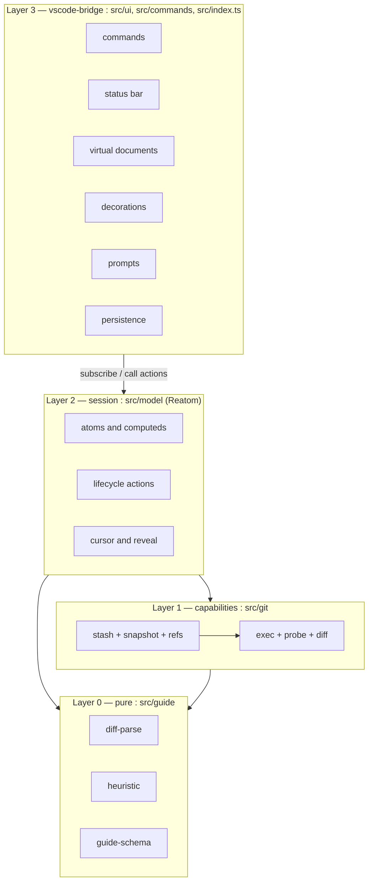
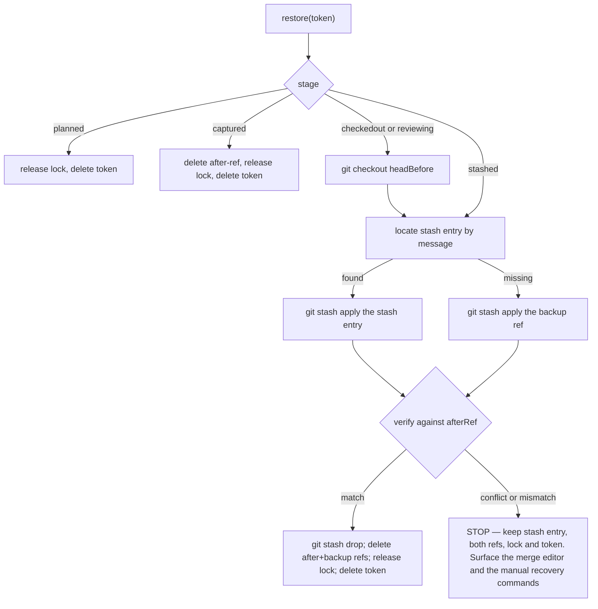
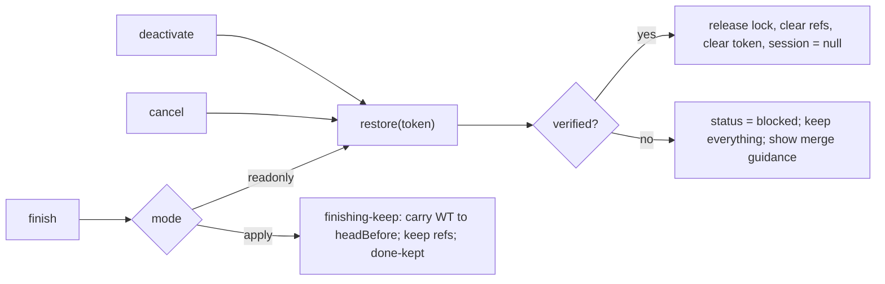
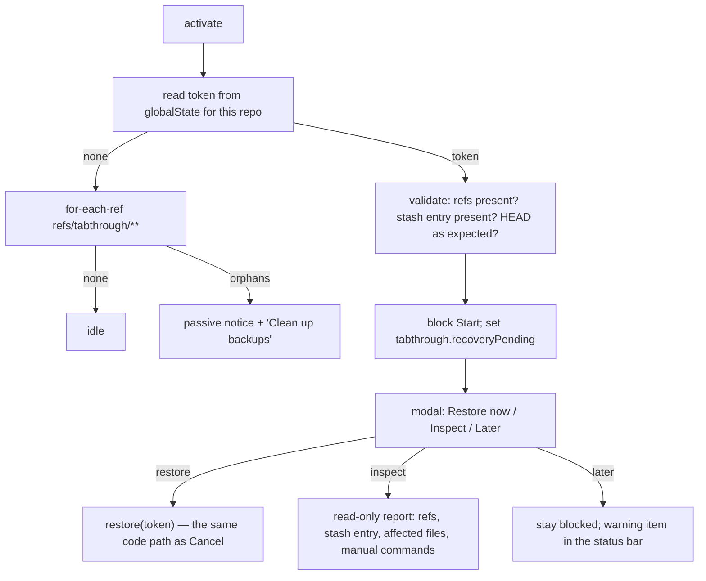
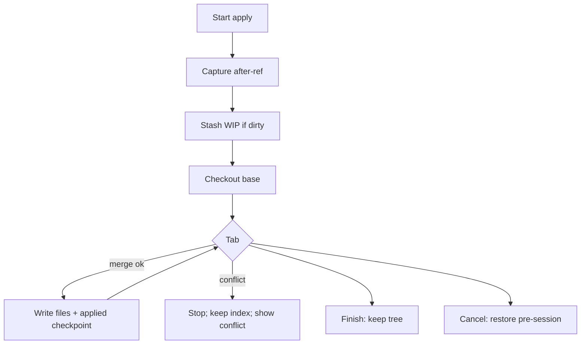

# Tabthrough — Architecture Overview

**Version:** 1.1 (v0.1 + apply-mode design)
**Owner:** Architect
**Status:** Proposed for implementation (apply mode: design accepted, code not started)
**Last updated:** 2026-08-07
**Companions:** [reatom-model.md](reatom-model.md) · [guide-schema.md](guide-schema.md) · [ADR 0002](../decisions/0002-architecture.md) · [ADR 0004](../decisions/0004-apply-mode.md)
**Reconciles with:** [plan.md](../progress/plan.md) (phases, module layout, risk register) · [ADR 0001](../decisions/0001-mvp-scope.md) · [product.md](../specs/product.md)

> Answers to the four open **[ARCH]** questions raised in the plan are in [§10](#10-answers-to-the-open-arch-questions). Apply-with-user is [§7.3](#73-apply-with-user-mode-v02).

---

## 1. Architectural goals

Ranked. When two goals conflict, the higher one wins.

1. **Never lose work in progress.** Before any mutating git command, the entire working state — tracked modifications *and* untracked files — is captured into an immutable commit anchored by a real ref, and a write-ahead journal entry is persisted. A hard crash at any instant is recoverable with a single command.
2. **One source of truth.** The Reatom model owns all session state. VS Code UI is a projection; commands are action calls. No parallel mutable session object anywhere.
3. **Testable core.** Diff parsing, heuristic ordering, and guide merging are pure functions with no `vscode` and no `child_process` in scope. They are the majority of the interesting logic and the majority of the tests.
4. **Offline-first.** MVP never needs the network. The LLM path (P1) plugs in as one more guide source behind the same interface.
5. **Honest reveal.** Every changed line belongs to exactly one step. Nothing is silently dropped — binaries and generated files get visible stub steps so `k/n` stays truthful.

---

## 2. Layers and the dependency rule



**The dependency rule** (the plan's "load-bearing rule", stated as an enforceable lint constraint):

| Directory | May import | Must **not** import |
|-----------|-----------|---------------------|
| `src/ui/**`, `src/commands/**`, `src/index.ts` | everything | — |
| `src/model/**` | `src/git`, `src/guide`, `@reatom/core` | `vscode`, `node:child_process`, `node:fs` |
| `src/git/**` | `src/guide`, node builtins | `vscode`, `@reatom/core` |
| `src/guide/**` | nothing but itself | `vscode`, `@reatom/core`, any node builtin |

Two consequences worth stating out loud:

- The **session model is unit-testable in plain vitest** against a temp git repo, with no extension host. That is where the safety tests live.
- The **pure layer is testable with string fixtures**. Diff parsing and ordering never touch a filesystem.

Anything the model needs from VS Code — confirmation modals, persistence, opening editors — crosses the boundary through a small **ports interface** that the bridge implements at activation (§5.2). This is also what makes `git/exec.ts` injectable, as the plan requires.

### 2.1 Conceptual modules → directories

The seven conceptual modules map onto the plan's directory layout as follows. Directories are the plan's; the boundaries below are the contracts.

| Conceptual module | Lives in | Purity |
|---|---|---|
| **git** | `src/git/exec.ts`, `probe.ts`, `diff.ts`, `refs.ts` | effectful, no VS Code, the only place that spawns |
| **stash** | `src/git/stash.ts`, `snapshot.ts`, `journal.ts` | effectful; the safety protocol |
| **diff-parse** | `src/guide/types.ts`, `parse-diff.ts`, `groups.ts`, `render.ts` | pure |
| **heuristic** | `src/guide/heuristic.ts` | pure |
| **guide-schema** | `src/guide/schema.ts`, `sidecar.ts`, `merge.ts` | pure |
| **session** | `src/model/session.ts`, `steps.ts`, `recovery.ts`, `lock.ts`, `ports.ts` | Reatom, no VS Code |
| **vscode-bridge** | `src/ui/*`, `src/commands/*`, `src/index.ts` | VS Code only |

Additions to the plan's tree (nothing removed):

```
src/
  git/
    refs.ts        # create / list / delete refs/tabthrough/**  + the lock ref CAS
    journal.ts     # SessionToken shape + stage transitions (pure over an injected store)
    apply.ts       # v0.2 — step apply/revert writes + applied checkpoint (ADR 0004)
  guide/
    groups.ts      # LineGroup extraction (splits parse-diff for testability)
    render.ts      # renderReveal — the pure fold that drives progressive reveal AND apply intent
    schema.ts      # .guide.json v1 types + total hand-rolled validator
    merge.ts       # sidecar x heuristic merge
  model/
    ports.ts       # StorePort / UiPort / ClockPort — interfaces only
    view.ts        # ui.statusText, ui.reviewViewModel — the bridge's projections
  ui/
    binding.ts     # useAtomRef — the single Reatom -> reactive-vscode adapter
```

---

## 3. Module contracts

Signatures are the contract the Implementer codes against; internals are free.

### 3.1 diff-parse (pure)

```ts
export type FileStatus = 'added' | 'modified' | 'deleted' | 'renamed' | 'binary' | 'mode-only'

export interface DiffLine {
  kind: 'context' | 'add' | 'del'
  text: string
  oldLine?: number   // 1-based; present for context | del
  newLine?: number   // 1-based; present for context | add
}

export interface DiffHunk {
  index: number
  header: string
  oldStart: number, oldLines: number
  newStart: number, newLines: number
  lines: readonly DiffLine[]
}

/** A contiguous run of changed lines. The atomic unit of reveal. */
export interface LineGroup {
  id: string                 // `${path}#${hunkIndex}:${oldStart}-${newStart}` — stable, fixture-safe
  path: string
  hunkIndex: number
  kind: 'add' | 'del' | 'replace'
  oldRange?: { start: number, end: number }   // absent for pure additions
  newRange?: { start: number, end: number }   // absent for pure deletions
  addedLines: number
  deletedLines: number
}

export interface DiffFile {
  path: string               // post-image path (pre-image for deletions)
  oldPath?: string           // renames / copies
  status: FileStatus
  isBinary: boolean
  isGenerated: boolean       // .gitattributes linguist-generated, or a known generated path
  noTrailingNewline: boolean
  hunks: readonly DiffHunk[]
  groups: readonly LineGroup[]
}

export interface ReviewDiff { files: readonly DiffFile[], digest: string }

export interface LineRange { start: number, end: number }   // 1-based, inclusive
export interface RevealRender {
  text: string
  groupRanges: ReadonlyMap<string, LineRange>   // group id → its range inside `text`
}

export function parseUnifiedDiff(patch: string, nameStatus: NameStatusEntry[]): ReviewDiff
export function groupHunkLines(hunk: DiffHunk, path: string, opts?: { gap?: number }): LineGroup[]
export function renderReveal(baseText: string, file: DiffFile, groups: readonly LineGroup[]): RevealRender
```

`renderReveal` is the heart of progressive reveal (§7): given the base file text and the groups revealed so far, it returns the text VS Code should render, plus the line range each revealed group occupies in that text (which the decoration layer uses to highlight the current step). It is a pure fold — fixture-testable, cheap, and trivially reversible for Shift+Tab.

**Grouping rule:** adjacent changed lines form one group; two changed runs separated by `≤ gap` context lines (default `gap = 1`) merge; an add-run immediately after a del-run becomes `kind: 'replace'`.

Awkward cases the parser must handle (from the plan's P0-9): `\ No newline at end of file`, `Binary files … differ`, rename headers, mode-only changes, empty hunks, and a patch with no trailing newline.

### 3.2 heuristic (pure)

```ts
export interface HeuristicOptions {
  maxLinesPerStep: number            // default 24
  intraHunkGap: number               // default 1
  hideFormattingSteps: boolean       // default false
}
export function buildHeuristicGuide(diff: ReviewDiff, opts?: Partial<HeuristicOptions>): Guide
```

Deterministic, stable-sorted; ties broken by path, then hunk index, then start line, so fixtures never flake.

**Stage 1 — file tier** (foundation before consumer):

| Tier | Contents | Rationale string |
|------|----------|------------------|
| 0 | schemas, `*.d.ts`, `types.*`, `*.proto`, migrations, `**/schema*` | "Types before callers" |
| 1 | pure domain / lib / utils | "Core logic before the code that calls it" |
| 2 | services, state, api clients | "Wiring after the pieces it wires" |
| 3 | UI, routes, components | "Presentation last" |
| 4 | tests, fixtures | "Tests confirm the behaviour above" |
| 5 | config, docs, lockfiles | "Supporting changes" |
| 6 | binary / generated | "Skipped: generated" (stub step) |

**Stage 2 — import-graph refinement inside a tier.** Scan `import` / `require` / `from` specifiers appearing *in the diff text only* — no filesystem walk, no AST. Build a DAG restricted to the changed files, resolve relative specifiers against the repo path, topologically sort, break cycles by path order. Deliberately cheap: a tiebreaker inside a tier, never across tiers.

**Stage 3 — hunk significance.** Additive score over the changed lines:

| Signal | Weight | Feeds rationale |
|--------|--------|-----------------|
| exported symbol added or changed | +5 | "New public surface" |
| signature change (params / return / type annotation) | +4 | "Signature changed — callers must adapt" |
| control flow (`if` / `for` / `while` / `switch` / `catch` / early `return`) | +3 | "New branch of behaviour" |
| new dependency (`import` / `require` added) | +2 | "New dependency introduced" |
| error handling / `throw` | +2 | "Failure path" |
| body edit | +1 | "Implementation detail" |
| whitespace or comment only | 0 | "Formatting only" |

Buckets: `critical ≥ 8`, `high ≥ 5`, `normal ≥ 2`, `low ≥ 1`, `skip = 0` (only when `hideFormattingSteps`).

**Stage 4 — step sizing.** High-significance groups get their own step (1–3 lines is fine). Low-significance groups coalesce up to `maxLinesPerStep`. A step never spans files in v1.

Per the plan's R3: the bar is **defensible, deterministic, and explainable** — not optimal. Every step names the rule that fired, and that string is data, not decoration: the status bar renders it directly.

### 3.3 guide-schema (pure)

```ts
export function validateGuideDoc(input: unknown): Result<GuideDoc, GuideDocError[]>   // total, hand-rolled
export function computeDiffDigest(normalizedPatch: string): string                    // "sha256:…"
export function mergeGuide(args: { diff: ReviewDiff, heuristic: Guide, sidecar?: GuideDoc }):
  { guide: Guide, diagnostics: GuideDiagnostic[] }
```

Full schema, merge algorithm, and the agent-facing contract are in [guide-schema.md](guide-schema.md). Runtime shape:

```ts
export interface GuideStep {
  readonly id: string
  readonly path: string
  readonly groups: readonly LineGroup[]   // empty for stub steps
  readonly kind: 'reveal' | 'stub'
  readonly significance: 'critical' | 'high' | 'normal' | 'low' | 'skip'
  readonly rationale: string
  readonly title?: string
  readonly notes?: string
  readonly source: 'heuristic' | 'sidecar'
}
export interface Guide {
  readonly steps: readonly GuideStep[]
  readonly stale: boolean
  readonly diagnostics: readonly GuideDiagnostic[]
}
```

A `Guide` is computed once at session start and then **frozen**. The session never mutates it; only the cursor moves. Per Reatom's atomization rule, readonly data stays plain — only genuinely mutable state becomes atoms.

Invariants, asserted in dev builds and covered by tests:

- **I1** every `LineGroup` in the diff belongs to exactly one step;
- **I2** step ids are unique;
- **I3** a non-empty diff yields at least one step;
- **I4** ordering is deterministic for a given (diff, sidecar) pair.

### 3.4 git

The only module that spawns processes. Every invocation is non-interactive and locale-stable:

```ts
const BASE_ENV = {
  ...process.env,
  GIT_TERMINAL_PROMPT: '0',   // never block on credentials
  GIT_OPTIONAL_LOCKS: '0',    // read probes never fight the user's git
  GIT_PAGER: 'cat',
  LC_ALL: 'C',
}
// spawn(gitPath, args, { cwd: repoRoot, env: BASE_ENV, shell: false })
```

`exec` is injectable (plan P0-1) so unit tests can feed recorded outputs, and takes `{ signal, timeoutMs }`. The session passes `abortVar.require().signal`, so aborting a Reatom frame kills the subprocess — except on the restore path, where no signal is ever passed (§8).

Frozen read invocations — the digest in §3.3 depends on these being stable:

```
git --no-optional-locks status --porcelain=v2 --branch -z
git -c core.quotepath=false diff --no-color --no-ext-diff -M -U3 --patch <base> <after>
git -c core.quotepath=false diff --no-color --no-ext-diff -M --name-status -z <base> <after>
git rev-parse --verify --quiet <rev>^{commit}
git merge-base <a> <b>
git cat-file blob <rev>:<path>
```

**Write mutex.** All mutating commands funnel through a single FIFO promise chain per repo, so two flows can never race `index.lock`. Reads run in parallel and take no optional locks.

### 3.5 stash — the safety protocol

The module the product's trust rests on. Two ideas carry it: **capture before mutate**, and **journal before act**.

#### 3.5.1 Two artifacts, two jobs

Restore fidelity and content reading are different problems, so they get different artifacts. Both are ordinary git commits behind ordinary refs.

| Ref | Built by | Job |
|-----|----------|-----|
| `refs/tabthrough/after/<id>` | temp-index snapshot (below) | **Read** the reviewed content / apply intent. One flat tree containing tracked modifications *and* untracked files. Makes the working-tree entry read exactly like a commit entry |
| `refs/tabthrough/backup/<id>` | the commit created by `git stash push -u` | **Restore pre-session.** Stash-shaped, so it preserves the staged/unstaged split and the untracked set, which a flat tree cannot |
| `refs/tabthrough/applied/<id>` | commit-tree of WT after each successful apply/revert (apply mode only) | **Crash resume / Finish evidence.** Includes user mid-walk edits |

The temp-index snapshot mutates nothing — not the index, not the working tree:

```
GIT_INDEX_FILE=$TMP git read-tree HEAD
GIT_INDEX_FILE=$TMP git add -A          # tracked edits + untracked; honours .gitignore
GIT_INDEX_FILE=$TMP git write-tree      # -> afterTree
git commit-tree $afterTree -p HEAD -m "tabthrough after <id>"   # -> afterCommit
git update-ref refs/tabthrough/after/<id> $afterCommit
```

`git add -A` honours `.gitignore`, so ignored files are never captured — the same boundary as `--include-untracked`, and the reason we never go near `git stash --all` (plan R8).

**This first step is the actual "never lose WIP" guarantee.** It completes before anything is touched, and it covers everything the later stash covers.

#### 3.5.2 Uniform revision pair

Every entry point resolves to the same two immutable commits, which is what keeps the rest of the system simple:

| Entry | base | after | Checkout (readonly) | Checkout (apply) |
|-------|------|-------|---------------------|------------------|
| Working tree | `HEAD` | `refs/tabthrough/after/<id>` | none (stash already left the tree at `HEAD`) | detach at `base` (`HEAD`) — clean apply zero |
| Single commit `C` | `C^` (root commit → empty tree; merge → `--first-parent`) | `C` | detach at `C` (after) | detach at `C^` (base) |
| Range `A..B` | `git merge-base A B` | `B` | detach at `B` | **out of v0.2 apply** (P1-12); readonly unchanged |

Downstream, nothing knows which entry it came from for *content*: the diff is `base..after`, base blobs come from `git cat-file blob <base>:<path>`. Read-only reveal is a fold over that. Apply mode uses the same fold as the **intended** tree after `k` steps, then writes real files (§7.3). This is why the working-tree entry is stashed like every other entry rather than being special-cased — see [ADR 0002 D4](../decisions/0002-architecture.md) and [ADR 0004](../decisions/0004-apply-mode.md).

#### 3.5.3 The journal

```ts
export type IsolationStage =
  | 'planned'     // nothing touched
  | 'captured'    // after-ref written; working tree still untouched
  | 'stashed'     // working tree cleaned
  | 'checkedout'  // detached HEAD at the target revision
  | 'reviewing'   // steady state (read-only reveal or apply walk)
  | 'applying'    // apply mode: mid Tab/Previous write (journalled before mutate)
  | 'finishing-keep' // apply mode Finish: carrying WT back to headBefore
  | 'restoring'   // restore in flight (Cancel / read-only Finish / recovery)
  | 'done'        // restored and verified; token about to be deleted
  | 'done-kept'   // apply Finish succeeded; tree kept; refs retained until cleanup

export interface SessionToken {
  v: 1
  sessionId: string
  createdAt: number
  heartbeatAt: number | null        // refreshed by the owning window; see §10.2
  repoRoot: string
  stage: IsolationStage
  mode: 'readonly' | 'apply'        // additive; readers treat missing as 'readonly'
  appliedIndex: number              // last successful apply step; -1 = none; missing → -1
  afterRef: string                  // refs/tabthrough/after/<id>
  backupRef: string | null          // refs/tabthrough/backup/<id>, null when the tree was clean
  appliedRef: string | null         // refs/tabthrough/applied/<id>, apply mode only
  stashMessage: string | null       // "tabthrough:<id>"
  headBefore: { kind: 'branch', name: string } | { kind: 'detached', sha: string }
  checkedOut: string | null
  entry: ReviewTarget
}
```

The stage is persisted **before** the operation it names. Recovery therefore always knows how far the previous run got, and never has to guess.

Storage: `globalState`, keyed by a hash of the repo root (§10.2) — not `workspaceState` — so a second window on the same repository can see it and so the token survives the workspace being reopened from a different folder path.

#### 3.5.4 Start sequence

```mermaid
sequenceDiagram
  participant M as model (Reatom)
  participant S as stash protocol
  participant G as git
  participant P as globalState

  M->>S: isolate(plan)
  S->>G: update-ref refs/tabthrough/lock  (CAS against zero oid)
  Note over S,G: fails if another window owns this repo
  S->>P: token {stage:'planned'}
  S->>G: temp-index snapshot to afterCommit; update-ref .../after/[id]
  S->>P: token {stage:'captured'}
  Note over S,P: a crash here loses nothing — the tree was never modified
  S->>G: git stash push --include-untracked -m "tabthrough:[id]"
  S->>G: rev-parse refs/stash; update-ref .../backup/[id]
  S->>P: token {stage:'stashed'}
  S->>G: status --porcelain  (assert clean, else unwind)
  S->>G: git checkout --detach afterRev (skipped for the working-tree entry)
  S->>P: token {stage:'checkedout'}
  S-->>M: IsolationHandle
```

If any step fails, the ones already done are unwound and the start is refused: a failed start leaves the tree exactly as it was found.

#### 3.5.5 Restore: apply → verify → drop

Never `pop`. `pop` drops the stash entry on partial success, which is precisely the case where we most need it to survive.



Verification compares `git status --porcelain=v2 -z` plus a content hash of every tracked and untracked file against the `afterRef` tree. Only a verified match permits `stash drop` and ref deletion.

Non-negotiable rules:

- **Never** `reset --hard`, `checkout -f`, `clean`, `stash pop`, or `stash drop` without a verified match or an explicit, specific user confirmation.
- **Never** delete the after-ref or backup ref before verification succeeds.
- On conflict, stop and hand the user the merge editor plus the literal `git` commands to recover by hand. The token stays, so the next activation still offers recovery.
- Backup and after refs live under `refs/tabthrough/**` — real refs, immune to `gc`, discoverable with `git for-each-ref`, and removable through `Tabthrough: Clean up backups`.
- A restore that cannot complete cleanly leaves **more** state behind, never less.

### 3.6 session

The Reatom model, fully specified in [reatom-model.md](reatom-model.md). It owns entry validation, the session lock, orchestration of stash + git + the pure guide pipeline, cursor movement, and all derived state the UI renders. No `vscode` import, no subprocess spawn.

### 3.7 vscode-bridge

| Concern | Composable | Notes |
|---------|-----------|-------|
| Commands | `useCommands` | Handlers call Reatom actions, wrapped with `wrap(...)` |
| Status bar | `useStatusBarItem({ text, tooltip, command, visible })` | Text from a Reatom computed via `useAtomRef` |
| Decorations | `useEditorDecorations` | Current-step highlight; dim fallback mode; P1 peek-ahead |
| Review documents | `workspace.registerTextDocumentContentProvider('tabthrough', …)` | Progressive reveal (§7) |
| Context keys | `useVscodeContext` | `gitUsable`, `sessionActive`, `recoveryPending`, `canStart`, `reviewEditorFocused` |
| Persistence | `useGlobalState` | Implements `StorePort` |
| Prompts | `window.showWarningMessage(…, { modal: true })` | Implements `UiPort`; **Cancel is the default button** on the pre-flight |
| Config | `defineConfig` over generated `meta.ts` | Existing template pattern |
| Logging | `defineLogger` + Reatom `connectLogger()` in dev | One output channel |

---

## 4. Data flow

### 4.1 Start

```mermaid
sequenceDiagram
  actor U as User
  participant B as bridge
  participant M as model
  participant S as stash
  participant G as git
  participant P as pure layer

  U->>B: "Tabthrough: Start" (quick pick entry)
  B->>M: startSession({ entry })
  M->>M: guard — status must be idle, probe must be ok, no recovery pending
  M->>G: resolve base/after, count changed lines
  M->>M: preflight.request.set(summary)
  B-->>U: modal — what will be stashed, how to abort (Cancel is default)
  U-->>M: preflight.answer(true) — awaited via take
  M->>S: isolate(plan) — capture-first, journal-first, see 3.5.4
  S-->>M: IsolationHandle
  M->>G: diff --name-status + --patch  (base..after)
  M->>G: read .guide.json at base (if present)
  M->>P: parseUnifiedDiff -> buildHeuristicGuide -> validateGuideDoc -> mergeGuide
  M->>M: session.set(reatomSession(...)); status -> active; cursor = -1
  M-->>B: reviewViewModel changed
  B->>B: open vscode.diff(base, reveal), set context keys, show status bar
  B->>M: next() — auto-reveal the first step
```

Time-to-first-reveal budget (<3 s on a ≤500-line diff): probe ~50 ms, capture + stash ~200–600 ms, diff read ~100 ms, parse + order <50 ms; base blobs are read lazily per file. The dominant cost is `checkout`, which the working-tree entry skips entirely — the fastest path and the natural demo.

### 4.2 Tab

```mermaid
sequenceDiagram
  actor U as User
  participant B as bridge
  participant M as model
  participant V as document provider

  U->>B: Tab (when: sessionActive && reviewEditorFocused && !suggestWidgetVisible && …)
  B->>M: session().next()
  M->>M: cursor.set(k + 1) — synchronous, no I/O, no await
  M-->>V: revealText computed changed
  V->>V: onDidChange(uri)
  V-->>B: VS Code re-reads; the native diff re-renders
  M-->>B: statusText changed -> status bar; ranges changed -> decoration
```

Tab is **synchronous state movement**. No subprocess, no I/O, no await — base texts were fetched lazily on first need and cached, and the next file is warmed by the dependency graph (see reatom-model.md §7). That is what makes the loop feel like AI-tab completion rather than a tool.

Past the last step, `next()` is a no-op that flips `isComplete`; the bridge shows a subtle "Review complete" message offering Finish. No score, no timer, no gate.

### 4.3 Finish / Cancel / deactivate

**Read-only:** Finish and Cancel run the identical restore; they differ only in messaging. Deactivate uses the same restore with a time budget.

**Apply mode:** Cancel still restores pre-session (sacred path). Finish **keeps** the working tree and does **not** stash-apply the backup — see §7.3 and ADR 0004 D6.



`deactivate` gets a bounded window: the restore promise raced against ~4 s. If the timeout wins, the journal is left at its current stage and the next activation offers recovery (plan R6). Apply mode mid-walk uses the same journal — a truncated deactivate is Resume-or-Restore, never silent half-state.

### 4.4 Crash recovery

On every activation, **before any command is enabled and before any git mutation**:



Recovery never guesses. If the token says `stashed` but no matching stash entry exists, it falls back to the backup ref; if that is gone too, it falls back to the after-ref content; if nothing is left, it reports exactly what is missing rather than attempting a heuristic repair.

**Apply mode tokens** additionally offer **Resume apply** when `mode === 'apply'` and an `applied` checkpoint / `appliedIndex` is coherent — reset WT to the checkpoint and continue — or **Restore pre-session** (same as Cancel). A journal stuck in `applying` without a matching applied-ref bump is treated as incomplete: show the mismatch; default recommendation is Restore or Resume-from-previous index, never a silent repair.

---

## 5. Process and trust boundaries

| Boundary | Direction | Isolation |
|----------|-----------|-----------|
| Extension host ↔ `git` subprocess | out | `spawn` with `shell: false`, argv arrays only (never string concatenation), hardened env, per-call timeout, `{ signal }` on reads, streamed stdout for large patches |
| Extension host ↔ workspace files | **read-only in `readonly` mode**; **journalled writes in `apply` mode** | Read-only sessions never write workspace files (virtual docs only). Apply mode writes only through the apply module (`src/git/apply.ts` + model actions), one step at a time, after journal `applying`, using intended states from `renderReveal`. No ad-hoc `fs.writeFile` from UI/commands |
| Extension host ↔ `globalState` | both | Journal only: a small JSON token. No code content, ever |
| Cross-window / cross-process | shared repo | A single lock ref, acquired by compare-and-swap (§10.2) |
| Network | none in MVP | The P1 LLM path is opt-in per session behind the same guide-source interface |

Untrusted inputs: a user-authored `.guide.json` (validated by a total hand-rolled validator, never `eval`'d, ignored wholesale when invalid); diff text (hand-written parser with bounded lookahead, never a regex across a whole patch); file paths (normalized, rejected when absolute or escaping the repo root).

### 5.1 "Never lose WIP" as invariants

- **W1** No mutating git command runs before the after-ref exists and the token is persisted.
- **W2** After- and backup refs are real refs, so `gc` cannot collect them.
- **W3** Restore is idempotent, and resumes from the journal stage after a partial failure.
- **W4** A restore that cannot complete cleanly leaves more state behind, never less.
- **W5** The user can always recover by hand with `git stash list` and `git for-each-ref refs/tabthrough` — the protocol uses only standard, legible git objects. No proprietary store, no hidden temp directory.

### 5.2 Ports

```ts
export interface StorePort {
  readToken(repoRoot: string): Promise<SessionToken | null>
  writeToken(token: SessionToken): Promise<void>
  clearToken(repoRoot: string): Promise<void>
}
export interface UiPort {
  confirm(request: PreflightRequest): Promise<boolean>
  notify(level: 'info' | 'warn' | 'error', message: string, actions?: string[]): Promise<string | undefined>
  openReview(target: ReviewDocTarget): Promise<void>
  openSourceControl(): Promise<void>   // apply Finish / commitHandoff — v0.2
  saveDocuments(paths: readonly string[]): Promise<{ ok: true } | { ok: false, path: string }>  // apply Tab
}

export interface ClockPort { now: () => number, sessionId: () => string }
```

Ports are installed once at activation into a `ports` atom; tests substitute in-memory implementations. User confirmation is *additionally* modelled Reatom-natively as an action event (`take(preflightAnswer)`) rather than a port call — see [reatom-model.md §6](reatom-model.md).

---

## 6. Configuration and commands

Settings, extending the five the plan declares in Phase 0:

| Setting | Type | Default | Phase |
|---------|------|---------|-------|
| `tabthrough.keybinding.useTab` | boolean | `true` | 5 |
| `tabthrough.showRationale` | boolean | `true` | 5 |
| `tabthrough.reveal.mode` | `'progressive' \| 'dim'` | `'progressive'` | 5 (readonly only) |
| `tabthrough.session.mode` | `'ask' \| 'readonly' \| 'apply'` | `'ask'` | v0.2 apply |
| `tabthrough.guideFile` | string | `.guide.json` | 3 |
| `tabthrough.stash.includeUntracked` | boolean | `true` | 2 |
| `tabthrough.maxLinesPerStep` | number | `24` | 3 |
| `tabthrough.hideFormattingSteps` | boolean | `false` | 3 |

Commands (plan P0-14 + apply): `tabthrough.start`, `.startFromCommit`, `.startFromRange`, `.next`, `.previous`, `.finish`, `.cancel`, `.restoreBackup`, plus `.cleanupBackups`, `.showStepDetail`, and v0.2 `.commitHandoff`. Every one carries an `enablement` clause driven by the context keys, so the palette never offers an action that will fail.

---

## 7. Reveal mechanics

### 7.1 Progressive virtual documents — and why this retires risk R5

The plan's R5 is real: **VS Code decorations cannot delete lines.** The escape is not to fight that API but to make the unrevealed content *not exist in the document*.

Two read-only URIs per file, served by one `TextDocumentContentProvider`:

```
tabthrough://base/<sessionId>/<path>?rev=<baseSha>   — the "before" text, static
tabthrough://reveal/<sessionId>/<path>               — the "after so far" text, dynamic
```

The reveal document's content is `renderReveal(baseText, file, revealedGroups).text` — a pure fold over the groups revealed up to the cursor. The editor shows `vscode.diff(baseUri, revealUri)`. When the cursor moves, the provider fires `onDidChange(revealUri)`; VS Code re-reads and the native diff re-renders with real gutter markers, real syntax highlighting, real navigation. When the last step is revealed, the reveal document is byte-identical to the after blob.

| | **Progressive** (readonly) | Dim (readonly fallback) | **Apply** (ADR 0004) |
|---|---|---|---|
| Prior steps stay visible | free — append-only fold | manual range bookkeeping | free — on disk |
| Unrevealed content hidden | genuinely absent | only dimmed — still selectable, copyable, readable | not yet applied to disk |
| Native diff coloring | yes | fights the diff editor's own colors | ordinary editors + git status |
| Touches the working tree | no | no | **yes** — intended; Cancel restores; Finish keeps |
| Read-only by construction | yes | yes | no (user edits allowed) |
| Cost per Tab | one memoized string fold | decoration recompute | save + 3-way merge + write + applied checkpoint |

`tabthrough.reveal.mode` keeps the readonly choice reversible: `'dim'` renders the full after-text with unrevealed ranges dimmed, sharing the same provider, the same URIs, and the same `LineGroup` data. Only the fold differs. Apply is **not** a reveal.mode value — it is `tabthrough.session.mode` / session `mode: 'apply'`.


**Deletions** need no special case: a revealed deletion removes lines from the reveal document, and the native diff shows them as deleted on the base side. **Binary and generated files** produce stub steps whose reveal document is a one-line explanation, keeping ordering and `k/n` honest.

Decorations remain, as an enhancement: highlight the current step's ranges (from `RevealRender.groupRanges`), and, in P1, dim-preview the next related hunk.

### 7.2 Keybinding

Finalised `when` clause (this answers the plan's open item — see §10.3):

```
tabthrough.sessionActive
  && resourceScheme == 'tabthrough'
  && editorTextFocus
  && !suggestWidgetVisible
  && !inlineSuggestionVisible
  && !inSnippetMode
  && !renameInputVisible
  && !parameterHintsVisible
  && !accessibilityModeEnabled
  && !editorTabMovesFocus
  && config.tabthrough.keybinding.useTab
```

`Alt+]` / `Alt+[` are registered unconditionally as the always-available chord, gated only on `tabthrough.sessionActive`.

### 7.3 Apply-with-user mode (v0.2)

Full decision record: [ADR 0004](../decisions/0004-apply-mode.md). Summary for implementers:

**Contract.** Session mode `apply` coexists with read-only progressive/dim. Isolation still capture-first / journal-first, but checkout is **`base`**, and each Tab mutates real files. Dirty `git status` is expected and disclosed in pre-flight.

**Tab / intended state.** For step `k`, per touched file:

```
intendedPrev = renderReveal(base, file, groups[0..k))
intendedNext = renderReveal(base, file, groups[0..k])
current      = on-disk (after save of dirty buffers for that path)
```

If `current === intendedPrev`, write `intendedNext`. Else 3-way merge (`intendedPrev`, `current`, `intendedNext`). Conflict → stop, do not advance, never silent overwrite.

**Shift+Tab.** Symmetric revert toward `intendedPrev` for `k = appliedIndex`; same conflict rule. No multi-step `jumpTo` in v0.2.

**Finish vs Cancel vs Commit.**

| Action | Effect |
|--------|--------|
| Cancel | Restore pre-session (backup stash → verify → drop). Confirm if apply progressed. |
| Finish | Keep WT; carry to `headBefore` without `-f`; journal `done-kept`; **do not** restore stash; offer SCM handoff |
| Commit handoff | Focus Source Control / commit UI — never silent `git commit` |

**Never lost:** after-ref, backup-ref, applied-ref, journal until verified Cancel restore or explicit cleanup after Finish.

**Modules.** Add `src/git/apply.ts` (write file bytes, 3-way merge helper, applied checkpoint) and extend journal/token. Pure `renderReveal` gains no mode flag — apply is orchestration over the same fold. Schema v1 unchanged.

**Keybinding note.** Apply mode uses ordinary file editors, so Tab cannot rely on `resourceScheme == 'tabthrough'`. v0.2: prefer the unconditional `Alt+]` / `Alt+[` chords while focused in workspace files during apply, and/or a narrowed when-clause (`tabthrough.sessionActive && tabthrough.sessionMode == 'apply' && editorTextFocus && resourceScheme == 'file' && …widget guards`). Exact clause is an Implementer detail under Planner’s phase; product pitch remains Tab-to-advance with chord fallback. Do not steal Tab globally.




## 8. Cancellation policy

Cancellation is a safety feature on the read path and a hazard on the write path. **Anything that can leave git half-applied runs without a signal.** The per-action table is in [reatom-model.md §9](reatom-model.md); the rule for the git layer is: `exec` accepts `{ signal }`, and `stash.ts` / `snapshot.ts` never pass one on the restore path.

---

## 9. Enforcement and testing seams

- **Import boundaries** — ESLint `no-restricted-imports` per directory, plus a unit test that greps the built module graph. `vscode` only under `src/ui/**`, `src/commands/**`, `src/index.ts`; `node:child_process` only under `src/git/**`; `@reatom/core` forbidden under `src/git/**` and `src/guide/**`.
- **Pure-layer tests** (vitest, no host): `.diff` fixtures → expected `LineGroup` lists; fixture diffs → expected step order (the foundation-before-consumer assertion); `.guide.json` fixtures → expected merged guide plus diagnostics; a property test for invariant I1.
- **Protocol tests** (vitest, real temp repos): the plan's round-trip matrix, extended with the after-ref assertions — the after-ref tree must equal the pre-stash working state for every fixture row.
- **Model tests** (vitest, `context.start`, in-memory ports): session lock, cursor monotonicity, abort behaviour when a start is cancelled mid-isolation, recovery gating.
- **Host tests** (`@vscode/test-electron`, thin): command registration, context keys, provider content changing on cursor move.

The safety-critical seam is `StorePort`: protocol tests inject a store that stops accepting writes after a chosen stage, which exercises the entire crash matrix without killing a process.

---

## 10. Answers to the open [ARCH] questions

### 10.1 Reatom scope lifetime vs `defineExtension`, and disposal ordering (plan P0-8, R4, R6)

**There is no scope to create.** Reatom v1001 uses an implicit global context; `context.start` exists for SSR and test isolation, not for application bootstrapping. An extension host runs one extension instance, so the default context is correct. Concretely:

- Atoms and actions are **module-level**, created at import time. Nothing constructs them inside `defineExtension`.
- What `defineExtension` owns is the **subscription lifetime**: every `useAtomRef` registers its Reatom unsubscribe with `useDisposable`, so the reactive-vscode scope disposes them.
- **Never call `context.reset()` in production.** The reference is explicit that a context reset rejects wrapped promises with abort errors — during an in-flight restore that is exactly the outcome we must not produce. `context.reset()` belongs in `beforeEach`, nowhere else.

**Disposal ordering at `deactivate`** is load-bearing, because disconnecting computeds can abort work that depends on connection:

1. Flip context keys off so no new command can start.
2. `await Promise.race([cancelSession('deactivate'), sleep(4000)])`. Restore is an `action`, not a connected `computed`, so it does not depend on any subscription staying alive; if extra insurance is wanted, `abortVar.spawn` detaches it from every parent abort scope.
3. Dispose the reactive-vscode scope, which unsubscribes the Reatom projections.
4. Return.

Doing (3) before (2) would tear down subscriptions while a restore is running. The ordering is the mitigation. Beyond that, per R6, we never *depend* on `deactivate`: a truncated one is indistinguishable from a crash, and the journal handles both.

### 10.2 Repo-level session lock mechanism (plan P0-7)

**A single lock ref, acquired by compare-and-swap through `git update-ref`.**

```
# the value names the owner: a blob holding "tabthrough-lock:<sessionId>"
git hash-object -t blob -w --stdin

# acquire — fails if the ref already exists, atomically, in git's ref transaction
git update-ref refs/tabthrough/lock <lockBlob> 0000000000000000000000000000000000000000

# release — fails if someone changed it underneath us
git update-ref -d refs/tabthrough/lock <lockBlob>
```

Passing the zero oid as the expected old value makes this a genuine atomic create-if-absent.

**The value is the session id, not the HEAD sha** (review 001 M3). A ref can only point at an object, so the id travels as a blob and the ref points at that; content addressing means the release recomputes the value it compares against rather than trusting the ref it is about to delete. With the HEAD sha, two windows on one repository computed the same value and the compare-and-swap could not distinguish owners at all — the property this design exists for. A lock written by hand (the stale-lock drill points the ref at HEAD) still reads as held; `readLock` reports its raw object name.

Why this over the alternatives:

| Mechanism | Verdict |
|-----------|---------|
| **Lock ref with CAS** (chosen) | Atomic across processes, windows, and even other tools; needs no filesystem semantics reasoning; works on every supported git; inspectable with `git for-each-ref`; cleaned by the same command that cleans backups |
| Lock file under `.git/` | Needs `wx` + stale-PID reasoning; PIDs are meaningless across containers and remote/WSL splits; another editor would not respect it |
| Backup-ref existence | Ambiguous — a surviving backup ref is the *normal* state after a conflicted restore, so it cannot also mean "in use" |
| `sessionStatus !== 'idle'` alone | Covers one window only; the plan already identified this gap |

The in-window atom guard stays as the fast path with a good error message; the ref is the real protection. A stale lock (owner crashed, token gone) is broken only through the leftover-lock sidebar action, never silently. A crashed session that still has its token is the recovery UI.

`globalState` rather than `workspaceState` for the token, for the same reason: a second window on the same repo must be able to see it, and it must survive the folder being reopened by another path.

**Liveness: `heartbeatAt` on the token** (review 001 M2). Seeing the token is what a second window needs to offer recovery — and also what made it offer to "restore" the first window's *running* session, applying that window's stash and ending its isolation mid-review. From git state alone a crashed session and a live one are identical, so the owning window says which it is: while `sessionStatus` is `active` it rewrites `heartbeatAt` every seven seconds through the `StorePort`, and `isolate` stamps it so a slow isolation is not born stale. A token whose heartbeat is under 30 s old is live: the second window shows *"A Tabthrough session is active in another window"* and offers nothing. Older than that, or absent — every token written before the field existed — and the crash-recovery modal is exactly as it was.

The beat runs only while `active`. In `stashing` and `restoring` the journal belongs to `isolate` and `restoreFromToken`, and a read-modify-write racing either of those could roll a stage back.

### 10.3 Final Tab `when` clause (plan P0-11)

§7.2 above. Two deltas from the plan's draft, both deliberate:

- **`!editorHasSelection` dropped.** In a read-only reveal document a selection carries no Tab semantics, and keeping the clause would break the common gesture of selecting a line to read it and then pressing Tab.
- **`!editorReadonly` dropped and inverted in spirit.** The reveal document *is* read-only; that is precisely why Tab is free to take. The original clause would have disabled the binding everywhere it is safe.
- **Added** `!parameterHintsVisible`, `!renameInputVisible`, `!accessibilityModeEnabled`, `!editorTabMovesFocus`, and the `config.tabthrough.keybinding.useTab` gate.

Accessibility is the reason for the last two: users who navigate by keyboard rely on Tab moving focus, and both VS Code signals for that intent are honoured rather than overridden.

### 10.4 `.guide.json` v1 shape (plan P0-15, track E)

Frozen in [guide-schema.md](guide-schema.md), which is the blocking artifact for P0-15. MVP reads and merges; the write path is documented for P1 agents but ships no code.

---

## 11. Deferred by design

| Item | Phase | Note |
|------|-------|------|
| LLM guide source | P1 | A new guide source behind the existing merge interface |
| Agent-authored sidecars in the wild | P1 | Schema frozen here so track E can proceed |
| Stale/partial sidecar merge semantics | P1-3 | v1 already carries `scope.diffDigest` for detection |
| Peek-ahead dim decoration | P1 | The decoration layer already exists |
| Compact mode for >3000-line diffs | P1 | `HeuristicOptions` has room reserved |
| Drift detection during review | P1-8 | Critical earlier for apply; warn on external edits |
| Apply mode — commit range | P1-12 | Single commit + working tree first (ADR 0004) |
| Multi-root workspaces | P2 | First root only; `workspaceRoot` is the single choke point |
| Resume without full restore | P2 | Apply mode already has Resume-from-checkpoint; full “continue readonly mid-reveal” still out |
