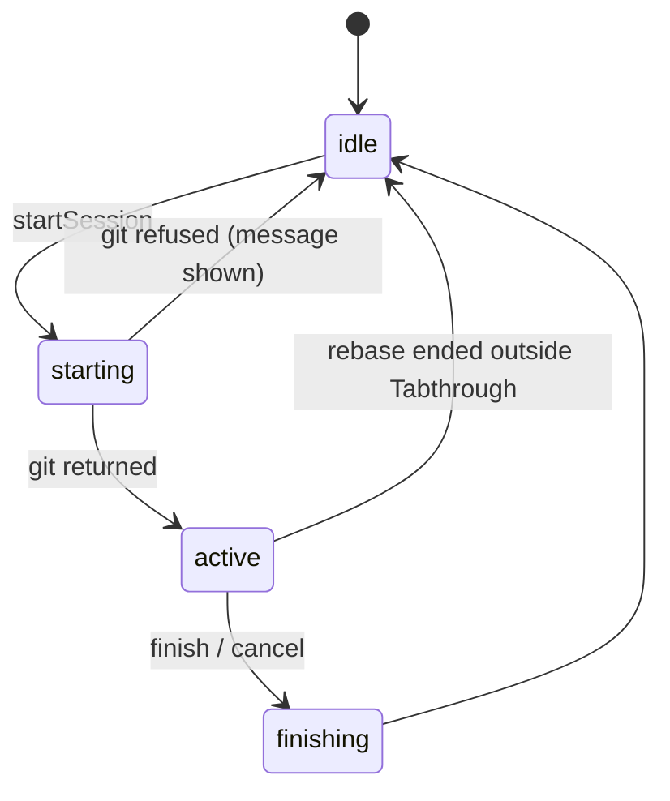

# ADR 0005: Git-first sessions — read-only, rebase, worktree

**Status:** Accepted (PO 2026-09-10)  
**Date:** 2026-09-10  
**Deciders:** Product Owner, Architect  
**Consulted:** ADR 0002 D1/D3/D4/D5, ADR 0004, overview §3.5 / §7, `src/git/*`, `src/model/session.ts`  
**Supersedes:** [ADR 0002](0002-architecture.md) D3 (journal), D4 (uniform stash), D5 (repo lock) · [ADR 0004](0004-apply-mode.md) D3–D6 (apply isolation, Tab write engine, Finish/Cancel)  
**Amends:** [ADR 0001](0001-mvp-scope.md) "stash safety" — the promise becomes "plain git underneath"  
**Keeps:** ADR 0002 D1 (virtual-document reveal), D2 (Reatom model), `.guide.json` v1 (one additive optional field, `defaults.finish`)

---

## Context

Read-only review never reads the working tree: base blobs come from `git cat-file`, the diff from `git diff base after`, the sidecar from the after commit, and the reveal is a pure fold into `tabthrough://` documents. The stash → detach → verify → restore protocol exists for a product stance (ADR 0002 D4: "isolate the workspace, keep the pipeline exercised"), not for rendering. That stance pays for the repository lock, the write-ahead journal, the heartbeat, `verifyRestored`, the `blocked` state, four recovery commands, and about 1,500 lines of git protocol plus 1,700 lines of tests.

Apply mode (ADR 0004) writes one step at a time to real files through a custom 3-way merge, so a language server sees an inconsistent tree until the last Tab, and every failure needs a custom recovery path.

The Product Owner's direction: **git-first**. Each session mode maps to one native git primitive whose state every git tool can see and whose exit every developer already knows. Tabthrough runs plain git commands, shows them before running them, and forwards git's own errors instead of guarding against them. It never holds the user's work in state only Tabthrough understands.

---

## Decision summary

The review view is the same in every mode: the virtual progressive/dim reveal of ADR 0002 D1. Modes differ only in what the working tree holds, which decides whether **Edit here** (D4) can open the real file.

| Mode | Git primitive | Working tree | Edit here | Finish | Cancel |
|------|---------------|--------------|-----------|--------|--------|
| **Read-only** | none (snapshot commit only) | untouched | working-tree entry: yes (disk already equals `after`); commit / range: no, with a hint | delete the snapshot ref | same |
| **Rebase** (commit / range on the current branch) | `git rebase -i --autostash` stopped at `after` | at `after`; linters see the whole change | yes; edits are amended on Finish | `git add -u` · `git commit --amend --no-edit` · `git rebase --continue` | `git rebase --abort` |
| **Worktree** | `git worktree add --detach` | main checkout untouched; new window on the worktree | yes, in the new window | close the window | `git worktree remove` |

Removed everywhere: the lock ref, the journal and `globalState` token, the heartbeat, `verifyRestored`, the status digest, the backup ref, `stash.ts`, the `blocked` state, the pre-flight modal, and the commands Restore from Backup, Dismiss Pending Restore, Clear Leftover Lock, Clean Up Backups.

---

## D1 — Read-only touches nothing

**Decision.** For a commit or range, start reads and never writes. For the working-tree entry, the temp-index snapshot (ADR 0002 D3 step 1) still produces the immutable `after` commit, parented at `HEAD`, pinned at `refs/tabthrough/after/<id>` so `gc` cannot collect it mid-review. Finish and Cancel delete that ref. Activation deletes any `refs/tabthrough/after/*` whose commit is older than 24 hours.

**Consequences.** No stash, no checkout, no lock, no modal. Several windows can review the same repository. The review is a snapshot: edits made during a working-tree review are not reflected until the user starts again. Navigation into files outside the diff shows the current tree, not `after` — the Worktree mode exists for readers who want the whole tree at `after`.

**Alternatives considered.** *No ref, rely on `gc.pruneExpire`.* Rejected: one `git gc --prune=now` breaks a review for the cost of one `update-ref`.

---

## D2 — Rebase mode is a stopped interactive rebase

**Applicability.** A commit / range whose `after` is an ancestor of `HEAD` (`git merge-base --is-ancestor <after> HEAD`). For anything else the sidebar says so and points at Worktree mode: rebase cannot put the working tree at a commit that is not on the current branch, and cherry-picking it onto the branch is not a review. The working-tree entry is not offered in this mode — its changes are already on disk, so Read-only gives the same result without a rebase.

**Start.**

```
git rebase -i --autostash --no-verify --no-gpg-sign <base>
```

`--no-verify` and `--no-gpg-sign` follow the hooks / signing policy below and are omitted when it is switched on. `GIT_SEQUENCE_EDITOR` points at a bundled script (run through the extension host with `ELECTRON_RUN_AS_NODE`, the same technique VS Code's git extension uses for askpass) that rewrites one todo line: the entry for `<after>` becomes `edit`; everything else stays `pick`. Git parks uncommitted tracked changes in the autostash, fast-forwards to `after`, and stops. The working tree is exactly `after`, so type checkers, linters and tests see the complete change, and the user can fix things while reading.

**View.** Unchanged: the virtual reveal pair. The tree at `after` exists for tooling and for Edit here (D4), not for rendering.

**Navigation is local.** The cursor lives in the Reatom model of the window that started the session and is not persisted. A window reload ends the review; the rebase itself remains as an ordinary git rebase the user can continue or abort.

**Finish.**

```
git add -u
git commit --amend --no-edit --no-verify --no-gpg-sign     # only when something is staged
git rebase --continue
```

Fixes are folded into `after`; commits above it replay. New untracked files are listed in the Finish confirmation and staged only if the user ticks them: `--autostash` leaves pre-existing untracked files on disk, so an unconditional `add -A` would sweep them into the commit. A replay conflict stops the rebase exactly as git does; the sidebar shows the conflicted paths and a Continue button that runs `git rebase --continue` and forwards whatever git says.

**Cancel.** `git rebase --abort`. Git restores `HEAD` and pops the autostash.

**Errors.** Forwarded verbatim: `pre-rebase` refusals, "rebase already in progress", "Applying autostash resulted in conflicts". Tabthrough does not retry, resolve, or clean up on the user's behalf.

**Hooks and signing.** Off by default: the rebase starts with `--no-verify --no-gpg-sign` (skips `pre-rebase`, leaves replayed commits unsigned) and the amend uses the same flags (skips `pre-commit` / `commit-msg`). Two settings turn them back on: `tabthrough.finish.hooks` and `tabthrough.finish.sign`, both `false`. A guide overrides the settings for its own review through `defaults.finish: { "hooks"?: boolean, "sign"?: boolean }` — an additive optional field on schema v1, so a guide that pins the review of a signed branch can ask for signatures without touching the user's config. Resolution: guide → setting → default. When hooks or signing are on and fail, the notification shows git's output and offers a single retry with the bypass flags. Because `commit.gpgsign=true` combined with the default means the rewritten commits above `after` lose their signatures, the Start line says so when both hold.

**Consequences.**

- Positive: the 3-way merge engine, conflict-marker scanning, `applied` checkpoints, and the `blocked` restore state are deleted. Renames, mode changes and binaries stop being refusals because nothing is written per step. Ranges are supported. Crash recovery is `git status`. Previous works as in read-only, since the reveal is virtual.
- Negative: two windows on one repository see the same rebase and either may abort it, exactly as two terminals would. Commits above `after` are rewritten, and unsigned unless `finish.sign` is on. With signing on, a headless GPG prompt fails and is reported.

**Why `--autostash` and not an explicit stash.** The earlier objection was for a design that replayed synthesized step commits, where the popped WIP collided with the walked change. With the working tree at `after` and fixes amended before `--continue`, the autostash pops onto a committed tree. Collisions are ordinary stash conflicts, git keeps the entry and says where it is, and the sidebar shows it (D5).

---

## D3 — Worktree mode is a detached worktree in a new window

**Start.**

```
git commit-tree <afterTree> -p <base> -m "tabthrough <target>"      # one squashed commit
git worktree add --detach <dir> <that commit>
```

Every worktree `HEAD` is one commit whose parent is `base` and whose tree is `after`, so the new window can review `HEAD^..HEAD` for any entry kind without carrying the range across processes. For the working-tree entry the snapshot already has that shape and includes untracked files. The worktree `HEAD` protects the commit from `gc`; no ref is needed.

`<dir>` = `<tabthrough.worktree.dir>/<repo-hash>/<id>`, default `os.tmpdir()/tabthrough`. The setting exists for users who prefer `~/.cache/tabthrough/worktrees`.

Tabthrough then calls `vscode.openFolder(<dir>, { forceNewWindow: true })`. Activating inside a directory under the configured worktree root, the sidebar preselects **Review HEAD^..HEAD** in read-only mode.

**Finish.** Close the window. **Cancel / cleanup.** `git worktree remove <dir>` without `--force`: git refuses when the worktree has modifications, and that refusal is the only safety check. `git worktree prune` runs on activation; it removes only entries whose directories are already gone.

**Consequences.** Full checkout cost per session; no `node_modules`, `.env`, or build output, so language tooling in the worktree is partial. Submodules and LFS behave as they do in any linked worktree. `post-checkout` hooks run.

---

## D4 — The review stays read-only; Edit here is the one escape hatch

**Decision.** The reveal pair is the only navigation surface in every mode. It already expresses what a `.guide.json` needs: a step is `path + groups`, a file may carry any number of groups across any number of steps in any order, and the reveal document of a file is the base text plus the groups of every step up to the cursor, with the current step's ranges highlighted. Reading a real file instead would lose this — all lines are present, and order could only be shown by highlighting.

**Edit here** (sidebar button and a chord) opens the real file beside the review, selection on the current step's ranges. It is enabled when the disk holds `after`: the working-tree entry in Read-only, every Rebase session, and the new window of a Worktree session. For a commit or range in Read-only it is disabled with the hint to start in Rebase or Worktree mode.

**Projection.** The ranges of the current step's groups in the full after text come from `renderReveal(base, file, file.groups).groupRanges`. At start the disk equals `after`, so they are exact. After edits they drift; the projection re-anchors by matching the text of the group's added lines and falls back to the nearest line. A pure-deletion step opens the file at the position the removed lines occupied.

**Snapshot semantics.** The review keeps showing the change as it was submitted. Edits live on disk on top of it; in Rebase mode Finish amends them into `after`. Files whose disk content no longer matches the after blob get an "edited on disk" mark in the sidebar. Next and Previous return focus to the review editor, so a detour into the file always ends where it began.

**Alternatives considered.** *A writable `FileSystemProvider` for the reveal document that writes through to the real file.* Rejected: mapping an edit of a document with absent lines back onto the file is the 3-way merge this ADR removes. *The real file as the right side of the diff.* Rejected for the reasons above; it remains available to the user through Edit here.

---

## D5 — Git state the extension shows, and what it manages

Refreshed on `gitWatchToken` from `git status --porcelain=v2 --branch`, `git rev-parse --git-path`, `git stash list`, and `git worktree list --porcelain`.

| State | Detection | Sidebar | Buttons (each runs the named git command and forwards output) |
|-------|-----------|---------|-------------|
| Rebase in progress | `rebase-merge/` or `rebase-apply/`; `head-name`, `onto`, `stopped-sha`, `done`, `git-rebase-todo`, `autostash` | "Rebasing `<branch>` · stopped at `<sha>` · n of m" | Continue · Abort · Open Source Control |
| Merge / cherry-pick / revert / bisect | `MERGE_HEAD`, `CHERRY_PICK_HEAD`, `REVERT_HEAD`, `BISECT_LOG` | one line | Open Source Control |
| Conflicts | porcelain `u` entries | paths | Open file · Continue |
| Autostash left by a rebase | `stash list` subject ending in `autostash` | "A rebase left your changes in `stash@{n}`" | Pop · Show |
| Tabthrough worktrees | `worktree list --porcelain` under the configured root | path · target · dirty? | Open · Remove · Prune |
| Dirty tree | porcelain counts | "n staged · m unstaged · k untracked"; the Rebase start line adds "autostash will park m files" | — |
| Detached HEAD | `symbolic-ref` fails | in the summary line | — |
| Snapshot refs | `for-each-ref refs/tabthrough/after` | count in details | swept on activation (D1) |
| Not a repository, bare, unborn, shallow with missing parents, old git, untrusted workspace | existing probe | Start disabled with the reason | — |

Managed by the extension: the snapshot ref (D1), the rebase it started (D2), the worktrees under its root (D3). Displayed but never touched automatically: stashes, other people's rebases, conflicts, detached `HEAD`. Never run: `reset --hard`, `clean`, `checkout -f`, `stash drop`, `worktree remove --force`.

**Session ownership.** A rebase-mode session is "ours" while `rebase-merge/stopped-sha` equals `after` and `orig-head` equals the `HEAD` recorded at start. When that stops being true — the user continued or aborted in a terminal — the review closes with one notice and the banner keeps showing git's state.

---

## D6 — Show the command, drop the modal

The pre-flight modal is replaced by a line under the Start button that names what will run — `git rebase -i --autostash 3f2a1c…`, `git worktree add --detach /tmp/tabthrough/… 9b0d…`, or "nothing" for read-only — and the same command is echoed with its stdout/stderr to the output channel. Confirmation is the Start click.

---

## D7 — Model and bridge



`session.status` shrinks to four states. `gitState` is a new `withAsyncData` computed feeding D5. `ports.store` and `ports.clock.now` disappear; `ports.ui` gains `openFolder` and `openFileAt`. `src/git/` keeps `exec`, `probe`, `diff`, `log`, `snapshot` (snapshot only), `refs` (read/write/delete only), `types`; gains `rebase.ts`, `worktree.ts`, `state.ts`; loses `stash.ts`, `journal.ts`, `apply.ts`, and most of `isolate.ts`.

---

## Documentation and code migration

| Artifact | Change | When |
|----------|--------|------|
| This ADR | Accepted once the PO signs off | before code |
| `package.json` | `session.mode` enum `ask · readonly · rebase · worktree`; drop `stash.includeUntracked`; add `worktree.dir`, `finish.hooks`, `finish.sign`; command list; `untrustedWorkspaces` / `virtualWorkspaces` descriptions; Edit here chord | with each phase |
| `schema/guide-v1.json`, `architecture/guide-schema.md`, `test/unit/published-schema.test.ts` | additive optional `defaults.finish { hooks?, sign? }`; `$id` unchanged | Phase 13 |
| `README.md` | "Review or apply" → three-mode table; "Designed to restore your workspace exactly" → "Plain git underneath" listing the exact commands and exits; commands, settings, limitations tables | when the phase ships, never ahead of it |
| `architecture/overview.md` | §3.5 rewritten around the three primitives; §3.5.3–3.5.5, §4.4, §10.2 deleted; §4, §5.1, §7.3, §8 updated | per phase |
| `architecture/reatom-model.md` | state machine, remove recovery atoms, add `gitState`, cancellation table | per phase |
| `specs/product.md` | modes, edge table rows for stash → rows for rebase/worktree, promise wording | with this ADR's acceptance |
| `progress/plan.md`, `backlog.md`, `test-matrix.md` | Phases 12–14 (P0-N2 read-only + git state + deletions, P0-N3 rebase, P0-N4 worktree); retire stash-roundtrip and crash-matrix in Phase 12 | done 2026-09-10 |
| Skills (`.agents`, `.cursor`, `res/skill`) | mode names; sidecar-in-after-commit rationale no longer mentions stash | with P0-G1 |
| `guides/*.md`, `architecture/guide-schema.md` | same wording fix | with P0-G1 |
| `marketing/branding-brief.md`, `launch.md` | trust-section slogan; listing screenshot 3 caption; Marketplace one-liner | last |
| Tests | delete `stash-roundtrip`, `crash-matrix`, `launch-safety`, `apply-step`, `apply-commit`; add `rebase-driver`, `worktree`, `git-state` | per phase |

---

## Open questions

1. Cherry-pick review of commits not on the current branch: out of scope, or a later "Rebase onto HEAD" option?
2. Chord for Edit here (`Alt+Enter` while the review editor is focused?), and whether it opens beside or replaces the review editor.
