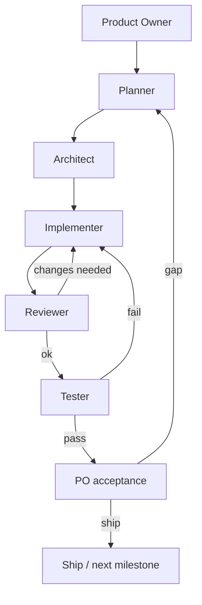

# Tabthrough — Agent Team Process

**Orchestrator:** Cloud agent (this run)  
**Source of truth:** Everything under `work-docs/` — sync after every role turn.

## Roles

| Role | Doc | Strong model? | Duty |
|------|-----|---------------|------|
| Product Owner | [roles/product-owner.md](../roles/product-owner.md) | Yes | Scope, priorities, UX principles, acceptance |
| Planner | [roles/planner.md](../roles/planner.md) | Yes | Milestones, task breakdown, risks |
| Architect | [roles/architect.md](../roles/architect.md) | Yes | Reatom model, git/safety, guide schema, module map |
| Implementer | [roles/implementer.md](../roles/implementer.md) | Medium | Code against architecture + backlog |
| Reviewer | [roles/reviewer.md](../roles/reviewer.md) | Yes | Reatom-review + product fit + safety |
| Tester | [roles/tester.md](../roles/tester.md) | Medium | Fixtures, edge matrix, CI green |

## Loop

## Sync rules

1. Before starting a role turn: read `progress/iteration-log.md` + relevant specs.
2. After finishing: append iteration-log, update backlog status, write/update decisions or architecture docs.
3. Never leave decisions only in chat — persist in `work-docs/`.
4. Reatom skills live in `.agents/skills/` and `.cursor/skills/` — implementers must load `reatom` (+ `reatom-async` / `reatom-review` as needed).

## Current milestone

**v0.1 MVP (closing)** — stash-safe Tab reveal + heuristic/sidecar; manual drills remain (see `specs/product.md`, ADR 0001).

**v0.2 (stopped)** — apply-with-user track (P0-A3…A6) superseded before ship; guide-quality track (P0-G1–G3) **Done**.

**Next (v0.3 — git-first)** — [ADR 0005](../decisions/0005-git-first-sessions.md) accepted. Phase 12 (P0-N2) **landed**: snapshot read-only, git-state sidebar, isolation deleted. **Next: Implementer P0-N3 (Phase 13, rebase mode).**
