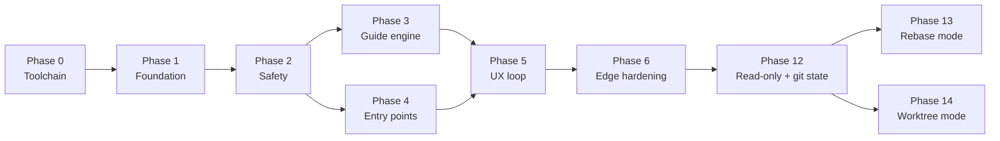

# Tabthrough — Implementation Plan (v0.1 MVP + v0.2 Apply + v0.3 Git-first)

**Owner:** Planner
**Status:** v0.1 Phases 0–6 landed in code; v0.2 Phases 7–10 **superseded by ADR 0005**; **v0.3 Phases 12–14 sequenced** (P0-N2…N4)
**Last updated:** 2026-09-10
**Scope source of truth:** [ADR 0001](../decisions/0001-mvp-scope.md) · [ADR 0005](../decisions/0005-git-first-sessions.md) · [specs/product.md](../specs/product.md) · [backlog.md](./backlog.md)

> Phases 0–6 sequence **v0.1 P0**. Phases 7–10 sequenced **v0.2 apply** against ADR 0004 and stop where they are: ADR 0005 replaces isolation, apply and recovery with three git-native modes, and Phase 12 deletes that code in the same slice as the new start path. Phases 12–14 sequence **v0.3 git-first** (P0-N2…N4). Guide skill track (P0-G*) is parallel and not owned here. There are no users yet — no aliases, no one-release restore, no delayed deletion.

---

## Sequencing principle



Safety (Phase 2) precedes everything user-visible in v0.1. **v0.3:** Phase 12 is the critical path — it deletes the isolation protocol and lands snapshot read-only plus the git-state sidebar. 13 and 14 may interleave after 12. README updates when a phase ships, never ahead of it.

---

## Phase 0 — Toolchain foundation

**Backlog IDs:** none (prerequisite). **Depends on:** nothing.

The template is unmodified and currently does not typecheck: `src/config.ts` and `src/utils.ts` import `./generated/meta`, which does not exist until `vscode-ext-gen` runs. Reatom is not a dependency yet. Fix this before writing feature code so every later phase has a working gate.

### Tasks

| # | Task | Detail |
|---|------|--------|
| 0-a | Install deps | `pnpm install` (no `node_modules` in a fresh clone) |
| 0-b | Add Reatom | `@reatom/core` v1001. Put it in `devDependencies` to match the template: `ext:package` runs `vsce package --no-dependencies` and tsdown bundles everything except `vscode` |
| 0-c | Extension identity | `package.json`: `publisher`, `name: tabthrough`, `displayName`, `description`, `categories: ["Other", "SCM Providers", "Education"]`, `repository`. Add config scope `tabthrough` with the settings listed in [Configuration surface](#configuration-surface) |
| 0-d | Generate meta | `pnpm update` → `src/generated/meta.ts`. Confirm `.gitignore` treatment matches template intent |
| 0-e | Test runner | `vitest.config.ts` with `environment: 'node'`, `include: ['test/**/*.test.ts']`, and a longer `testTimeout` for the git integration suite. Add `"test:ci": "vitest run"` so local `pnpm test` can stay in watch mode without ambiguity |
| 0-f | CI | Existing `.github/workflows/ci.yml` already runs lint + typecheck + test on ubuntu/windows/macos. Leave the matrix intact — it is the mitigation for [R7](#r7--git-version--platform-variance) |

### Exit criteria

- [ ] `pnpm install && pnpm lint && pnpm typecheck && pnpm test:ci` green on a clean clone
- [ ] F5 (`Extension` launch config) starts an extension host that activates without error
- [ ] `@reatom/core` imports and a trivial `atom` round-trips in a vitest test

### Test gate

`test/unit/toolchain.test.ts` — one test that creates a Reatom scope, sets an atom, reads it back. Proves the dependency and the runner work before anyone depends on them.

---

## Phase 1 — Foundation: git probe + Reatom session model

**Backlog IDs:** P0-1, P0-8. **Depends on:** Phase 0.

Two independent workstreams that can be done in either order or in parallel by one implementer. They meet at the end of the phase when the probe result lands in the model.

### P0-1 — Git capability probe

A single async probe returning a **discriminated result**, never a thrown string:

```
ok:    { ok: true,  repoRoot, headSha, headRef | null, detached, shallow, dirty, gitVersion }
fail:  { ok: false, reason: 'git-missing' | 'not-a-repo' | 'bare-repo' | 'shallow-missing-objects'
                          | 'unborn-head' | 'rebase-or-merge-in-progress' | 'git-too-old',
         message, hint? }
```

- All git access goes through one `exec` wrapper: `spawn` (never `shell: true`), explicit `cwd`, arg array, timeout, captured stdout/stderr, non-zero exit surfaced as a typed error. The wrapper is **injectable** so unit tests can feed recorded outputs.
- `rebase-or-merge-in-progress` is a P2 "refuse start" row in the product edge table — detect it here, do not implement recovery.
- The probe drives a VS Code context key (`tabthrough.gitUsable`) so command `enablement` in `package.json` disables Start with an explanation, per the P0 edge row "Git not a repo / no git".

### P0-8 — Reatom session model

Single source of truth. Everything else in the extension reads it; nothing keeps a parallel copy.

- `sessionStatusAtom`: `'idle' | 'preflight' | 'stashing' | 'active' | 'restoring' | 'error'`
- `sessionAtom`: `{ id, repoRoot, entry, targetRev, originalHead, startedAt } | null`
- `stashHandleAtom`: `{ stashSha, backupRef, includedUntracked, fileCount } | null`
- `stepsAtom`: `Step[]` (from the guide engine, Phase 3)
- `cursorAtom`: `number` (index of last revealed step; `-1` = nothing revealed)
- `currentStep`, `revealedSteps`, `progressLabel`, `canAdvance`, `canRetreat` — all `computed`
- Git mutations are `action(async () => …).extend(withAsync())`; every subprocess boundary is `await wrap(...)`
- **[ARCH]** Scope ownership: who creates the Reatom scope relative to `defineExtension`, and how `deactivate` drains a pending restore. See [R6](#r6--async-restore-during-deactivate).

### Exit criteria

- [ ] Probe returns a correct discriminated result for: valid repo, non-repo directory, repo with no commits, shallow clone
- [ ] Start command is visibly disabled with a reason when the probe fails
- [ ] Session status transitions are centralised in one action; illegal transitions (e.g. `active → stashing`) are rejected, not silently applied
- [ ] No module outside `src/ui/` and `src/commands/` imports `vscode`

### Test gate

| Test | Type |
|------|------|
| Probe parses recorded `rev-parse` / `status` outputs into each result variant | unit, injected exec |
| Probe against a real temp repo and a real non-repo temp dir | integration |
| Session transition table: legal + illegal pairs | unit |
| Lint rule or test asserting the `vscode` import boundary | unit |

---

## Phase 2 — Safety: stash pipeline, restore, session lock

**Backlog IDs:** P0-5, P0-6, P0-7. **Depends on:** Phase 1.

The highest-risk phase and the one non-negotiable in ADR 0001. Gate it hardest.

### P0-5 — Stash pipeline

Order of operations matters and is itself the safety property:

1. Probe → refuse if unusable.
2. Compute the pre-flight summary: file list split into staged / unstaged / untracked, with counts.
3. Show pre-flight UI. **Cancel is the default action.** State exactly what will be stashed and how to abort.
4. Write the **durable recovery token** to `globalState` *before* any mutation.
5. `git stash push --include-untracked -m "tabthrough:<sessionId>"`.
   - **Never `--all`.** `--all` sweeps ignored files (`node_modules`, `.env`, build output) — slow, and a restore failure there is catastrophic. See [R8](#r8--untracked--ignored-scope-in-stash).
6. Resolve the stash commit SHA and pin it with `git update-ref refs/tabthrough/backup/<sessionId> <sha>`. The ref is what makes the work survive a `git stash drop` or `git stash clear` by the user or another tool.
7. Update the token with `stashSha` + `backupRef`, then enter the target revision.

If any step fails, unwind the ones already done and refuse to start. A failed start must leave the tree exactly as found.

### P0-6 — Restore on all exit paths

| Exit path | Behaviour |
|-----------|-----------|
| Finish | Full restore, verify, drop stash, delete backup ref, clear token |
| Cancel | Identical to Finish — cancel is not a "discard" |
| `deactivate()` | Best-effort restore; token guarantees completion on next activation |
| Window close / crash | Nothing at the time; next activation sees the token and offers **Resume restore** *before any other git operation* |
| Recovery command | `Tabthrough: Restore from backup` works standalone, even with no session |

Restore algorithm: **apply → verify → then drop.** Use `git stash apply`, never `pop` (pop drops on partial success). Verify by comparing `git status --porcelain=v2 -z` and content hashes against the pre-stash snapshot. Only on a verified match do we `stash drop` and delete the backup ref.

On conflict: **never force, never `checkout -f`, never `clean`.** Keep the backup ref, keep the stash entry, put the user in front of the 3-way merge UI, and show the exact `git` command to recover manually. Clear the token only when the user explicitly dismisses.

### P0-7 — Single-session lock

`sessionStatusAtom !== 'idle'` blocks a second Start with a toast. Also guard per-`repoRoot` so two windows on the same repo cannot both stash — a repo-level lock (backup ref existence or a lock file under `.git/`) is the real protection; the atom only covers one window. **[ARCH]** pick the mechanism.

### Exit criteria

- [ ] Round-trip is byte-identical across the fixture matrix below
- [ ] Every one of the five exit paths restores or defers safely
- [ ] Stash-apply conflict produces zero data loss and a surviving backup ref
- [ ] Second Start attempt is blocked with a clear message, in the same window and across two windows on one repo
- [ ] `progress/test-matrix.md` documents the manual crash drill

### Test gate — the sacred suite

`test/integration/stash-roundtrip.test.ts`, running against **real temp git repos** built by `test/helpers/tmp-repo.ts`:

| Fixture repo state | Assert |
|--------------------|--------|
| Clean tree | No stash created; start proceeds without touching anything |
| Unstaged edits only | Byte-identical restore |
| Staged + unstaged edits to the same file | Both hunks restored **and** the index state restored |
| Untracked files present | Restored, still untracked |
| File mode change (`chmod +x`) | Mode preserved (skip on Windows) |
| CRLF / mixed line endings | No normalisation drift |
| Deleted-but-not-staged file | Still deleted after restore |
| Apply conflict (target rev touches a stashed file) | Error surfaced, backup ref present, no content lost |

Comparison is `git status --porcelain=v2 -z` plus a SHA-256 of every tracked and untracked file, before vs after.

**This suite is a merge blocker for every subsequent phase.**

---

## Phase 3 — Guide engine (pure, offline)

**Backlog IDs:** P0-9, P0-10, P0-15. **Depends on:** Phase 2 merged (not technically, but to keep review attention ordered). Parallel with Phase 4.

Everything in this phase is **pure functions over strings** — no `vscode`, no subprocess, no I/O except the sidecar read, which is injected. That makes it the cheapest phase to test exhaustively and the safest to parallelise.

### P0-9 — Diff → step graph

Unified diff text → structured model:

- `DiffFile`: `path`, `oldPath`, `status` (`added|modified|deleted|renamed|binary|mode-only`), `hunks[]`
- `DiffHunk`: `oldStart/oldLines/newStart/newLines`, `header`, `lines[]` typed `add|del|context`
- `LineGroup`: contiguous runs of `add`/`del` separated by context, so a hunk can be revealed in pieces

Must handle: `\ No newline at end of file`, `Binary files … differ`, rename headers (`similarity index` / `rename from|to`), mode-only changes, empty hunks, and diffs with no trailing newline.

### P0-10 — Heuristic orderer

Pure, **deterministic**, stable-sorted (ties broken by path then hunk index so fixtures never flake). Three tiers, each contributing a score:

1. **File tier** — by extension and path segment: types/schema/interfaces/migrations/config → core/lib/domain → services/api → UI/components → tests → docs, generated files, lockfiles.
2. **Hunk significance** — new exported symbol > signature change > logic change > import/rename churn > whitespace-only.
3. **Intra-hunk line groups** — file order within the hunk.

Every emitted `Step` carries a one-line `rationale` naming the rule that fired ("types before callers", "new export before its call sites"). P0-13's status bar consumes this directly, so it is not optional decoration — it is part of the data model.

Binary and generated files emit a **visible skipped stub step** so the ordering and the `k/n` count stay honest, per the P0 edge row.

### P0-15 — Sidecar `.guide.json` read (minimal)

- Read from repo root; path overridable by setting.
- Validate against the shape the Architect freezes in `architecture/guide-schema.md`. Validation is hand-rolled and total — no schema library dependency for MVP.
- **Valid** → override order for the hunks it references; hunks it does not reference are appended in heuristic order.
- **Invalid or unparseable** → one warning, full heuristic fallback. Never a hard failure.
- **Explicitly out of MVP:** partial/stale merge semantics (that is P1-3) and any write path.

**Blocked on:** `architecture/guide-schema.md` from the Architect (parallel track C). Implementer should not invent the shape.

### Exit criteria

- [ ] Parser handles every fixture in `test/fixtures/diffs/` including the four awkward cases above
- [ ] Foundation-before-consumer fixture orders `types.ts` → `service.ts` → `Component.tsx` → `service.test.ts`
- [ ] Ordering is stable across repeated runs on the same input
- [ ] A binary file in the diff yields a skipped stub without breaking `k/n`
- [ ] A valid `.guide.json` fixture changes the order of at least one step (ADR gate 5)
- [ ] An invalid `.guide.json` fixture falls back with exactly one warning

### Test gate

Pure vitest, no VS Code host, no temp repos. Snapshot tests over checked-in `.diff` fixtures; explicit assertion tests (not snapshots) for the ordering rules, so a fixture refresh cannot silently accept a regression.

---

## Phase 4 — Session entry points

**Backlog IDs:** P0-2, P0-3, P0-4. **Depends on:** Phase 1 (probe). Parallel with Phase 3.

Each entry point resolves to the same thing: a target revision plus a unified diff string that Phase 3 consumes. Keep the interface that narrow.

| ID | Entry | Command | Notes |
|----|-------|---------|-------|
| P0-2 | Working tree | `git diff HEAD` | Covers staged + unstaged in one pass. Untracked files are included only if they were in stash scope — keep the two consistent or the reveal will show content the restore does not cover |
| P0-3 | Single commit | `git diff <sha>~1 <sha>` | Root commit → diff against the empty tree. Merge commit → `--first-parent` and say so in the pre-flight |
| P0-4 | Commit range | `git merge-base A B` then `git diff <base> B` | Accept `A..B` as user input, resolve through merge-base so ancestor noise is excluded. Document the three-dot semantics in the command description so the behaviour is not a surprise |

Empty or whitespace-only diff (`git diff -w` returns nothing) **blocks start** with a clear message, per the P0 edge row.

### Exit criteria

- [x] All three entries produce a step list on scripted fixture repos
- [x] Range output matches `git diff $(git merge-base A B) B` textually
- [x] Root commit and merge commit both produce sensible output rather than an error
- [x] Empty and whitespace-only diffs are blocked, not started

### Test gate

`test/integration/entry-points.test.ts` on scripted repos: linear history, a branch with a merge, a root commit, an empty-diff repo, a whitespace-only change.

---

## Phase 5 — UX loop: Tab, reveal, status bar, commands

**Backlog IDs:** P0-11, P0-12, P0-13, P0-14. **Depends on:** Phases 3 and 4.

### Prerequisite spike (do this before committing to P0-12)

> **Resolved without a spike.** The Architect's built-document design (overview §7.1, ADR 0002 D1) sidesteps the whole comparison: unrevealed lines are *absent* from a virtual document rather than hidden in a real one, so no API needs to delete lines. `progressive` shipped as the default and `dim` as a fold over the same `LineGroup` data, sharing the provider and the URIs. The table below is kept as the record of what was rejected.

VS Code decorations **cannot delete lines**. There is no supported "hide these ranges" API. The three candidate reveal mechanisms have materially different risk:

| Option | How | Risk |
|--------|-----|------|
| **Dim** (recommended default) | Read-only virtual document holding the target revision; unrevealed ranges get a low-opacity `TextEditorDecorationType` | Content is technically visible if the user squints or copies. Honest, simple, fully reversible |
| **Fold** | Programmatic folding of unrevealed ranges | Fights user folding; folding API is coarse |
| **Staged apply** | Write revealed hunks into real files progressively | Couples reveal to the working tree — exactly what the stash pipeline is trying to keep clean. Highest risk |

Spike output: a short recommendation appended to `architecture/overview.md`. **Default to dim** unless the spike shows fold is clean. Expose `tabthrough.reveal.mode` so the choice is not permanent.

### P0-12 — Reveal rendering

Render into a **read-only virtual document** (`TextDocumentContentProvider`, scheme `tabthrough:`) holding the target-revision content. This buys three things at once:

- The working tree is never written to during reveal, so stash safety is independent of rendering.
- Read-only means Tab has no competing indent/completion/snippet semantics in that editor — the single biggest mitigation for [R1](#r1--tab-keybinding-conflicts).
- Reveal is a pure function of `cursorAtom`, so Shift+Tab is trivially correct.

Prior steps stay visible: revealed set is `steps[0..cursor]`, monotonic on advance.

### P0-11 — Tab / Shift+Tab

Recommended `when` clause shape (**[ARCH]** to finalise):

```
tabthrough.sessionActive && editorTextFocus && resourceScheme == 'tabthrough'
  && !suggestWidgetVisible && !inlineSuggestionVisible && !inSnippetMode
  && !editorHasSelection && !editorReadonly
```

Always ship an **alternate chord** (`alt+]` / `alt+[`) bound unconditionally, plus a `tabthrough.keybinding.useTab` setting to switch Tab off entirely. If the conflict matrix cannot be made clean, the fallback position is to make the alternate chord the default and Tab opt-in — that is a UX downgrade, not a scope change.

### P0-13 — Status bar

`$(book) Step k/n · service.ts · types before callers`. Driven by `computed` values so it updates synchronously with the model, never by imperative refresh calls. Rationale suppressed when `tabthrough.showRationale` is false. Clicking jumps to the current step.

### P0-14 — Commands

`tabthrough.start`, `.startFromCommit`, `.startFromRange`, `.next`, `.previous`, `.finish`, `.cancel`, `.restoreBackup`. All registered in `contributes.commands` with `enablement` clauses driven by the same context keys, so the palette never offers an action that will fail.

### UX guardrails (PO checklist, verified this phase)

No score, no timer, no streak, no "did you get it?" gate, no red/green judgment on pace. Tab past the last step is a **no-op** plus a subtle "Review complete" toast offering Finish.

### Exit criteria

- [x] Tab advances through ≥10 steps with monotonic visibility on a sample diff (ADR gate) — `reveal-loop.test.ts`, three modules, twelve-odd steps, driven by `next()`
- [x] Shift+Tab retreats without corrupting the revealed set — the previous document is restored byte for byte, not undone
- [x] Tab at the end no-ops and offers Finish — the no-op is asserted in the model; the toast itself is bridge code with no host test
- [ ] Tab in a normal editor with a session active still does normal Tab things — **needs a keyboard**, runbook at `test-matrix.md` §6.4
- [x] Status bar `k/n` matches the model at every step — it is a computed over the same cursor, so there is no path by which it can disagree
- [ ] Time-to-first-reveal <3s on a 500-line diff (product metric) — **unmeasured**, runbook at `test-matrix.md` §6.5
- [x] PO UX checklist: zero exam-like elements — no score, timer, streak, or comprehension gate anywhere in the surface

### Test gate

| Test | Type |
|------|------|
| Advance / retreat / clamp at both ends | unit, model-level |
| Reveal set is a pure function of cursor | unit |
| Status bar label composition incl. rationale toggle | unit |
| Keybinding conflict matrix: IntelliSense open, inline suggestion, snippet mode, selection active, terminal focus, normal editor focus | **manual runbook** in `progress/test-matrix.md` |
| Time-to-first-reveal benchmark | manual |

---

## Phase 6 — Edge hardening + dogfood

**Backlog IDs:** P0-16. **Depends on:** Phases 2–5.

Walk all ten P0 edge rows in `specs/product.md` and give each one a passing test or a written runbook. Most are already covered by earlier phases; this phase closes the gaps and proves it in one place.

| P0 edge case | Covered by | Remaining work |
|--------------|-----------|----------------|
| Dirty tree at start | Phase 2 | — |
| Stash pop conflict | Phase 2 | — |
| VS Code closed mid-session | Phase 2 token | Manual drill (`test-matrix.md` §6.1) |
| Tab with no steps remaining | Phase 5 | — |
| Empty / whitespace-only diff | Phase 4 | — |
| Binary / generated files | Phase 3 stub | ~~End-to-end check~~ — `test/integration/edge-cases.test.ts` |
| Extension crash | Phase 2 backup ref | Manual drill (`test-matrix.md` §6.1) |
| Concurrent sessions | Phase 2 lock | Two-window drill (`test-matrix.md` §6.2) |
| Not a repo / no git | Phase 1 | ~~—~~ model-level gating now asserted too |
| Detached HEAD / shallow | Phase 1 | ~~Shallow-clone fixture~~ — and it found a defect: `test-matrix.md` §2.1 |

Also in this phase: README with a "Known limitations" section covering the P2 rows, marketplace metadata review, and five dogfood sessions.

### Exit criteria — MVP done

- [x] Every P0 edge row has a test or a documented runbook (`progress/test-matrix.md` §2 — all ten rows automated; four also carry a human drill that has not been run)
- [ ] ADR 0001 acceptance gates 1–5 all satisfied
- [ ] Product spec MVP acceptance checklist all ticked
- [ ] Dogfood: 5 sessions, zero restore failures
- [ ] Reviewer sign-off (`progress/reviews/`) with no open blockers
- [ ] PO sign-off

---

## Phase 7 — Apply engine + commit target (P0-A3)

> **Superseded (2026-09-10).** Phases 7–10 are kept as the record of the v0.2 apply work. [ADR 0005](../decisions/0005-git-first-sessions.md) replaces them; no further work lands here, and Phase 12 removes the code they describe.

**Backlog IDs:** P0-A3 (+ P1-13 revert engine, P1-8 drift warn early). **Depends on:** ADR 0004 · Phases 2–5 green in code · v0.1 sacred suite still green. **Owner:** Implementer.

Additive only: read-only `progressive`/`dim` sessions must keep behaving as today. Do not rewrite virtual-doc reveal.

### Tasks

| # | Task | Detail |
|---|------|--------|
| 7-a | Journal / token fields | Additive `mode`, `appliedIndex`, `appliedRef` on `SessionToken` (v stays `1`; readers default missing). Stages: journal `applying` around each Tab/Previous write. |
| 7-b | `src/git/apply.ts` | Intended states from `renderReveal`; fast-path write or 3-way merge; applied checkpoint commit (`refs/tabthrough/applied/<id>`); refuse unmerged paths. No `vscode` import. |
| 7-c | Isolation fork for apply | Capture → stash → checkout **`base`** (commit: `C^`) → `reviewing` with `mode: 'apply'`, `appliedIndex: -1`. Pre-flight discloses disk writes. |
| 7-d | Mode surface | Setting `tabthrough.session.mode`: `ask` \| `readonly` \| `apply` (default `ask`). Chooser when `ask`. `reveal.mode` ignored in apply. |
| 7-e | Async next / prev | Apply: `action` + `withAsync` + `withAbort('first-in-win')`; no abort signal on write path. Status `applying` while in flight. Cursor / `appliedIndex` advance only after successful write + applied-ref bump. |
| 7-f | Shift+Tab revert | Symmetric 3-way toward `intendedPrev`; block on conflict (P1-13 folded here). |
| 7-g | Conflict + drift | Conflict → stop, do not advance; surface explanation. Warn on external drift for paths outside the step (P1-8 early, warn-only). |
| 7-h | Keybinding (file scheme) | Apply uses real editors: ship `Alt+]`/`Alt+[` in apply; optional narrowed Tab when-clause for `resourceScheme == 'file'` + widget guards (overview §7.3). Do not steal Tab globally. |
| 7-i | Cancel still sacred | Apply Cancel = existing restore path; confirm modal when `appliedIndex >= 0`. **Finish-keep is Phase 9** — this phase may leave Finish as restore-or-stub only if needed, but must not ship a Finish that silently restores while claiming “keep.” Prefer: Finish disabled or “not yet” until Phase 9 if keep path is incomplete. |

### Done when

- [x] Commit-entry apply: checkout `C^`; Tab applies steps to real files; user edits preserved or honest conflict
- [x] Shift+Tab reverts last applied step or blocks on conflict
- [x] Cancel restores pre-session byte-identical (sacred suite still green + apply Cancel cases)
- [x] Read-only path unchanged in automated reveal/lifecycle suites
- [x] No silent overwrite on merge conflict

### Test gate

| Gate | Where |
|------|-------|
| 3-way apply / revert / conflict-stop fixtures | unit + integration (`apply-step` suite) |
| Sacred suite still green; apply Cancel after N steps | stash-roundtrip / lifecycle extended |
| Journal `applying` crash leaves recoverable token | crash-matrix stub (full Resume UI in Phase 10) |
| Contributions: file-scheme / chord when-clauses | `contributions.test.ts` + manual §6.4 apply rows |

---

## Phase 8 — Working-tree apply (P0-A4)

**Backlog IDs:** P0-A4. **Depends on:** Phase 7 engine (7-b…7-f). **Owner:** Implementer. **May interleave with Phase 9** after 7’s engine gate.

### Tasks

| # | Task | Detail |
|---|------|--------|
| 8-a | WT isolation | Same capture/stash; apply **always** checks out `base = HEAD` (post-stash clean) even when already at HEAD — empty apply cursor at pedagogical zero (ADR 0004 D3). |
| 8-b | Reapply walk | Same `apply.ts` engine; after-ref is content source; WT is editable projection. |
| 8-c | Abort bar | Cancel after edits → pre-session WIP byte-identical (staged/unstaged via backup). |

### Done when

- [ ] Working-tree apply walk works end-to-end on dirty fixture repos
- [ ] Abort after mid-walk edits restores fingerprint (product P0 v0.2 row “User edits then abort”)
- [ ] Staged/unstaged flatten during walk disclosed; Cancel restores original split

### Test gate

Lifecycle + sacred extensions for WT apply start / Tab / Cancel; fingerprint before vs after Cancel.

---

## Phase 9 — Finish keep + Commit handoff (P0-A5)

**Backlog IDs:** P0-A5. **Depends on:** Phase 7 (applied checkpoint). **Owner:** Implementer. **May interleave with Phase 8.**

### Tasks

| # | Task | Detail |
|---|------|--------|
| 9-a | Finish fork | Readonly Finish unchanged (restore). Apply Finish: save buffers → applied checkpoint → journal `finishing-keep` → carry WT to `headBefore` (no `-f`) → `done-kept` → **do not** stash-apply backup. |
| 9-b | Carry failure | If checkout cannot carry changes: stay detached, keep refs, surface instructions (R-apply-2). |
| 9-c | Commit handoff | `tabthrough.commitHandoff` + Finish offer → SCM / commit UI. Never silent `git commit`. |
| 9-d | Copy / pre-flight | Disclose writes; Finish ≠ Cancel; after Finish, Cancel is no longer the restore path — recovery needs dangerous confirm to overwrite kept tree. |
| 9-e | Cleanup | Refs + `done-kept` token retained until explicit cleanup / Clean up backups. |

### Done when

- [x] Finish keeps tree; Cancel restores; copy never confuses them
- [x] No auto-commit; handoff opens SCM
- [x] `done-kept` leaves after/backup/applied refs until cleanup
- [ ] Product acceptance rows for Finish vs Commit ticked in dogfood checklist

### Test gate

Lifecycle: Finish-keep fingerprint ≠ Cancel; `done-kept` token present; readonly Finish still restores. **Automated** in `apply-commit.test.ts` (Finish-keep vs Cancel + carry failure). Dogfood checklist remains manual.

---

## Phase 10 — Apply crash / mid-edit recovery (P0-A6)

**Backlog IDs:** P0-A6. **Depends on:** Phases 7 and 9 (`applying` + `done-kept`). **Owner:** Implementer.

### Tasks

| # | Task | Detail |
|---|------|--------|
| 10-a | Crash stages | Extend crash matrix: `applying` (partial write vs applied-ref mismatch), `finishing-keep`, `done-kept`. |
| 10-b | Recovery UI | Offer **Restore pre-session** \| **Resume apply** (reset WT to applied checkpoint; cursor = `appliedIndex`) \| **Inspect**. Never silent repair of half-written files. |
| 10-c | Conflict resume | After user resolves conflict in editor, resume apply without skipping ahead. |
| 10-d | done-kept recovery | Not a crash; Start may proceed; cleanup/recovery still available; dangerous confirm to restore pre-session over kept tree. |

### Done when

- [ ] Product P0 v0.2 rows: crash mid-apply, conflict on user-edit, abort after edits — automated or runbook
- [ ] Resume-apply and Restore paths never drop backup without verify
- [ ] Reviewer safety pass on apply write path

### Test gate

Crash-matrix rows for apply stages; recovery protocol tests; manual drill §6.6 (apply crash).

---

## Phase 12 — Read-only + git state; delete isolation (P0-N2)

**Backlog IDs:** P0-N2. **Depends on:** ADR 0005 accepted · Phases 3–5 green. **Owner:** Implementer.

No users yet: delete the stash / journal / apply / lock protocol in this slice. Do not alias `apply`, do not keep a legacy restore.

### Tasks

| # | Task | Detail |
|---|------|--------|
| 12-a | Delete protocol | `src/git/{stash,journal,apply}.ts`, restore / lock / finish-keep paths in `isolate.ts`, `src/ui/{global-state-store,recovery-prompt}.ts`, heartbeat, recovery atoms, `blocked` status, commands Restore from Backup / Dismiss Pending Restore / Clear Leftover Lock / Clean Up Backups, `ports.store`, `ports.clock.now`. |
| 12-b | Snapshot-only start | Read-only `startSession`: working-tree entry → temp-index snapshot → `commit-tree -p HEAD` → `refs/tabthrough/after/<id>`; commit / range → no write. No lock, journal, stash, checkout, heartbeat, or pre-flight. `IsolationHandle` shrinks to `{ baseRev, afterRev, afterRef }`. |
| 12-c | Ref lifecycle | Finish / Cancel delete the after-ref. Activation sweeps `refs/tabthrough/after/*` whose commit is older than 24 h. |
| 12-d | Mode surface | `tabthrough.session.mode` enum becomes `ask · readonly · rebase · worktree`; drop `apply` and `tabthrough.stash.includeUntracked` with no alias. The chooser lists only landed modes until Phases 13 / 14 ship. |
| 12-e | Edit here (working tree) | Sidebar button + chord: open the real file beside the review at the current step's ranges (`renderReveal(base, file, file.groups).groupRanges`); re-anchor by added-line text after edits, nearest line as fallback; pure-deletion steps open at the removed lines' position. Disabled with a hint for commit / range. Sidebar marks files whose disk content differs from the after blob. |
| 12-f | `src/git/state.ts` | One `readGitState(repoRoot)`: rebase (`rebase-merge` / `rebase-apply`: `head-name`, `onto`, `stopped-sha`, `orig-head`, done / todo counts, `autostash`), merge / cherry-pick / revert / bisect markers, porcelain `u` conflicts, dirty counts, detached HEAD, `stash list` entries with subject `autostash`, `worktree list --porcelain` filtered by the Tabthrough root. |
| 12-g | `gitState` atom | `withAsyncData` computed on `gitWatchToken`; replaces `repoLockOwner`, `orphanRefs`, `staleLock`, `sessionLiveElsewhere`. |
| 12-h | Sidebar banner + Start line | ADR 0005 D5 table: one line per state, buttons run the named git command and forward stdout / stderr to the output channel and the notification. Replace the pre-flight modal with "Will run: <command>" (D6). |
| 12-i | Commands | `tabthrough.git.continueRebase`, `abortRebase`, `popAutostash`, `openWorktree`, `removeWorktree`, `pruneWorktrees`; all with `enablement` on `gitState`. |
| 12-j | Docs | README (read-only + "Plain git underneath" for what this phase ships), `architecture/overview.md` §3.5 / §4 / §5.1 / §7.3 / §8 / §10.2, `reatom-model.md`, skills, guides — per the ADR 0005 migration table. |
| 12-k | Tests | Delete `stash-roundtrip`, `crash-matrix`, `launch-safety`, `apply-step`, `apply-commit`; trim `session-lifecycle`; retire test-matrix §3, §4, §6.1–6.3, §9. |

### Done when

- [x] Working-tree, commit and range read-only reviews start and finish with `git status` byte-identical before and after, without a stash entry ever appearing
- [x] Two windows can review the same repository at once
- [x] Edit here opens the right line for a fixture guide with two steps in one file in reverse order
- [x] A rebase started from a terminal shows in the sidebar with working Continue / Abort
- [x] A failed autostash pop shows the stash entry with a Pop button
- [x] Every button's git output appears in the output channel verbatim
- [x] Isolation protocol deleted; leftover `stash` / `lock` hits are display code, lockfile names, or the word "block"
- [x] README describes only shipped behaviour

### Test gate

| Gate | Where |
|------|-------|
| Snapshot ref create / delete / sweep | `test/integration/snapshot-ref.test.ts` (new) |
| Reveal loop and entry points green with no stash calls (`exec` spy asserts no `stash`, `checkout`, `update-ref …/lock`) | `reveal-loop`, `entry-points` (extended) |
| Edit here projection: ordered groups, drift re-anchor, deletion step | `test/unit/edit-here.test.ts` (new) |
| State detection matrix: clean, dirty, rebase stopped, rebase conflict, merge, cherry-pick, autostash left, detached, worktree present | `test/integration/git-state.test.ts` (new) |
| New commands + enablement | `contributions.test.ts` |
| Banner rendering per state | `sidebar-html.test.ts`, `sidebar.test.ts` |
| Isolation / apply / lock suites gone; CI green on three platforms | deleted files + `pnpm test:ci` |

---

## Phase 13 — Rebase mode (P0-N3)

**Backlog IDs:** P0-N3. **Depends on:** Phase 12. **Owner:** Implementer.

### Tasks

| # | Task | Detail |
|---|------|--------|
| 13-a | `src/git/rebase.ts` | `isAncestor(after, HEAD)`; `startRebase({ base, after, hooks, sign })` → `git rebase -i --autostash [--no-verify] [--no-gpg-sign] <base>`; `finishRebase({ hooks, sign, stageUntracked })` → `add -u`, `add -- <ticked>`, `commit --amend --no-edit [flags]` when staged, `rebase --continue`; `abortRebase`; `readOwnership(after, origHead)`. |
| 13-b | Sequence editor | Second build entry `dist/sequence-editor.cjs`; invoked as `ELECTRON_RUN_AS_NODE=1 "<process.execPath>" "<script>" <afterSha>`; rewrites the `pick` / `p` line for `<after>` to `edit`; leaves everything else. |
| 13-c | Hooks / signing policy | Settings `tabthrough.finish.hooks`, `tabthrough.finish.sign` (default `false`). Schema v1 gains optional `defaults.finish { hooks?, sign? }`; `loadSidecar` surfaces it; resolution guide → setting → default. Start line notes "replayed commits will be unsigned" when `commit.gpgsign=true` and `sign` is off. |
| 13-d | Finish confirmation | Lists untracked files with checkboxes (none ticked by default); on hook / signing failure shows git output with one "Retry without hooks / signing" action. |
| 13-e | Ownership watch | `gitState` change → if `rebase-merge` is gone or `stopped-sha ≠ after` or `orig-head ≠ recorded HEAD`, close the review with one notice; banner keeps showing git's state. |
| 13-f | Applicability | Commit / range must satisfy `isAncestor`; otherwise Start is disabled with the Worktree hint. Working-tree entry hides the Rebase option. |
| 13-g | Edit here | Enabled for every rebase session; same projection as 12-e. |

### Done when

- [ ] Reviewing `HEAD~2` on a dirty branch: tree equals `HEAD~2` after Start, WIP is parked, `git status` shows the rebase; Finish amends fixes into `HEAD~2`, replays the two commits, pops the WIP
- [ ] Cancel = `git rebase --abort` returns HEAD and WIP exactly
- [ ] A conflict on replay stops with the conflicted paths in the sidebar; Continue works after manual resolution
- [ ] `git rebase --abort` in a terminal closes the review without touching anything

### Test gate

| Gate | Where |
|------|-------|
| Start / stop at `after`, autostash parked and popped, finish amend + replay, replay conflict, abort, ownership lost, `--no-verify --no-gpg-sign` present by default and absent when enabled, fixture `pre-commit` hook runs only when `hooks: true` | `test/integration/rebase-driver.test.ts` (new) |
| Sequence editor rewrite with full and abbreviated verbs, `rebase.instructionFormat` noise | `test/unit/sequence-editor.test.ts` (new) |
| `defaults.finish` parse + resolution | `schema.test.ts`, `published-schema.test.ts`, `merge.test.ts` |
| Settings + Start line copy | `contributions.test.ts`, `sidebar-html.test.ts` |

---

## Phase 14 — Worktree mode (P0-N4)

**Backlog IDs:** P0-N4. **Depends on:** Phase 12. **Owner:** Implementer.

### Tasks

| # | Task | Detail |
|---|------|--------|
| 14-a | `src/git/worktree.ts` | `squashCommit(base, afterTree, message)`; `add(dir, commit)` → `worktree add --detach`; `list()` filtered by the configured root; `remove(dir)` without `--force`; `prune()`. |
| 14-b | Setting | `tabthrough.worktree.dir` (string, default empty → `os.tmpdir()/tabthrough`); path `<root>/<repo-hash>/<id>`. |
| 14-c | New window | `ports.ui.openFolder(dir, newWindow)`; on activation inside a directory under the root (`--git-common-dir` ≠ `--git-dir`), the sidebar preselects **Review HEAD^..HEAD** in read-only mode. |
| 14-d | Sidebar | Worktree rows from Phase 12 gain Open; `prune` runs on activation. |

### Done when

- [ ] Worktree for a working-tree entry contains the untracked files of the snapshot
- [ ] Worktree HEAD has parent `base` and tree `after` for commit, range and working-tree entries
- [ ] `Remove` on a dirty worktree is refused with git's message; clean worktree is removed

### Test gate

| Gate | Where |
|------|-------|
| add / list / remove-refused / remove / prune; parent and tree assertions per entry kind | `test/integration/worktree.test.ts` (new) |
| Detection of "inside a Tabthrough worktree" | `test/unit/worktree-detect.test.ts` (new) |
| Setting + command contributions | `contributions.test.ts` |

---

## Parallel tracks

These run **beside** the core sequence and never block it.

| Track | Work | Owner | Starts after | Must land before |
|-------|------|-------|--------------|------------------|
| **A — Core** | Phases 0→6 above | Implementer | — | — |
| **B — Fixtures & matrix** | `test/helpers/tmp-repo.ts`, diff fixtures, `progress/test-matrix.md` skeleton | Tester | Phase 0 | Phase 2 needs the temp-repo helper; Phase 3 needs the diff fixtures |
| **C — Architecture docs** | `architecture/overview.md`, `architecture/reatom-model.md`, `architecture/guide-schema.md` | Architect | Now | `guide-schema.md` blocks P0-15; `reatom-model.md` blocks P0-8 |
| **D — Product surface** | README, marketplace metadata, settings descriptions, keybinding documentation | Implementer (low priority) | Phase 0 | Phase 6 |
| **E — P1 prep (docs only)** | `.guide.json` schema v1 publication + agent skill draft | Anyone idle | Phase 3 green | **Not MVP-blocking.** Zero code in `src/` |
| **F — Apply (v0.2)** | Phases 7→10 (P0-A3…A6) — **superseded by ADR 0005** | — | — | — |
| **G — Guide quality** | P0-G1–G3 skill / fixtures / dogfood | Docs + Tester | P0-G1 Done | Parallel; does not block N |
| **N — Git-first (v0.3)** | Phases 12→14 (P0-N2…N4) | Implementer | ADR 0005 accepted | v0.3 milestone |

Track B is the one worth starting immediately in parallel — the temp-repo helper is on the critical path for Phase 2, and building it early de-risks the hardest phase.

Track E exists because ADR 0001 fixes the `.guide.json` shape early precisely so agent-facing work can proceed independently. **It writes documentation, not extension code.** LLM generation and the `gh` PR entry point remain out of MVP.

**Track G** is parallel to apply: finer steps improve apply pedagogy but schema v1 is unchanged (ADR 0004 D8). Planner does not own G.

---

## Risk register

Ordered by expected cost, not likelihood.

### R2 — Stash conflict / data loss

**Likelihood:** Medium · **Impact:** Critical · **Owner:** Implementer + Reviewer

The one failure mode that kills the product. A single lost-work report in dogfood ends the MVP.

*Mitigations:* backup ref via `update-ref` survives `stash drop`/`clear`; apply-verify-then-drop ordering; durable token written before any mutation; never `--force`, `checkout -f`, or `clean`; the round-trip suite blocks merges.
*Trigger:* any round-trip test failing on any platform halts feature work until green.

### R5 — Reveal rendering feasibility

**Likelihood:** Medium · **Impact:** High · **Owner:** Architect

Decorations cannot hide lines. If "reveal" degrades to "dim", the core demo is weaker than the pitch.

*Mitigations:* spike before Phase 5 commits; read-only virtual document makes all three options viable; `tabthrough.reveal.mode` setting keeps the choice reversible; dim is an acceptable MVP floor.
*Trigger:* if the spike shows dim is unconvincing in a real session, escalate to PO — this is a UX decision, not an engineering one.

### R1 — Tab keybinding conflicts

**Likelihood:** High · **Impact:** High · **Owner:** Implementer

Tab is the most contested key in the editor: IntelliSense accept, inline/Copilot suggestion accept, snippet navigation, indent, emmet.

*Mitigations:* the reveal document is read-only and on its own scheme, which removes most competitors structurally; narrow `when` clause; unconditional alternate chord; setting to disable the Tab binding.
*Trigger:* if the conflict matrix cannot be made clean, ship the alternate chord as default and Tab as opt-in.

### R6 — Async restore during `deactivate()`

**Likelihood:** Medium · **Impact:** High · **Owner:** Architect

VS Code does not reliably await async work in `deactivate()`. A restore started there may be cut off mid-flight.

*Mitigations:* never depend on `deactivate` alone; the durable token makes next-activation resume authoritative; keep the deactivate path as short as possible; the resume prompt runs before any other git operation.

### R8 — Untracked / ignored scope in stash

**Likelihood:** Medium · **Impact:** High · **Owner:** Implementer

`git stash --all` would sweep `.env`, `node_modules`, and build output. Slow, surprising, and a restore failure there is unrecoverable in practice.

*Mitigations:* `--include-untracked` only, never `--all`; the pre-flight lists exactly what is included; stash scope and diff scope for the working-tree entry point must match.

### R4 — Reatom + reactive-vscode boundary

**Likelihood:** Medium · **Impact:** Medium · **Owner:** Architect

Two reactivity systems in one process. The failure mode is subtle: state drifting into `reactive-vscode` refs, or async git work escaping the Reatom frame.

*Mitigations:* strict layering (pure core → Reatom orchestration → reactive-vscode binding); no `vscode` import below `src/ui/` and `src/commands/`; one scope created in `defineExtension`; `await wrap(...)` at every subprocess boundary; Reviewer runs the `reatom-review` skill on every slice.
*Open:* scope lifetime vs `defineExtension`, and disposal ordering. **[ARCH]**

### R3 — Heuristic order quality

**Likelihood:** High · **Impact:** Medium · **Owner:** PO (accepted debt)

The heuristic will be wrong on complex refactors. ADR 0001 already accepts this.

*Mitigations:* the MVP bar is **defensible, deterministic, and explainable** — not optimal; every step states its reason; `.guide.json` is the escape hatch; P1 LLM is the real fix.
*Trigger:* heuristic tuning must not block Phase 5. Timebox it; log disagreements as P1 input rather than iterating.

### R7 — Git version / platform variance

**Likelihood:** Low · **Impact:** Medium · **Owner:** Tester

`--porcelain=v2`, `stash push`, and `-z` behaviour vary across git versions; file modes and line endings vary across platforms.

*Mitigations:* the probe records `gitVersion` and refuses below a documented minimum with a clear message; CI already runs the test matrix on ubuntu, windows, and macos — keep it.

### R9 — Scope creep into P1

**Likelihood:** Medium · **Impact:** Medium · **Owner:** Planner + PO

LLM generation, agent skill publication, and `gh` PR entry are all tempting and all out.

*Mitigation:* Track E is documentation-only. Any PR touching `src/` for a P1 item is rejected at review. (v0.2 apply is P0-A*, not this creep.)

---

## Git-first risk register (v0.3)

From [ADR 0005](../decisions/0005-git-first-sessions.md) Consequences. Owners: Implementer unless noted. Test hooks point at [test-matrix.md](./test-matrix.md) §10.

### R-git-1 — Sequence editor portability

**Likelihood:** Medium · **Impact:** High · **Phase:** 13

`GIT_SEQUENCE_EDITOR` must be a command git can spawn on Windows, macOS and Linux, from a desktop and a remote extension host. `ELECTRON_RUN_AS_NODE` is what VS Code's own git extension relies on for askpass, but forks and remote hosts differ.

*Mitigations:* probe once at Start by running the script with `--check`; on failure, refuse Rebase mode with the reason and keep Read-only / Worktree available. CI runs `rebase-driver` on all three platforms.

### R-git-2 — Rewritten commits above `after`

**Likelihood:** High · **Impact:** Medium · **Phase:** 13

Reviewing a commit in the middle of a branch rewrites every commit above it (new shas; unsigned by default). Users who push those commits get a force-push situation they may not expect.

*Mitigations:* the Start line says "n commits above will be rewritten"; the signature note when `commit.gpgsign=true`; README states it plainly. Accepted as inherent to the git primitive.

### R-git-3 — Edit here drift

**Likelihood:** Medium · **Impact:** Low · **Phases:** 12, 13

After edits, snapshot ranges no longer match the file.

*Mitigations:* re-anchor by added-line text; nearest-line fallback; "edited on disk" mark; unit fixtures in `edit-here.test.ts`.

### R-git-4 — Shared rebase state

**Likelihood:** Low · **Impact:** Medium · **Phase:** 13

A second window or a terminal can continue or abort the rebase under the review.

*Mitigations:* accepted as git semantics; the ownership watch closes the review with a notice instead of acting on stale state.

### R-git-5 — Temp-dir worktrees

**Likelihood:** Low · **Impact:** Low · **Phase:** 14

The OS may clean `os.tmpdir()` under a long-lived worktree window.

*Mitigations:* `worktree prune` on activation removes the stale entry; `tabthrough.worktree.dir` for users who want a persistent root.

---

## Apply-mode risk register (v0.2)

> Superseded by ADR 0005; kept as record.

From [ADR 0004](../decisions/0004-apply-mode.md) Consequences. Owners: Implementer unless noted. Test hooks point at [test-matrix.md](./test-matrix.md) §9.

### R-apply-1 — 3-way merge quality on messy user edits

**Likelihood:** High · **Impact:** High · **Phases:** 7, 10

*Mitigation:* Fixture matrix: edit-then-Tab, edit-then-Previous, overlapping hunks; stop-on-conflict gate; never skip ahead.
*Test hook:* §9.1 conflict / mid-edit rows; unit merge fixtures.

### R-apply-2 — Finish carry-checkout fails (branch tip ≠ base)

**Likelihood:** Medium · **Impact:** High · **Phases:** 9

*Mitigation:* Explicit detached-keep UX + applied ref; instructions; never `checkout -f`.
*Test hook:* §9.2 Finish carry failure; commit-entry when HEAD moved under session (simulated).

### R-apply-3 — Pre-session WIP orphaned after Finish

**Likelihood:** Medium · **Impact:** Critical · **Phases:** 9, 10

*Mitigation:* `done-kept` token + recovery/cleanup copy; never auto-drop backup/after/applied.
*Test hook:* §9.2 Finish keeps refs; §9.3 `done-kept` recovery; cleanup command drill.

### R-apply-4 — Unsaved buffer / multi-editor races

**Likelihood:** High · **Impact:** High · **Phases:** 7–8

*Mitigation:* Save-before-apply; single-path steps (v1 guides); drift warn (P1-8 early).
*Test hook:* §9.1 save-fail blocks advance; drift warn case.

### R-apply-5 — Async Tab vs keybinding spam

**Likelihood:** High · **Impact:** Medium · **Phases:** 7

*Mitigation:* `withAbort('first-in-win')`; disable next/prev while `applyPending`; no git abort signal on write.
*Test hook:* Model unit: double-Tab does not interleave; contributions enablement while pending.

### R-apply-6 — Trust-boundary docs / write surface

**Likelihood:** Low · **Impact:** High · **Phases:** 7 · **Owner:** Reviewer

*Mitigation:* Writes only through `src/git/apply.ts` + model actions; overview §5 already updated; import-boundary test forbids ad-hoc FS from UI.
*Test hook:* Import-boundary / review checklist; no `fs.writeFile` outside apply module.

### R-apply-7 — Range apply

**Likelihood:** — · **Impact:** — · **Phases:** out of v0.2

*Mitigation:* Deferred to P1-12. Refuse or keep range entry read-only-only until then.
*Test hook:* Range + `session.mode=apply` either blocked with message or forced readonly — Implementer pick in Phase 7; document in README limitations.

### R-apply-8 — File-scheme Tab steals editor Tab (Planner-added)

**Likelihood:** High · **Impact:** High · **Phases:** 7 · **Owner:** Implementer

*Mitigation:* Prefer unconditional chords in apply; Tab on `file` only with narrow when-clause + widget guards; never global Tab steal (overview §7.3).
*Test hook:* §9.4 apply keybinding rows; extend §6.4.

### R-apply-9 — Finish stubbed as restore ships confusing UX (Planner-added)

**Likelihood:** Medium · **Impact:** High · **Phases:** 7→9

*Mitigation:* Phase 7 must not ship Finish that restores while labeled “keep.” Disable Finish or gate behind Phase 9 keep path.
*Test hook:* Contributions / lifecycle asserts Finish behavior matches mode copy.

---

## Suggested module layout

High level only — the Architect owns the details, and the Implementer should follow `architecture/overview.md` where it disagrees.

```
src/
  index.ts                  # defineExtension: scope, context keys, disposal
  config.ts                 # existing — generated meta binding
  utils.ts                  # existing — logger
  generated/meta.ts         # vscode-ext-gen output

  git/                      # subprocess layer — no vscode imports
    exec.ts                 # injectable spawn wrapper (cwd, args, timeout)
    probe.ts                # P0-1
    diff.ts                 # P0-2, P0-3, P0-4 — revision resolution + raw diff
    stash.ts                # P0-5, P0-6 — push, backup ref, apply/verify/drop
    snapshot.ts             # porcelain + content hashes for restore verification
    apply.ts                # P0-A3 — 3-way write + applied checkpoint (v0.2)

  guide/                    # pure — no vscode, no subprocess, no I/O
    types.ts                # DiffFile, DiffHunk, LineGroup, Step, GuideGraph
    parse-diff.ts           # P0-9
    heuristic.ts            # P0-10
    sidecar.ts              # P0-15 — validate + merge (injected reader)

  model/                    # Reatom — orchestration only
    session.ts              # P0-8 — status, session, stash handle (+ apply mode v0.2)
    steps.ts                # steps, cursor, revealed set, derived labels
    recovery.ts             # P0-6 — durable token in globalState
    lock.ts                 # P0-7

  ui/                       # vscode allowed from here down
    document.ts             # P0-12 — read-only virtual doc provider
    decorations.ts          # P0-12 — reveal rendering
    status-bar.ts           # P0-13
    prompts.ts              # pre-flight, conflict, resume dialogs

  commands/
    index.ts                # P0-14 — registration + enablement (+ commitHandoff v0.2)

test/
  unit/                     # pure: parser, heuristic, sidecar, model transitions
  integration/              # real temp git repos: stash round-trip, entry points, apply
  fixtures/
    diffs/*.diff
    guides/*.guide.json
  helpers/
    tmp-repo.ts             # build + mutate + hash a throwaway git repo
```

**The load-bearing rule:** nothing under `git/`, `guide/`, or `model/` imports `vscode`. That is what lets the majority of the codebase run under plain vitest with no extension host, which in turn is what makes the safety and ordering suites cheap enough to run on every commit. Apply writes live only in `git/apply.ts` + session actions (R-apply-6).

---

## Configuration surface

Settings to declare in Phase 0 so later phases can read them without re-touching `package.json`:

| Setting | Type | Default | Phase |
|---------|------|---------|-------|
| `tabthrough.keybinding.useTab` | boolean | `true` | 5 |
| `tabthrough.showRationale` | boolean | `true` | 5 |
| `tabthrough.reveal.mode` | `'progressive' \| 'dim'` | `'progressive'` | 5 (readonly only) |
| `tabthrough.session.mode` | `'ask' \| 'readonly' \| 'rebase' \| 'worktree'` | `'ask'` | 12 (was `'apply'` in 7; no alias) |
| `tabthrough.guideFile` | string | `.guide.json` | 3 |
| `tabthrough.stash.includeUntracked` | boolean | `true` | 2 — removed in 12 |
| `tabthrough.finish.hooks` | boolean | `false` | 13 |
| `tabthrough.finish.sign` | boolean | `false` | 13 |
| `tabthrough.worktree.dir` | string | `''` (→ `os.tmpdir()/tabthrough`) | 14 |

---

## Test gates at a glance

| Phase | Automated gate | Manual gate |
|-------|---------------|-------------|
| 0 | lint + typecheck + `vitest run` green; Reatom smoke test | F5 launches |
| 1 | Probe variants; session transition table; import-boundary check | — |
| 2 | **Stash round-trip matrix (merge blocker)**; conflict test | Crash drill; two-window drill |
| 3 | Diff parser fixtures; ordering assertions; sidecar override + fallback | — |
| 4 | Entry-point integration on scripted repos | — |
| 5 | Advance/retreat/clamp; reveal purity; status bar composition | Keybinding conflict matrix; <3s benchmark; PO UX checklist |
| 6 | Full P0 edge matrix | 5 dogfood sessions; Reviewer + PO sign-off |
| 7 | Apply step/merge/revert; sacred Cancel; `applying` journal stub | Apply keybinding §9.4 |
| 8 | WT apply + Cancel fingerprint | — |
| 9 | Finish-keep vs Cancel; `done-kept` refs retained | Finish/Commit copy dogfood |
| 10 | Crash matrix `applying` / `done-kept`; Resume vs Restore | Apply crash drill §6.6 |
| 12 | Snapshot ref lifecycle §10.1; no side-effect exec spy; Edit here projection §10.2; git state detection §10.3; command contributions; banner rendering; `rg` deletion assertion; CI green | Two-window drill §10.6 |
| 13 | Rebase driver §10.4 on 3 platforms; sequence editor; `defaults.finish` schema | Terminal takeover + reload drills §10.6 |
| 14 | Worktree lifecycle §10.5; window detection | Worktree window drill §10.6 |

Per the Planner rules, **every P0 has a gate**: P0-1/8 in Phase 1, P0-5/6/7 in Phase 2, P0-9/10/15 in Phase 3, P0-2/3/4 in Phase 4, P0-11/12/13/14 in Phase 5, P0-16 in Phase 6, P0-A3…A6 in Phases 7–10 (superseded), **P0-N2…N4 in Phases 12–14**.

---

## Definition of done for an Implementer slice

1. `pnpm lint && pnpm typecheck && pnpm test:ci` green.
2. New behaviour has a test at the phase's stated gate.
3. No `any` or unsafe casts; no drive-by refactors outside the slice.
4. `progress/iteration-log.md` appended; `progress/backlog.md` status updated.
5. Reatom code reviewed against the `reatom-review` skill before requesting review.
6. **Apply slices:** read-only suites must stay green; sacred suite remains a merge blocker.

---

## First Implementer slice (historical — Phase 0)

~~Phase 0 in full, plus P0-1.~~ **Shipped.** See iteration-log.

---

## Next Implementer slice — Phase 7 foundation (P0-A3 start)

**One branch. Do this first. Owner: Implementer.**

1. Add `src/git/apply.ts`: `renderReveal` intended prev/next → fast-path or 3-way merge → write bytes; applied checkpoint helper. Pure git/FS seam; injectable for tests.
2. Extend journal/token with additive `mode` / `appliedIndex` / `appliedRef`; stage `applying` around the write.
3. Session status: allow `active ↔ applying`; wire apply `next`/`prev` with `withAsync` + `first-in-win` (reatom-model §5.2).
4. Commit-entry start path when mode is `apply`: checkout `base`, pre-flight discloses writes; Cancel still sacred restore.
5. Tests: merge fixtures (clean / conflict / edit-then-Tab / revert); Cancel after N apply steps byte-identical; readonly lifecycle untouched.

### Do **not** touch yet

- Finish-keep / `done-kept` / SCM handoff (Phase 9 / P0-A5) — **Done**
- WT apply dogfood (Phase 8 / P0-A4)
- Apply crash / Resume UI (Phase 10 / P0-A6)
- Working-tree apply specialization beyond shared engine (Phase 8 / P0-A4)
- Full Resume-apply recovery UI (Phase 10 / P0-A6) — journal fields only
- Range apply (P1-12 / R-apply-7)
- Guide skill / P0-G* (Track G)
- Rewriting readonly virtual-doc reveal or ADR 0004

### Architect note (no ADR edit this turn)

If Finish must remain temporarily unavailable in Phase 7, that is a UX gap to close in Phase 9 — do not invent alternate Finish semantics that contradict ADR 0004 D6.

---

## References

- [ADR 0001 — MVP scope](../decisions/0001-mvp-scope.md)
- [ADR 0004 — Apply mode](../decisions/0004-apply-mode.md) (superseded)
- [ADR 0005 — Git-first sessions](../decisions/0005-git-first-sessions.md)
- [Product spec](../specs/product.md)
- [Backlog](./backlog.md)
- [Test matrix](./test-matrix.md) §10
- [Process](../process/README.md)
- Reatom skills: `.agents/skills/reatom/`, `.agents/skills/reatom-async/`, `.agents/skills/reatom-review/`
