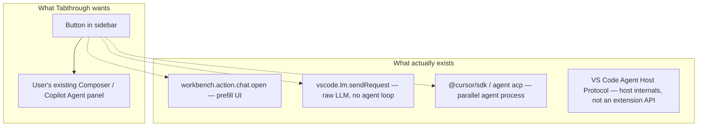
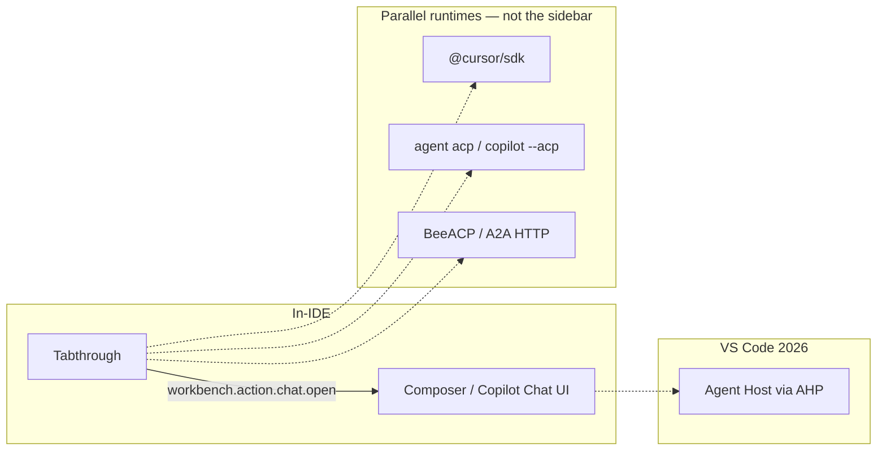

# Ask agent: can Tabthrough invoke the editor’s built-in agent?

Status: research, 2026-09-05. Not an implementation plan.

## TL;DR

**Yes, we can add an “Ask agent” button.** There is **no stable public API** that programmatically *runs* the in-IDE Composer / Copilot Agent as a library. There *is* a practical UI path: open the native chat and **prefill a prompt**.

| Host | Prefill native chat | Auto-submit | Official extension API |
|---|---|---|---|
| **VS Code** | `workbench.action.chat.open` `{ query, mode: 'agent' }` | Yes, if `isPartialQuery` is omitted/false | **No** — internal workbench command |
| **Cursor ≥ 2.3** | Same command, string or `{ query }` | **No** | **No** — Cursor’s `vscode.cursor.*` only covers MCP + plugins |

The [Agent Communication Protocol](https://agentcommunicationprotocol.dev/introduction/welcome) you linked is **not** what Cursor implements, and it cannot talk to Composer. Cursor’s “ACP” is [Agent Client Protocol](https://agentclientprotocol.com) on the CLI (`agent acp`) — a **new subprocess**, not the sidebar session.

**Recommended Tabthrough UX:** sidebar button during a review → build a prompt from the current step → `workbench.action.chat.open` with `isPartialQuery: true` so the user presses Enter. Do not depend on BeeACP / A2A / spawning `agent acp` for this button.

---

## What “call the built-in agent” actually means

Three different products get conflated:



Only the first path reuses the **native chat UI**. The others either skip the agent harness or start a **different** session.

---

## Two protocols named ACP

The acronym collision is the main trap.

| | **Agent Communication Protocol** (Bee / IBM) | **Agent Client Protocol** (Zed) |
|---|---|---|
| Site | [agentcommunicationprotocol.dev](https://agentcommunicationprotocol.dev/introduction/welcome) | [agentclientprotocol.com](https://agentclientprotocol.com) |
| Layer | Agent ↔ agent (HTTP REST) | Editor ↔ coding agent (JSON-RPC over stdio) |
| Status | Merged into **A2A** under LF AI & Data | Active; Cursor CLI implements this |
| Cursor “integration” | Add docs to `@Docs` — [not a protocol host](https://agentcommunicationprotocol.dev/integrations/cursor) | Cursor is an **ACP agent server**: `agent acp` |
| Can inject into Composer? | No | No — new subprocess + new session |

### BeeACP / A2A

Built for multi-agent orchestration across HTTP. [ACP is now part of A2A](https://github.com/orgs/i-am-bee/discussions/5). MCP stays inside one agent (tools); A2A wires agents to each other. Neither VS Code nor Cursor hosts this as the Composer/Copilot Chat runtime.

### Zed ACP (the one Cursor docs mean)

[Cursor CLI ACP](https://cursor.com/docs/cli/acp): spawn `agent acp`, `initialize` → `authenticate` → `session/new` → `session/prompt`. Designed so **other editors** (JetBrains, Neovim, Zed) can drive Cursor’s agent. The Cursor *desktop* Composer is a proprietary client on a proprietary runtime, not an ACP client that extensions can address.

GitHub Copilot CLI also speaks Zed ACP (`copilot --acp`, [public preview](https://github.blog/changelog/2026-01-28-acp-support-in-copilot-cli-is-now-in-public-preview/)). Community VS Code extensions (e.g. [ACP Client](https://marketplace.visualstudio.com/items?itemName=formulahendry.acp-client)) spawn those CLIs into a **separate** chat panel. Native Copilot Chat is a different stack.

VS Code has [an open request](https://github.com/microsoft/vscode/issues/265496) to become an ACP client; it is not shipped. VS Code’s 2026 direction is **Agent Host Protocol (AHP)**, not Zed ACP.

---

## VS Code: what an extension can do

### Path that hits the native Agent UI

`workbench.action.chat.open` — **internal** (not in the [documented commands](https://code.visualstudio.com/api/references/commands) list; only `vscode.editorChat.start` is). Used in VS Code source and by staff.

```ts
await vscode.commands.executeCommand('workbench.action.chat.open', {
  mode: 'agent',
  query: prompt,
  isPartialQuery: true, // prefill only; omit/false → auto-submit in VS Code
})
```

| Option | Effect |
|---|---|
| `query` | Prompt text |
| `isPartialQuery: true` | Prefill, do not send |
| `mode: 'agent' \| 'ask' \| 'edit'` | Chat mode |
| `attachFiles` | File attachments (upstream; Cursor historically lagged) |
| `blockOnResponse` | Wait for a terminal state (automation) |

Wrappers from VS Code 1.100: `workbench.action.chat.openAgent` / `openAsk` / `openEdit`.

**Auto-submit in VS Code:** if `query` is set and `isPartialQuery` is not `true`, the chat widget `acceptInput()`s. This is the closest thing to “call the built-in agent.”

Documented **inline** chat (not the panel Agent): [`vscode.editorChat.start`](https://code.visualstudio.com/api/references/commands) with `message` + `autoSend`.

A request for a stable `vscode.chat.openAgent` was [closed without shipping](https://github.com/microsoft/vscode/issues/318097).

### Paths that do *not* invoke the built-in agent

| API | What it actually is |
|---|---|
| [`vscode.lm.selectChatModels` + `sendRequest`](https://code.visualstudio.com/api/extension-guides/ai/language-model) | Raw LLM. You own tools/edits. Copilot models need user consent. |
| [`vscode.chat.createChatParticipant`](https://code.visualstudio.com/api/extension-guides/ai/chat) | You become `@someone`. Does not drive Copilot’s default agent. |
| [`vscode.lm.registerTool`](https://code.visualstudio.com/api/extension-guides/ai/tools) | **Extends** the agent; does not start a run. |
| `contributes.chatAgents` | Custom agent files in the picker — contribution, not invocation. |

### Agent Host Protocol (AHP)

[Aug 2026](https://code.visualstudio.com/blogs/2026/08/26/agent-host-architecture): VS Code moved the agent runtime into a dedicated Agent Host. AHP is JSON-RPC between **host** and **clients** (editor window, Agents window, browser). Internals expose `sendMessage` on chat channels ([`agentService.ts`](https://github.com/microsoft/vscode/blob/main/src/vs/platform/agentHost/common/agentService.ts)) — **not** a published extension API. Extensions still contribute tools/MCP/custom agents; they do not become AHP clients from `vscode.*`.

---

## Cursor: what an extension can do

### Official extension API

[cursor.com/docs/extension-api](https://cursor.com/docs/extension-api) documents only:

- `vscode.cursor.mcp.registerServer` / `unregisterServer`
- `vscode.cursor.plugins.registerPath` / `unregisterPath`

**No prompt, no Composer, no Agent invoke.** MCP registration gives the *already-running* agent extra tools.

`vscode.lm.*` / `registerTool` are **not** supported in Cursor ([forum](https://forum.cursor.com/t/support-for-language-model-tools/152071)).

### What shipped for extensions

Cursor 2.3 (Jan 2026, [Andrew Milich](https://forum.cursor.com/t/a-command-for-passing-a-prompt-to-the-chat/138049)): `workbench.action.chat.open` **prefills** a new Agent tab.

```ts
await vscode.commands.executeCommand('workbench.action.chat.open', prompt)
await vscode.commands.executeCommand('workbench.action.chat.open', { query: prompt })
```

Staff, Apr 2026: it **does not auto-send** ([forum #157654](https://forum.cursor.com/t/is-it-possible-to-submit-chat-programmatically/157654)). Upstream VS Code’s `acceptInput()` path was not kept. `workbench.action.chat.submit` is **absent** from current Cursor builds. `composer.startGeneration` is not a registered command.

`cursor.startComposerPrompt` / `composer.startComposerPrompt` take **no prompt argument** (inline Cmd+K). Do not use them for this button.

`attachFiles` on this command is an [open Cursor gap](https://forum.cursor.com/t/support-attachfiles-in-workbench-action-chat-open/156275) vs upstream VS Code 1.102+. Put file paths in the prompt text.

### Cursor SDK and `agent acp`

[`@cursor/sdk`](https://cursor.com/docs/sdk/typescript) / `CURSOR_API_KEY` runs the **same harness family** locally or in the cloud. Cloud runs can appear in the Agents Window. It does **not** share the open Composer thread, and it needs an API key. Wrong tool if the button should dump into the sidebar the user is already looking at.

`agent acp` is the same idea for *other editors*. An extension that spawned it would own a second agent UI.

---

## Protocol map (who talks to whom)



MCP sits *inside* an agent (tools). It is complementary, not a substitute for opening chat.

---

## Tabthrough hook point

No chat/composer integration exists today.

**Best surface:** Walkthrough sidebar (`src/model/sidebar.ts` + `src/ui/sidebar.ts`) while a session is active. The sidebar already shows title, path, rationale, notes. Add an action row + whitelist `tabthrough.askAgent` in `SIDEBAR_COMMANDS`.

**Prompt ingredients already in the session model:**

- `currentStep()`: id, path, title, rationale, notes, groups/ranges
- `progress()`, `guide.summary`, `entry`, `diff` hunks for that path
- `reviewViewModel` reveal/base text for the active file

Put paths and line ranges in the prompt body; do not wait on Cursor `attachFiles`.

**Not good:** status bar (single command), diff editor (no chrome), package.json menus (not step-scoped).

---

## Recommended implementation (when we build it)

1. **Same command on both hosts**, feature-detected:

   ```ts
   const cmds = await vscode.commands.getCommands(true)
   if (cmds.includes('workbench.action.chat.open')) {
     await vscode.commands.executeCommand('workbench.action.chat.open', {
       query: prompt,
       isPartialQuery: true,
       mode: 'agent',
     })
     return
   }
   ```

2. **Prefill, don’t auto-submit.** VS Code *can* auto-send; Cursor cannot. Same UX everywhere: user reviews and hits Enter.

3. **Fallback:** copy prompt + `showInformationMessage('Prompt copied — paste into Chat')`. Clipboard+`composer.newAgentChat` paste is a last resort (clobbers clipboard, races).

4. **Do not** ship `@cursor/sdk`, BeeACP, or `agent acp` for this button unless the product goal changes to “Tabthrough-owned agent panel.”

5. **Optional later:** `vscode.lm.registerTool` on VS Code only, so Copilot Agent can *pull* Tabthrough step context — that extends the agent, it does not replace the button.

---

## Sources

- [VS Code Language Model API](https://code.visualstudio.com/api/extension-guides/ai/language-model)
- [VS Code Chat Participant API](https://code.visualstudio.com/api/extension-guides/ai/chat)
- [VS Code built-in commands](https://code.visualstudio.com/api/references/commands)
- [VS Code Agent Host architecture](https://code.visualstudio.com/blogs/2026/08/26/agent-host-architecture)
- [Cursor extension API](https://cursor.com/docs/extension-api)
- [Cursor CLI ACP](https://cursor.com/docs/cli/acp)
- [Cursor TypeScript SDK](https://cursor.com/docs/sdk/typescript)
- [Forum: pass a prompt to chat](https://forum.cursor.com/t/a-command-for-passing-a-prompt-to-the-chat/138049)
- [Forum: auto-submit](https://forum.cursor.com/t/is-it-possible-to-submit-chat-programmatically/157654)
- [BeeACP welcome](https://agentcommunicationprotocol.dev/introduction/welcome)
- [BeeACP “Cursor integration”](https://agentcommunicationprotocol.dev/integrations/cursor)
- [Zed Agent Client Protocol](https://agentclientprotocol.com)
- [Copilot CLI ACP](https://docs.github.com/en/copilot/reference/copilot-cli-reference/acp-server)
