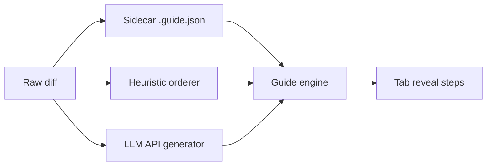

# Tabthrough — Product Specification

**Version:** 0.1 (MVP scope)  
**Owner:** Product  
**Status:** Approved for planning  
**Last updated:** 2026-08-07

---

## Problem

Developers receive code through commits, PRs/MRs, or AI-generated patches, but **review is often shallow**: skim the diff, approve, move on. They do not *own* the change — they cannot explain it, extend it confidently, or spot subtle coupling.

Existing tools optimize for **speed** (inline comments, AI summaries, bulk approve). Tabthrough optimizes for **understanding** without turning review into a test.

### Pain points

| Pain | Who feels it | Today’s workaround |
|------|--------------|-------------------|
| Large diffs are cognitively overwhelming | Reviewer on unfamiliar code | Scroll fast, ask author in chat |
| AI/agent PRs arrive without narrative | Solo dev, team lead | Re-read prompt + diff manually |
| Context switching loses mental model | Dev with dirty working tree | Stash manually, diff in another tool |
| “I approved it but couldn’t explain it” | Anyone under time pressure | Hope tests catch issues |

---

## Vision (one sentence)

When a developer activates Tabthrough on a commit, PR/MR, or current changes, the extension **safely isolates their workspace**, then lets them press **Tab** to reveal changes **step by step** in pedagogical order — familiar AI-tab UX, but ordered for understanding, not completion speed.

---

## Personas

### P1 — The Careful Reviewer (primary)

- **Role:** Mid/senior dev reviewing teammate or agent PRs  
- **Goal:** Understand *why* and *how* before approving  
- **Behavior:** Uses git, VS Code diff, sometimes `gh pr diff`  
- **Success:** Can explain the change in 2 minutes without re-opening the diff  

### P2 — The Solo Shipper (secondary)

- **Role:** Indie/small-team dev merging their own AI-assisted work  
- **Goal:** Sanity-check agent output before push  
- **Behavior:** Large local diffs, frequent unstaged WIP  
- **Success:** Catches one non-obvious issue they would have missed in a skim  

### P3 — The Onboarder (tertiary, P1 feature)

- **Role:** Tech lead walking a junior through a change  
- **Goal:** Shared, ordered walkthrough (async first; live pairing later)  
- **MVP:** Same Tab flow; export/share guide is post-MVP  

---

## Success metrics

### MVP (qualitative + lightweight quantitative)

| Metric | Target | How we measure |
|--------|--------|----------------|
| **Session completion** | ≥70% of started sessions reach “Finish” (not abort) | Local opt-in counter / dogfood log |
| **Stash safety** | **Zero** reported data-loss incidents in dogfood | Explicit abort/restore tests + issue tracker |
| **Time-to-first-reveal** | <3s from command to first Tab step on ≤500-line diff | Manual benchmark |
| **Comprehension (dogfood)** | 4/5 reviewers say “I understood the change better than normal diff” | 5-person internal survey |
| **Tab UX tone** | 0 guilt/shame patterns in UX audit | PO + design review checklist |

### Post-MVP

- LLM guide generation latency p95 <15s for typical PR  
- Agent-authored guide adoption: ≥1 published skill/template referencing guide format  
- Marketplace installs / weekly active sessions (once published)

---

## MVP definition

### In scope (P0 — must ship)

1. **Start session** from:
   - Current working tree changes (staged + unstaged)
   - Single commit (`HEAD`, pick commit)
   - Commit range (`A..B`, merge-base aware)
2. **Stash safety pipeline** (non-negotiable):
   - Detect dirty tree → stash with extension-scoped message + backup ref
   - Checkout/replay target revision in isolated review mode
   - **Always** restore on: Finish, Cancel, extension deactivate, VS Code window close (best-effort), unhandled error
   - Clear pre-flight UI: what will be stashed, how to abort
3. **Tab-to-reveal** core loop:
   - Global Tab (configurable chord) advances one **step**
   - Each step reveals 1–N lines/hunks based on **significance heuristic** (not fixed line count)
   - Prior steps remain visible; no “exam timer”, no score, no forced quiz
4. **Heuristic + file-based guide** (offline, no API key):
   - Order: file dependency heuristics → hunk significance → intra-hunk line groups
   - Optional sidecar `.guide.json` / frontmatter in repo (see guide format ADR companion)
5. **Session UI** (minimal, trust-building):
   - Status bar: step `k/n`, current file, short rationale (“types before callers”)
   - Command palette: Start / Next step / Previous step / Finish / Cancel
6. **Reatom state model** for session, stash handle, step index, guide graph — single source of truth for UI + commands

### P1 (fast follow — same release train if time, else v0.2)

1. **Portable guide contract** (`.guide.json` schema + agent skill/prompt) — read path in MVP stub; write path documented for agents  
2. **LLM guide generation** from raw diff when no sidecar exists (BYOK API key, explicit opt-in per session)  
3. **PR/MR entry** via `git` remote + optional `gh` when available  
4. **Peek ahead**: dim preview of next related hunk (no spoil of rationale)

### Explicitly out of MVP (P2+)

See [Non-goals](#non-goals) and [Edge-case budget](#edge-case-budget).

---

## UX principles

1. **Trust before pedagogy** — If stash/restore is unclear, nothing else matters. Boring, explicit confirmations beat cleverness.  
2. **Tab feels like unfolding, not grading** — No scores, streaks, “got it?” gates, or red/green judgment on speed. Optional “Take a break” / pause anytime.  
3. **Reveal why this order** — One-line rationale per step; user can skip rationale display in settings.  
4. **User owns pace** — Tab, Shift+Tab, jump to file, exit anytime with restore.  
5. **Offline-first path** — Heuristic guide works with no network; LLM is enhancement, not gate.  
6. **Familiar VS Code** — Native diff editor, decorations, status bar; no webview dashboard for MVP.  
7. **Agent guide is a contract, not a lock-in** — Same JSON schema whether authored by agent, LLM, or hand-edited.

---

## Guide sources (vision → MVP order)

| Phase | Source | Rationale |
|-------|--------|-----------|
| **MVP P0** | Heuristic + optional checked-in `.guide.json` | Works offline; shippable without API costs; validates Tab UX |
| **P1** | LLM from diff (BYOK) | Covers repos with no agent sidecar |
| **P1** | Agent rules / skill emitting `.guide.json` | Portable contract; teams adopt in CI/agents without extension changes |

**MVP default:** heuristic order. If `.guide.json` present and valid for diff scope → merge/override steps per schema rules.

---

## Non-goals (MVP)

- Team analytics dashboard, leaderboards, review scores  
- Inline chat with author / AI tutor during review  
- Auto-approve / merge / CI integration  
- Full semantic AST dependency analysis across languages  
- Bitbucket/GitLab native APIs (git + optional `gh` only for P1)  
- Multi-root workspace perfection  
- Voice narration, video export  
- Replacing normal VS Code diff as default for all reviews  

---

## Edge-case budget

Philosophy: **P0 = no data loss + honest happy path**; **P1 = common dev friction**; **P2 = document or defer**.

### P0 — Must handle correctly (ship blocker)

| Edge case | Handling |
|-----------|----------|
| Dirty working tree at session start | Stash all tracked+configured untracked; show summary; refuse start if stash fails |
| Stash pop conflict on restore | Never force; surface 3-way merge UI link + keep backup ref until user dismisses |
| User closes VS Code mid-session | Persist session token; on next activate offer “Resume restore” before any git op |
| Tab when no steps remain | No-op + subtle “Review complete” toast; offer Finish |
| Empty diff / whitespace-only | Block start with clear message |
| Binary / generated files in diff | Skip with visible “skipped binary” step stub (don’t break ordering) |
| Extension crash during review | Backup ref + recovery command “Restore from Tabthrough backup” |
| Multiple concurrent sessions | **Disallow** — one active session; block second start |
| Git not a repo / no git | Disable commands with explanation |
| Detached HEAD / shallow clone missing objects | Detect early; fail with fetch hint |

### P1 — Should handle (fast follow)

| Edge case | Handling |
|-----------|----------|
| Partial `.guide.json` (stale vs diff) | Merge with heuristic for missing hunks; warn once |
| Huge diff (>3000 LOC) | Cap steps with “compact mode” (file-level steps); warn at start |
| Merge commits / conflict markers in range | Use `-m` first-parent option default; document limitation |
| `gh` not installed for PR flow | Fall back to `git fetch` + branch diff instructions |
| User edits files during review | Read-only recommendation; detect drift and warn |
| Submodule pointer changes | Show as single meta-step; no submodule interior |
| Renames | Follow rename detection in git diff |

### P2 — Accept limitation (document in README)

| Edge case | Handling |
|-----------|----------|
| Multi-root workspaces | Best-effort first root only |
| LFS / external diff drivers | Pass through git; may show “binary” |
| Live rebase / interactive rebase in progress | Refuse start |
| Remote-only commits not fetched | Prompt to fetch |
| Custom diff tools / beyond built-in editor | Out of scope |
| Non-UTF-8 encodings | Best-effort; garbled text disclaimer |

---

## MVP acceptance criteria (PO sign-off)

- [ ] Start session from working tree, one commit, and commit range on sample repo  
- [ ] Stash → review → Finish restores identical working tree (automated test)  
- [ ] Cancel and simulated crash path restore verified (automated + manual)  
- [ ] Tab advances through ≥10 steps with monotonic visibility on sample diff  
- [ ] Heuristic order places “foundation before consumer” on structured sample (test fixture)  
- [ ] Valid `.guide.json` overrides order for at least one step  
- [ ] No exam-like UI elements in session flow  
- [ ] All P0 edge cases have test or documented manual procedure  

---

## Open questions (for Architect / Planner)

1. Exact `.guide.json` schema version and merge algorithm with heuristic fallback  
2. Tab key conflict resolution vs VS Code IntelliSense (default chord recommendation)  
3. reactive-vscode + Reatom boundary for git subprocess isolation  

---

## References

- ADR: [0001-mvp-scope](../decisions/0001-mvp-scope.md)  
- Backlog: [progress/backlog.md](../progress/backlog.md)  
- Reatom skills: `.agents/skills/reatom/`
