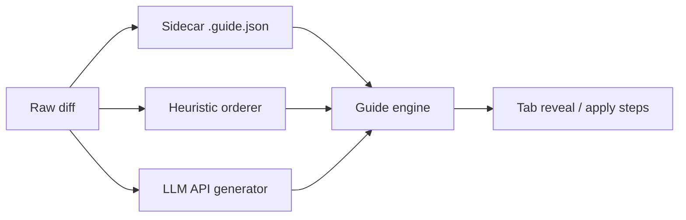

# Tabthrough — Product Specification

**Version:** 0.2 (intent — post-MVP direction)  
**Owner:** Product  
**Status:** Direction approved for Architect / Planner reconciliation  
**Last updated:** 2026-08-07

---

## Problem

Developers receive code through commits, PRs/MRs, or AI-generated patches, but **review is often shallow**: skim the diff, approve, move on. They do not *own* the change — they cannot explain it, extend it confidently, or spot subtle coupling.

Existing tools optimize for **speed** (inline comments, AI summaries, bulk approve). Tabthrough optimizes for **understanding that becomes ownership** — without turning review into a test.

### Pain points

| Pain | Who feels it | Today’s workaround |
|------|--------------|-------------------|
| Large diffs are cognitively overwhelming | Reviewer on unfamiliar code | Scroll fast, ask author in chat |
| AI/agent PRs arrive without narrative | Solo dev, team lead | Re-read prompt + diff manually |
| Context switching loses mental model | Dev with dirty working tree | Stash manually, diff in another tool |
| “I approved it but couldn’t explain it” | Anyone under time pressure | Hope tests catch issues |
| Flashy one-panel reveals hide distinct thoughts | Anyone Tabbing a coarse guide | Split mentally; miss coupling |
| Virtual diffs flash and disappear — nothing is committed by the reader | Careful reviewer who wants to *own* the change | Re-apply manually after “reviewing” |

---

## Vision (one sentence)

When a developer activates Tabthrough on a commit, PR/MR, or current changes, the extension **safely isolates their workspace**, then lets them press **Tab** to unfold the change **one thought at a time** — and, in apply-with-user mode, **land those thoughts on disk with the user** so the developer **commits** the work, not merely watches it vanish.

---

## Product shift (v0.2)

v0.1 proved stash-safe isolation and Tab reveal via read-only virtual documents. Dogfood and founder intent now require two upgrades that change what “success” means:

1. **Finer guide steps** — agents must understand the change and emit **detailed Tab navigation**: one thought per step, distinct edits split (not one flashy panel that bundles a helper and its consumer).
2. **Apply-with-user / commit workflow** — reveal must work like **“rebase with fixes”**: the user walks the change onto the tree, may edit mid-step, and **owns the commit**. Looking at a disappearing virtual diff is not enough.

These are the primary product hypothesis for the next milestone. Read-only progressive/dim remain valuable; they are no longer the only (or default long-term) definition of “done.”

---

## Product shift (v0.3 — git-first)

Dogfooding v0.2 showed the isolation protocol (stash → detach → journal → verify → restore, plus lock, heartbeat and four recovery commands) was the most complex part of the product and paid for a stance, not a capability: read-only review never reads the working tree. The apply engine wrote one step at a time, so tooling never saw a consistent tree until the last Tab.

**Direction ([ADR 0005](../decisions/0005-git-first-sessions.md)):** every session mode is one native git primitive with a native exit. The review **feels read-only** everywhere; one escape hatch, **Edit here**, opens the real file at the current step when the disk holds the reviewed change.

| Mode | What git does | When to pick it | Edit here |
|------|---------------|-----------------|-----------|
| **Read-only** (default) | nothing (a snapshot commit for working changes) | understand a change; several windows at once | working changes: yes · commit / range: no |
| **Rebase** | `git rebase -i --autostash` stopped at the reviewed commit | fix your own branch's commits while reading, with linters and tests seeing the whole change; Finish amends, Cancel is `git rebase --abort` | yes |
| **Worktree** | `git worktree add --detach` in a new window | check a change in parallel without touching the current checkout | yes, in the new window |

**Promise wording.** "Designed to restore your workspace exactly" becomes **"Plain git underneath"**: every action is a git command shown before it runs; every exit is one the user already knows; git's own errors are forwarded, not guarded against.

**Finish defaults (Rebase).** Hooks and commit signing are skipped (`--no-verify --no-gpg-sign`) unless `tabthrough.finish.hooks` / `tabthrough.finish.sign` are on, or the guide sets `defaults.finish` for its own review. A failing hook or signature offers one retry with the bypass.

**Retired.** Pre-flight modal (replaced by the "Will run:" line), apply-with-user step writing, journal, lock, heartbeat, Restore from Backup, Dismiss Pending Restore, Clear Leftover Lock, Clean Up Backups, `tabthrough.stash.includeUntracked`. Journeys J2 / J3 and the "Apply-with-user mode" section below are the historical record.

---

## Personas

### P1 — The Careful Reviewer (primary)

- **Role:** Mid/senior dev reviewing teammate or agent PRs  
- **Goal:** Understand *why* and *how*, then **own** the change before approving or merging  
- **Behavior:** Uses git, VS Code diff, sometimes `gh pr diff`  
- **Success:** Can explain the change in 2 minutes **and** has either committed the walked steps or finished a deliberate read-only pass  

### P2 — The Solo Shipper (secondary)

- **Role:** Indie/small-team dev merging their own AI-assisted work  
- **Goal:** Sanity-check agent output, fix what is wrong, **commit as their own work**  
- **Behavior:** Large local diffs, frequent unstaged WIP  
- **Success:** Catches one non-obvious issue **and** ends with a tree they wrote (edits allowed), not only a finished slideshow  

### P3 — The Onboarder (tertiary, P1 feature)

- **Role:** Tech lead walking a junior through a change  
- **Goal:** Shared, ordered walkthrough (async first; live pairing later)  
- **MVP:** Same Tab flow; export/share guide is post-MVP  

---

## Success metrics

### v0.1 MVP (still required for ship)

| Metric | Target | How we measure |
|--------|--------|----------------|
| **Session completion** | ≥70% of started sessions reach “Finish” (not abort) | Local opt-in counter / dogfood log |
| **Stash safety** | **Zero** reported data-loss incidents in dogfood | Explicit abort/restore tests + issue tracker |
| **Time-to-first-reveal** | <3s from command to first Tab step on ≤500-line diff | Manual benchmark |
| **Comprehension (dogfood)** | 4/5 reviewers say “I understood the change better than normal diff” | 5-person internal survey |
| **Tab UX tone** | 0 guilt/shame patterns in UX audit | PO + design review checklist |

### v0.2 — Apply & guide quality

| Metric | Target | How we measure |
|--------|--------|----------------|
| **Ownership outcome** | ≥50% of apply-mode sessions end with user-authored commit or explicit “keep working tree, I’ll commit” — not only Finish→restore-to-pre-session | Dogfood log |
| **Step granularity** | On a sample refactor with ≥2 distinct thoughts in one file, agent guide emits ≥2 steps (not one combined panel) | Fixture + skill dogfood |
| **Edit mid-walk** | User can change a revealed step’s on-disk content; later steps still apply cleanly or conflict is honest | Automated + manual |
| **Stash / restore safety** | **Zero** data-loss in apply mode (same bar as v0.1) | Sacred suite extended |

### Post-MVP (unchanged direction)

- LLM guide generation latency p95 <15s for typical PR  
- Agent-authored guide adoption: ≥1 published skill/template referencing guide format  
- Marketplace installs / weekly active sessions (once published)

---

## User journeys

### J1 — Read-only review (v0.1, retained; v0.3 shape)

1. Start from working tree, commit, or range.  
2. Sidebar shows "Will run: nothing"; Start.  
3. Tab through steps in pedagogical order on `tabthrough:` virtual docs.  
4. Working changes: **Edit here** opens the real file at the current step; fixes live on disk on top of the reviewed snapshot.  
5. Finish / Cancel delete the snapshot ref. The working tree was never touched.  
6. **Outcome:** understanding; nothing to restore.

### J5 — Rebase review of your own commit (v0.3)

1. On branch `feature`, dirty tree, pick commit `C` (an ancestor of `HEAD`).  
2. Sidebar shows `git rebase -i --autostash --no-verify --no-gpg-sign C^` and "autostash will park 3 files; 2 commits above will be rewritten"; Start.  
3. Tree is at `C`; linters and tests see the whole change; Tab through the virtual reveal; **Edit here** to fix.  
4. Finish: untracked files offered with checkboxes; `add -u`, amend into `C`, `rebase --continue` replays the commits above; WIP pops.  
5. Cancel: `git rebase --abort`. Any conflict or hook failure is git's message with a Continue / Retry button.  
6. **Outcome:** the fixed commit on the branch; nothing Tabthrough-specific left in the repository.

### J6 — Worktree review in parallel (v0.3)

1. Pick any target; choose Worktree.  
2. Sidebar shows `git worktree add --detach <dir> <sha>`; Start opens a new window on the worktree.  
3. The new window preselects **Review HEAD^..HEAD**; read-only review with the whole tree at the change.  
4. Close the window when done; **Remove** from either window runs `git worktree remove` and is refused by git if the worktree is dirty.  
5. **Outcome:** the current checkout was never touched.

### J2 — Apply-with-user on a commit (v0.2 target — superseded by J5)

Metaphor: **interactive rebase with fixes**, walked by Tab.

1. User picks commit `C` (or equivalent “apply this commit’s change”).  
2. Extension checks out **previous** commit (`C^` / resolved base) in an isolated, recoverable session (same stash/journal safety bar).  
3. Each Tab **applies the next guide step onto the real working tree** (user sees real files, real editor, real git status).  
4. User **may edit** the applied content before advancing.  
5. After last step (or when user stops), the developer **commits** (or continues editing). Extension does not pretend the slideshow was ownership.  
6. Abort / Cancel restores to pre-session state via the existing safety protocol (or Architect-designed equivalent that never loses WIP).

**Outcome:** the change lives on disk under the user’s authorship.

### J3 — Apply-with-user on working-tree changes (v0.2 target — superseded by J1 + Edit here)

1. User starts on dirty working tree.  
2. Extension **stashes** (capture-first, journal-first — non-negotiable).  
3. Tree is clean at base; each Tab **reapplies** the stashed change **step by step** with the user (same edit-allowed rule as J2).  
4. User commits or keeps the tree; Finish semantics must be explicit (see open questions).

**Outcome:** same as J2 — ownership via apply, not flash-and-restore-only.

### J4 — Authoring a fine-grained guide (skill / agent)

1. Agent produces a non-trivial change.  
2. Agent **understands** the real patch (not the plan): distinct thoughts, helpers vs callers, renames vs behavior.  
3. Emits `.guide.json` with **one thought per Tab step**; splits distinct edits (e.g. `eventActionName` helper **then** `jsxEvent` refactor — never one combined flashy panel).  
4. Human unfolds via J1 or J2/J3.

---

## MVP definition (v0.1 — still the ship bar)

### In scope (P0 — must ship for v0.1)

1. **Start session** from:
   - Current working tree changes (staged + unstaged)
   - Single commit (`HEAD`, pick commit)
   - Commit range (`A..B`, merge-base aware)
2. **Stash safety pipeline** (non-negotiable):
   - Detect dirty tree → stash with extension-scoped message + backup ref
   - Checkout/replay target revision in isolated review mode
   - **Always** restore on: Finish, Cancel, extension deactivate, VS Code window close (best-effort), unhandled error
   - Clear pre-flight UI: what will be stashed, how to abort
3. **Tab-to-reveal** core loop:
   - Global Tab (configurable chord) advances one **step**
   - Each step reveals 1–N lines/hunks based on **significance heuristic** (not fixed line count)
   - Prior steps remain visible; no “exam timer”, no score, no forced quiz
4. **Heuristic + file-based guide** (offline, no API key):
   - Order: file dependency heuristics → hunk significance → intra-hunk line groups
   - Optional sidecar `.guide.json` / frontmatter in repo (see guide format ADR companion)
5. **Session UI** (minimal, trust-building):
   - Status bar: step `k/n`, current file, short rationale (“types before callers”)
   - Command palette: Start / Next step / Previous step / Finish / Cancel
6. **Reatom state model** for session, stash handle, step index, guide graph — single source of truth for UI + commands

### P1 (fast follow — v0.2 train)

1. **Portable guide contract** (`.guide.json` schema + agent skill/prompt) — read path in MVP stub; write path documented for agents  
2. **LLM guide generation** from raw diff when no sidecar exists (BYOK API key, explicit opt-in per session)  
3. **PR/MR entry** via `git` remote + optional `gh` when available  
4. **Peek ahead**: dim preview of next related hunk (no spoil of rationale)  
5. **Apply-with-user mode** (see below) — product-critical for v0.2  
6. **Guide authoring quality bar** enforced in skill + long-form docs — product-critical for both read-only and apply modes  

### Explicitly out of MVP (P2+)

See [Non-goals](#non-goals) and [Edge-case budget](#edge-case-budget).

---

## Apply-with-user mode (v0.2 product shape)

> **Superseded (2026-09-10)** by [Product shift (v0.3 — git-first)](#product-shift-v03--git-first) and ADR 0005. Kept as the record of why D1 was reopened.

### Intent

Reveal should not only show virtual diffs that flash and disappear. It should work like **rebase with fixes**: land the target change **step by step with the user**, allow edits, and leave a tree the **user/developer commits**.

### Scoped shape for Architect (preferred reconciliation)

**Do not replace** read-only `progressive` / `dim` wholesale in v0.1. Propose a **third session mode** (name TBD: e.g. `apply` / “Walkthrough & commit”) that coexists:

| Mode | Disk | Goal |
|------|------|------|
| `progressive` / `dim` (v0.1) | Read-only virtual docs; restore on Finish | Understand safely |
| `apply` (v0.2) | Real working tree mutated step-by-step under journal/stash protection | Understand **and own** (user commits) |

PO formally **reopens ADR 0002 D1** on the rejection of “staged apply to disk” — not to discard virtual docs, but to **add** an apply path with equal (or stricter) safety acceptance. Architect owns the ADR amendment; PO owns acceptance criteria below.

### Why reopen D1

D1 correctly rejected naive “write patches during a protected review” for the **read-only** product. That rejection assumed the session’s premise was isolation-for-looking. The new premise for apply mode is isolation-for-**replaying with the user**. Pollution of `git status` is then **the feature**, not a bug — provided restore/abort remains trustworthy and conflicts are honest.

### Acceptance criteria (apply mode)

- [ ] **Commit target:** session starts from `C^` (resolved base); each Tab applies the next step of `C`’s change to the working tree; after the walk the user can `git commit` without the extension inventing the commit message for them (assist OK; ownership clear).
- [ ] **Working-tree target:** current changes are stashed/captured first; each Tab reapplies the next step; user may edit; abort restores pre-session WIP byte-identically (same sacred bar as v0.1).
- [ ] **User edits mid-step** are preserved when advancing when possible; when later steps conflict with user edits, stop with merge/conflict UX — never silent overwrite.
- [ ] **Shift+Tab / Previous** has a defined, safe behavior (revert last applied step vs blocked) — Architect proposes; PO accepts only if no WIP loss.
- [ ] **Finish vs Commit** is explicit in UI copy: Finish must not imply “discard what you applied” unless the user chose read-only or an explicit “restore and exit.” Preferred: Finish = “end session, keep tree / offer commit”; Cancel = “abort, restore pre-session.”
- [ ] **Coexistence:** user can choose read-only vs apply at start (or via setting + confirm); read-only path remains stash-safe and does not write review content to disk.
- [ ] **Zero data-loss** dogfood bar identical to stash pipeline; backup refs / journal cover apply-mode crash points.
- [ ] Pre-flight copy states plainly: apply mode **will** change files on disk; Cancel restores.

### Risks PO accepts only if Architect mitigates

| Risk | Product stance |
|------|----------------|
| Polluted `git status` mid-session | Expected in apply mode; must be explained up front |
| Undo stack / multi-editor races | Prefer single-file apply per step; warn on external edits (extend P1 drift detection) |
| Stash contract confusion (stash then reapply vs review-then-restore) | Separate mode name + pre-flight; never overload Finish semantics |
| Partial apply left behind after crash | Journal must recover to “tree = base + applied steps + user edits” or restore fully — no silent half-state without recovery UI |
| Coarse guides in apply mode | Blocked by guide quality bar — applying two thoughts as one step defeats ownership |

---

## Guide step quality bar (v0.2)

### Intent

Guides (heuristic, sidecar, agent skill, future LLM) must force **detailed step-by-step Tab navigation**: the reader unfolds **one thought per step**. Distinct edits must be **separate Tabs**.

### Canonical anti-pattern (from dogfood)

Bundling `eventActionName` helper introduction **and** a `jsxEvent` refactor into **one** flashy panel. Those are two thoughts → **two steps** (helper/contract first, then consumer refactor), even when they sit in one hunk or one file.

### Authoring requirements (skill + long-form)

Tighten [`.agents/skills/tabthrough/SKILL.md`](../../.agents/skills/tabthrough/SKILL.md) and [`guides/agent-guide-authoring.md`](../guides/agent-guide-authoring.md) so models **must**:

1. **Understand the change from the real patch** before emitting steps (already stated; elevate to checklist gate).  
2. **Split distinct edits** — new helper vs call-site refactor; type vs implementation; failure test vs fix; etc.  
3. **One thought per step** — if the rationale needs “and”, split (existing principle → acceptance test).  
4. Prefer **more, smaller steps** when in doubt on mixed hunks; collapse only mechanical uniformity (`grouping: "split"` / demote churn).  
5. Never optimize for “impressive single panel”; optimize for Tab navigation that builds a mental model.

PO does not require a full skill rewrite in this turn; **Planner/Implementer (docs)** own the edit once Architect confirms no schema change is required. Schema stays v1 unless Architect proves ranges/grouping cannot express the splits.

### Acceptance criteria (guide quality)

- [ ] Skill + long-form name the anti-pattern (helper+consumer / two thoughts one panel) with a worked split.  
- [ ] Pre-emit checklist includes: “Did I merge two whiteboard thoughts into one step?”  
- [ ] Dogfood: agent guide for a mixed helper+refactor sample yields ≥2 steps a human agrees are separate thoughts.  
- [ ] Heuristic (P1 follow): prefer splitting high-significance groups that look like “definition + first use” when cheap signals exist — does not replace agent skill; softens coarse offline guides.  
- [ ] Apply mode + coarse step is treated as a **product bug** in review, not “author preference.”

---

## UX principles

1. **Trust before pedagogy** — If stash/restore is unclear, nothing else matters. Boring, explicit confirmations beat cleverness.  
2. **Tab feels like unfolding, not grading** — No scores, streaks, “got it?” gates, or red/green judgment on speed. Optional “Take a break” / pause anytime.  
3. **Reveal why this order** — One-line rationale per step; user can skip rationale display in settings.  
4. **User owns pace** — Tab, Shift+Tab, jump to file, exit anytime with restore (read-only) or explicit keep/restore (apply).  
5. **Offline-first path** — Heuristic guide works with no network; LLM is enhancement, not gate.  
6. **Familiar VS Code** — Native diff editor, decorations, status bar; no webview dashboard for MVP.  
7. **Agent guide is a contract, not a lock-in** — Same JSON schema whether authored by agent, LLM, or hand-edited.  
8. **Ownership over spectacle** — Prefer real apply + user commit over a prettier virtual slideshow.  
9. **One Tab, one thought** — Coarse multi-thought steps are a defect in the guide, not a viewer limitation.

---

## Guide sources (vision → MVP order)

| Phase | Source | Rationale |
|-------|--------|-----------|
| **MVP P0** | Heuristic + optional checked-in `.guide.json` | Works offline; shippable without API costs; validates Tab UX |
| **P1** | LLM from diff (BYOK) | Covers repos with no agent sidecar |
| **P1** | Agent rules / skill emitting `.guide.json` | Portable contract; teams adopt in CI/agents without extension changes |
| **v0.2** | Skill quality bar + apply mode consuming the same steps | Same guide drives understand **and** own |

**MVP default:** heuristic order. If `.guide.json` present and valid for diff scope → merge/override steps per schema rules.

---

## Non-goals (MVP / near-term)

- Team analytics dashboard, leaderboards, review scores  
- Inline chat with author / AI tutor during review  
- Auto-approve / merge / CI integration  
- Full semantic AST dependency analysis across languages  
- Bitbucket/GitLab native APIs (git + optional `gh` only for P1)  
- Multi-root workspace perfection  
- Voice narration, video export  
- Replacing normal VS Code diff as default for all reviews  
- Extension auto-creating the final git commit without user intent (assist / prompt to commit is OK; silent commit is not)

---

## Edge-case budget

Philosophy: **P0 = no data loss + honest happy path**; **P1 = common dev friction**; **P2 = document or defer**.

### P0 — Must handle correctly (ship blocker)

| Edge case | Handling |
|-----------|----------|
| Dirty working tree at session start | Stash all tracked+configured untracked; show summary; refuse start if stash fails |
| Stash pop conflict on restore | Never force; surface 3-way merge UI link + keep backup ref until user dismisses |
| User closes VS Code mid-session | Persist session token; on next activate offer “Resume restore” before any git op |
| Tab when no steps remain | No-op + subtle “Review complete” toast; offer Finish |
| Empty diff / whitespace-only | Block start with clear message |
| Binary / generated files in diff | Skip with visible “skipped binary” step stub (don’t break ordering) |
| Extension crash during review | Backup ref + recovery command “Restore from Tabthrough backup” |
| Multiple concurrent sessions | **Disallow** — one active session; block second start |
| Git not a repo / no git | Disable commands with explanation |
| Detached HEAD / shallow clone missing objects | Detect early; fail with fetch hint |

### P0 (v0.2 apply mode — additional; superseded)

| Edge case | Handling |
|-----------|----------|
| Crash mid-apply | Journal names applied step index + base; recovery offers restore-to-pre-session **or** resume from last applied step |
| User edits then abort | Abort restores pre-session WIP; never keeps half-apply unless user explicitly “keep tree” |
| Conflict applying next step onto user edits | Stop; show conflict; do not skip ahead |

### P0 (v0.3 git-first) — replaces the stash, crash, concurrency and apply rows above

| Edge case | Handling |
|-----------|----------|
| Dirty working tree at start | Read-only / Worktree: irrelevant, nothing is touched. Rebase: `--autostash` parks tracked changes; the Start line says how many files. Staged changes return unstaged — git's autostash apply does not pass `--index` |
| Editor closed mid-session | Read-only: a snapshot ref, swept after 24 h. Rebase: an ordinary rebase in progress, shown in the sidebar with Continue / Abort. Worktree: a worktree, listed with Remove |
| Second window or terminal touches the rebase | Ownership watch closes the review with a notice; git's state stays visible |
| Autostash pop conflicts on Finish / Abort | Git keeps the entry and says so; sidebar shows it with Pop |
| Replay conflict after Finish | Rebase stops as git does; conflicted paths in the sidebar; Continue button |
| Hook or signing failure on Finish (only when enabled) | Git's output shown; one Retry with `--no-verify` / `--no-gpg-sign` |
| Commit not on the current branch in Rebase mode | Start disabled with the Worktree hint |
| Rebase / merge / cherry-pick already in progress | Rebase mode: git refuses, message forwarded. Read-only and Worktree still start |
| Untracked files at Rebase Finish | Listed with checkboxes, none ticked; never swept by `add -A` |
| Edits drift Edit here ranges | Re-anchor by added-line text; nearest-line fallback; "edited on disk" mark |
| Dirty worktree on Remove | `git worktree remove` refuses; message forwarded; no `--force` |
| Empty / whitespace-only diff · binary stubs · not a repo · shallow missing parents · old git | unchanged from v0.1 |

### P1 — Should handle (fast follow)

| Edge case | Handling |
|-----------|----------|
| Partial `.guide.json` (stale vs diff) | Merge with heuristic for missing hunks; warn once |
| Huge diff (>3000 LOC) | Cap steps with “compact mode” (file-level steps); warn at start |
| Merge commits / conflict markers in range | Use `-m` first-parent option default; document limitation |
| `gh` not installed for PR flow | Fall back to `git fetch` + branch diff instructions |
| User edits files during **read-only** review | Read-only recommendation; detect drift and warn |
| Submodule pointer changes | Show as single meta-step; no submodule interior |
| Renames | Follow rename detection in git diff |
| Coarse agent guide (two thoughts / one step) | Skill checklist + dogfood rejection; optional heuristic split assist |

### P2 — Accept limitation (document in README)

| Edge case | Handling |
|-----------|----------|
| Multi-root workspaces | Best-effort first root only |
| LFS / external diff drivers | Pass through git; may show “binary” |
| Live rebase / interactive rebase in progress | Refuse start |
| Remote-only commits not fetched | Prompt to fetch |
| Custom diff tools / beyond built-in editor | Out of scope |
| Non-UTF-8 encodings | Best-effort; garbled text disclaimer |

---

## Acceptance criteria

### v0.1 MVP (PO sign-off — unchanged)

- [ ] Start session from working tree, one commit, and commit range on sample repo  
- [ ] Stash → review → Finish restores identical working tree (automated test)  
- [ ] Cancel and simulated crash path restore verified (automated + manual)  
- [ ] Tab advances through ≥10 steps with monotonic visibility on sample diff  
- [ ] Heuristic order places “foundation before consumer” on structured sample (test fixture)  
- [ ] Valid `.guide.json` overrides order for at least one step  
- [ ] No exam-like UI elements in session flow  
- [ ] All P0 edge cases have test or documented manual procedure  

### v0.2 — Apply-with-user (PO sign-off)

See [Acceptance criteria (apply mode)](#acceptance-criteria-apply-mode).

### v0.2 — Guide granularity (PO sign-off)

See [Acceptance criteria (guide quality)](#acceptance-criteria-guide-quality).

### v0.3 — Git-first (PO sign-off)

- [ ] Read-only review of working changes, a commit and a range leaves `git status` and `git stash list` identical; two windows can review the same repository
- [ ] Edit here opens the real file at the current step for a guide with out-of-order groups in one file
- [ ] Rebase review of `HEAD~2` on a dirty branch: tree at `HEAD~2`, WIP parked, Finish amends and replays, WIP pops; Cancel is `git rebase --abort`
- [ ] `git rebase --abort` typed in a terminal closes the review without any Tabthrough action
- [ ] Hooks and signing skipped by default; `tabthrough.finish.*` and `defaults.finish` turn them on; failure offers one bypass retry
- [ ] Worktree review opens a new window at `HEAD^..HEAD` for every entry kind; Remove is refused on a dirty worktree
- [ ] Every git command appears in the sidebar before it runs and in the output channel with its output
- [ ] No lock, journal, heartbeat, or Tabthrough-specific recovery command remains; README says "Plain git underneath"

---

## Open questions (for Architect / Planner)

### Apply mode / safety — **decided in ADR 0004** (Architect 2026-08-07)

1. **ADR 0002 D1:** amended — read-only rejection stands; apply is a separate session mode ([ADR 0004](../decisions/0004-apply-mode.md)).  
2. **Stash contract:** capture after-ref → stash → checkout **base** → reapply via `renderReveal` intent + 3-way merge; Cancel restores stash-shaped backup (staged/unstaged preserved on Cancel only; walk flattens to WT).  
3. **Dirty edits mid-step:** saved buffers + 3-way merge on advance; applied-ref checkpoint after each success; Cancel still restores pre-session.  
4. **Finish vs Commit:** Finish = keep tree (`done-kept`); Cancel = restore; Commit = SCM handoff only — never silent commit.  
5. **Previous / Shift+Tab:** revert last step via symmetric 3-way; block on conflict.  
6. **Coexistence default:** `tabthrough.session.mode` default **`ask`**; chooser at start; optional remember.  
7. **Partial commit / range apply:** out of v0.2 (P1-12).

### Guide quality (Planner / docs Implementer)

8. Skill + `agent-guide-authoring.md` — P0-G1 Done; golden fixture P0-G2 next.  
9. **Schema:** v1 `ranges` + `grouping` suffice — **no schema change** (Architect confirm).  
10. Dogfood fixture for helper+consumer sample — P0-G2 owns authorship.

### Carry-over (still open)

11. Exact `.guide.json` merge algorithm refinements with heuristic fallback (P1-3)  
12. Tab key conflict resolution vs IntelliSense (matrix drills still human-run); **apply mode** needs file-scheme when-clause / chord plan (overview §7.3)  
13. reactive-vscode + Reatom boundary for git subprocess isolation (closed in ADR 0002; verify under apply writes in review)

---

## References

- ADR: [0001-mvp-scope](../decisions/0001-mvp-scope.md)  
- ADR: [0002-architecture](../decisions/0002-architecture.md) — D1 scoped by ADR 0004  
- ADR: [0004-apply-mode](../decisions/0004-apply-mode.md) — apply-with-user session mode  
- Architecture overview §7: [overview.md](../architecture/overview.md)  
- Backlog: [progress/backlog.md](../progress/backlog.md)  
- Agent skill: [`.agents/skills/tabthrough/SKILL.md`](../../.agents/skills/tabthrough/SKILL.md)  
- Authoring guide: [guides/agent-guide-authoring.md](../guides/agent-guide-authoring.md)  
- Reatom skills: `.agents/skills/reatom/`
